title: Version Control
subtitle: Git and GitHub
theme: league

## Git and GitHub Process

<div float="right">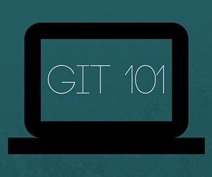</div>

- GitHub is a code hosting platform for version control and collaboration. 

- GitHub lets you and others work together on projects from anywhere.

- Understanding the GitHub process and its effective use is critical.

- In this lesson we will learn the GitHub and GitBash processes and the importance of version control. 

## Code version control

<div float="right" class="img img-center"></div>

- When you are developing software, you will almost certainly be doing so as part of a team.

- This means you may have two or more developers adding, deleting, creating, and editing a project at the same time.

- On a small project you might be able to track and keep up with changes, but on a larger project - FORGET IT!

- So let's learn how to use GitHub and GitBash. 

- Volunteer time!!

## GitHub

- To start the process of using GitHub, we must have an GitHub user account.

- Open your Chrome browser, and navigate to <mark>https://github.com/</mark>.

<div float="right" class="img"></div>

## GitHub cont.

- Here is an important point for you to consider when creating your account.

	- This account will be part of your professional portfolio once you have graduated.

	- Select a username and email address that will be professional.
	
	- Potential employers WILL browse GitHub to review your work!!
	
	- You do not want your username and email to distract from your work in GitHub.
	
- Once you have selected a professional <mark>username</mark> and <mark>email</mark>, enter a password.

- Select <mark>Sign up for GitHub</mark> and your account will be created.

## GitHub cont.

<div float="right" class="img"></div>

- It is not necessary at this time to pay for private repositories. You may choose to do so in the future.

- Select <mark>continue</mark>

## GitHub cont.

<div float="right" class="img">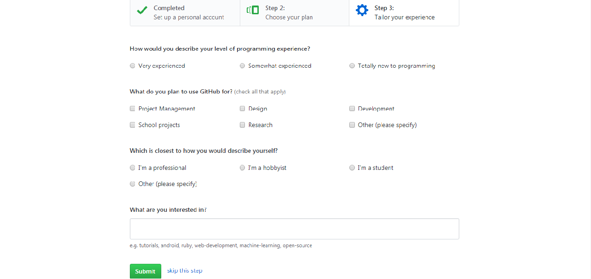</div>

- Choose the options that best describe you, then select <mark>continue</mark>

## We should all be here

<div float="right" class="img"></div>

- As our journey through this course continues, we will cover GitHub in greater detail.

- Let's move on to GitBash

## GitBash

<div float="right" class="img"></div>

- If you are using a WCCI laptop, you will notice an icon titled <mark>GitBash</mark>.

- If you do not have an icon on your desktop then do the following:

	- Select Start > All Programs > Git > GitBash

- If you are not using a WCCI laptop, please go to <mark>https://git-scm.com/downloads</mark> and download and install the latest version of GitBash.

## GitBash cont.

<div float="right" class="img img-center">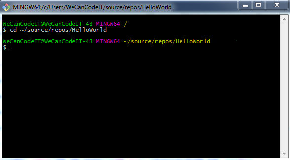</div>

- To navigate through GitBash, we use the DOS command line.

- We want to navigate to the folder in Visual Studio where our <mark>HelloWorld</mark> program resides.

- Type the following: `cd ~/source/repos/HelloWorld` and press enter

- Shortcut: type a few letters of the desired directory and press <mark>Tab</mark> to automatically complete, e.g. `sou` + Tab, `rep` + Tab

- Alternatively, navigate to the folder in Windows Explorer, right click and select **GitBash Here**

## GitBash cont.

- We can now think of the <mark>HelloWorld</mark> directory as a <mark>local repository</mark>.

- GitBash also thinks of the <mark>HelloWorld</mark> directory as a <mark>local repository</mark>.

- When we set up a local repository for use with GitBash and GitHub, there are a few steps we need to perfom.

- Volunteer time!!

## GitBash cont.

<div float="right" class="img">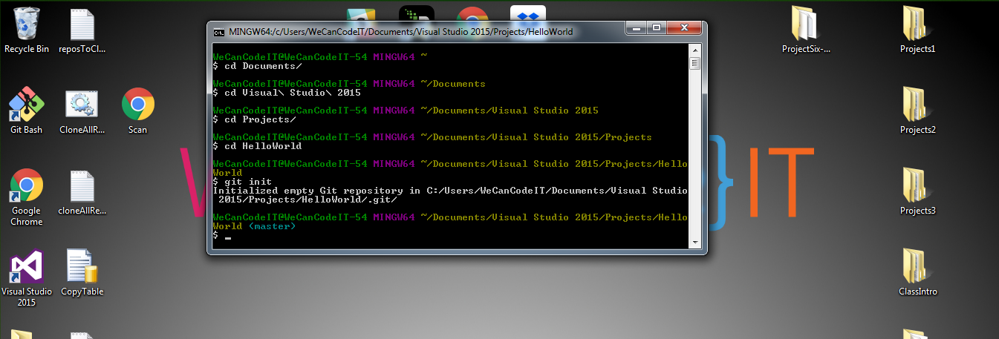</div>

- When we initially create a project or website in Visual Studio we must use GitBash to <mark>initialize</mark> the local repository.

- We intialize the local project or website repository by executing the following command at the root of the local repository in GitBash: `git init`

- Next we must add a <mark>.gitignore</mark> file to the root of our local repository.

## GitBash cont.

<div float="right" class="img"></div>

- The purpose of the `.gitignore` file is to allow you to ignore files that you never want to commit into a repository (e.g. editor backup files, build products, or local configuration overrides).

- You can generate a `.gitignore` file by browsing to <mark>https://www.gitignore.io/</mark>

- Enter <mark>VisualStudio</mark> into the text box and select <mark>Create</mark>

## GitBash cont.

<div float="right" class="img"></div>

- Highlight and copy the entire contents of the web page that appears.

- Paste the contents of the `.gitignore` file into a new text file (i.e. Notepad).

!SLIDE

<div float="right" class="img">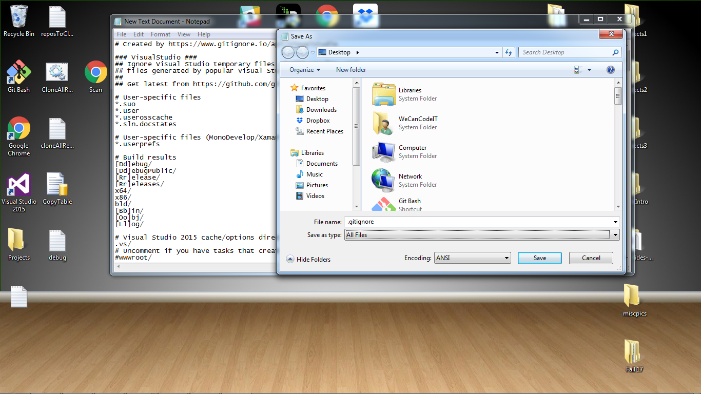</div>

- Save the file to your <mark>deskotop</mark> as `.gitignore` and change <mark>file type</mark> to <mark>all files</mark>.

- You will now see a document on your desktop with no name. Keep this copy for future projects.

- Make a copy of this file, and place it in the root of your <mark>HelloWorld</mark> local repository.

## GitBash cont.

<div float="right" class="img">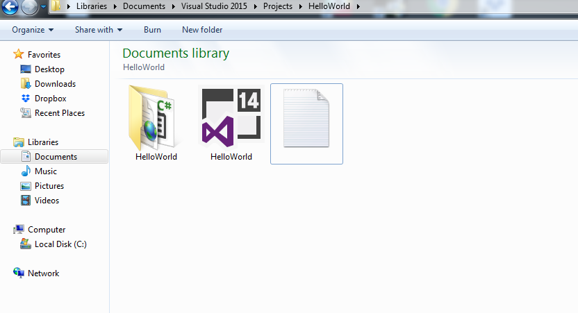</div>

- We are now ready to carry on with preparing our local repository.

## GitBash cont.

<div float="right" class="img">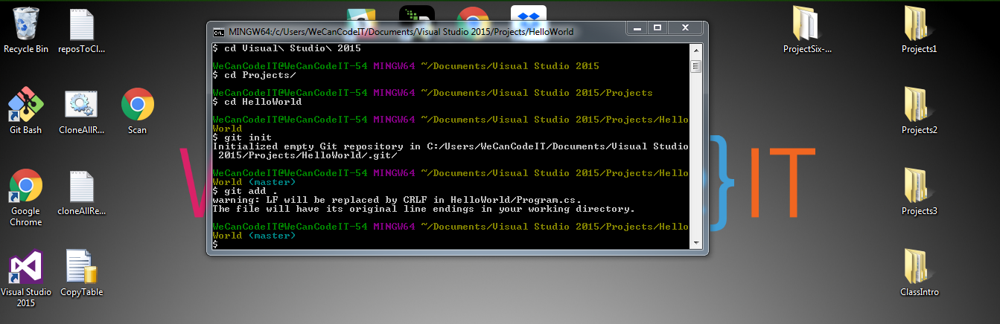</div>

- We now need to add all the files in the <mark>HelloWorld</mark> local repository to be processed.

- We add the files to be processed by typing the following commands in GitBash: <mark><code>git add .</code></mark> and pressing <mark>enter</mark>.

- Now let's check the status of our `git add .` to see what files have been added

## GitBash cont.

<div float="right" class="img"></div>

- Type `git status` and press enter

- You can see a number of files have been added for tracking including our `.gitignore`

- We will cover in future lessons what <mark>branches</mark> are and how we use them.

- Now we need to link up our local repository with a GitHub repository.


## GitBash/GitHub cont.

<div float="right" class="img">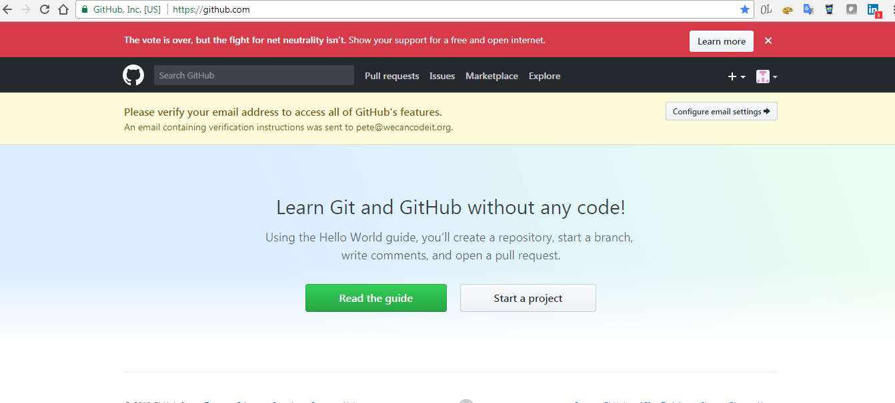</div>

- In order to link up our local <mark>HelloWorld</mark> repository with GitHub, we must create a corresponding repository in GitHub.

- Use Chrome to open your home page in the GitHub account we just created.

## GitBash/GitHub cont.

<div float="right" class="img"></div>

- If you haven't already, go to the email address you used to create your GitHub account, and verify your email address.

- In the upper right hand corner of the page, you will see a <mark>+</mark>.

- Select the <mark>+</mark> > then select <mark>New Repository</mark>.

## GitBash/GitHub cont.

<div float="right" class="img"></div>

- Give the new repository the same name as our local repository.

- Although the description is optional, let's enter the following: <mark> My first C# program</mark>.

- Finally select <mark>Create Repository</mark>.

## GitBash/GitHub cont.

<div float="right" class="img">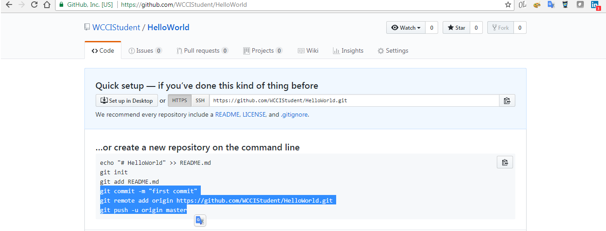</div>

- We are now ready to connect our local repository on our desktop with our new GitHub repository.

- You will see three lines in the page I have highlighted above.

- We now will enter each of those lines in our GitBash window.

## GitBash/GitHub cont.

<div float="right" class="img">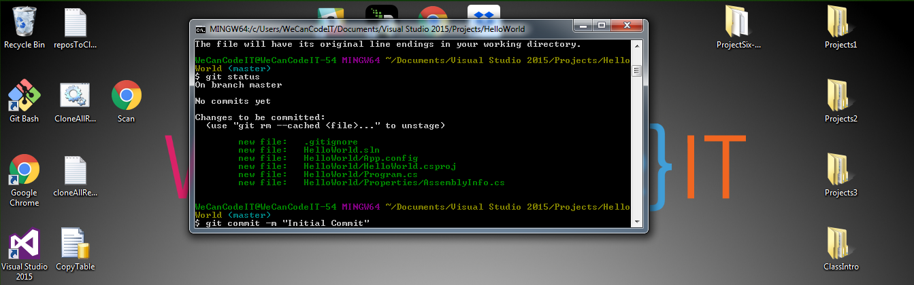</div>

- Return to your GitBash window, and enter the following command: `git commit -m "Initial Commit"`

- The <mark>-m</mark> tells GitBash we are including a message in our commit.

- When we <mark>commit</mark>, we are adding files to be tracked by GitBash and GitHub. 

- We will use this command every time we make changes. Including a message allows us to easily keep track in GitHub of changes in our program.

## GitBash/GitHub cont.

<div float="right" class="img"></div>

- Press <mark>enter</mark>.

- Now GitBash is set up to track the changes we make to our code.

- Because we are the only ones who currently have acccess to the project, we need to <mark>push</mark> our code to the GitHub repository.

## GitBash/GitHub cont.

<div float="right" class="img">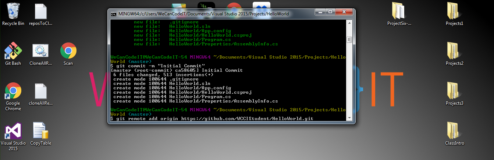</div>

- In your GitBash window, enter the following command (where "WCCIStudent" is your GitHub username): 

```bash
git remote add origin https://github.com/WCCIStudent/HelloWorld.git
```
- You can copy and paste this directly from GitHub to your GitBash window and press <mark>enter</mark>.

- Now that we have set up a relationship between the local repository on your desktop and your GitHub repository, let's do our first push.

## GitBash/GitHub cont.

<div float="right" class="img">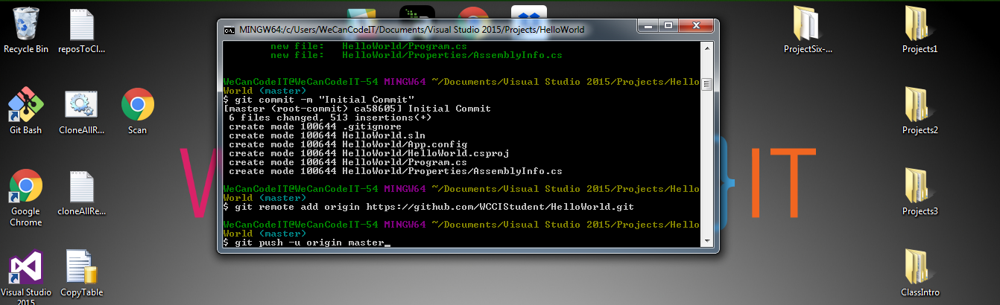</div>

- In your GitBash window, enter the following command: <mark>git push -u origin master</mark>

- You can copy and paste this directly from GitHub to your GitBash window and press <mark>enter</mark>.

## GitBash/GitHub cont.

<div float="right" class="img">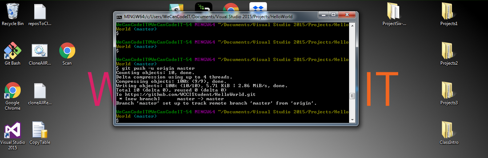</div>

- We have successfully pushed our local repository data to GitHub.

- We can check our success by returning to our GitHub page and refreshing the page.

## GitBash/GitHub cont.

<div float="right" class="img"></div>

- You will notice our page has changed. We now see our <mark>Program description</mark>

- We see our <mark>HelloWorld</mark> program directory, and our <mark>.gitignore</mark> and related files are present.

- Above the <mark>Code</mark> tab you will notice the following link <mark>WCCIStudent/HelloWorld</mark>. Select <mark>WCCIStudent</mark>

## GitBash/GitHub highlights

<div float="right" class="img">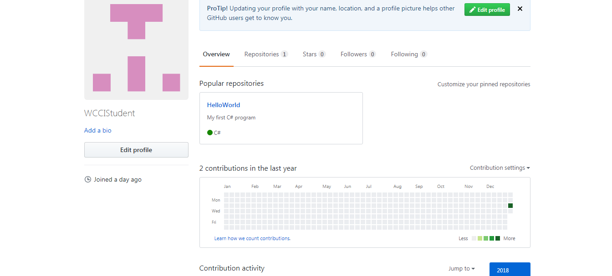</div>

- This page is your main GitHub profile page. We will spend some time in a future lesson updating this page.

- You will notice the <mark>Activity Grid</mark>, which at this point has one green square present.

- This grid will show prospective employers how much time you have spend coding. We will work to fill this grid with green squares.


## In conclusion

- We now have the foundation for saving our code and tracking code versions. 

- Going forward, we will create a new repository for every project or website we develop. 

- Likewise, we also have the tools which will allow others to collaborate with us on our programs.

- GitHub and GitBash offer developers many other tools which we will discuss in future lessons.

- Using GitHub and GitBash will become second nature, and you will shortly see the wide range of benefits these tools offer.

## Git Guide - Basic Commands


```
cd //navigates to desired directory

git init //initializes a local repository in GitBash

git add . //adds files to local repository

git commit -m "[message]" //commits with specified message

git push -u origin master //pushes local repository to GitHub
```

<style type="text/css">
.img:hover  {
        transform: scale(1.5);
        box-shadow: 0 0 10px rgba(0, 0, 0, 0.5);
    }

.img-center {
    display: block;
    margin-left: 0px;
    margin-right: auto;
	width: 40%;
	}
</style>