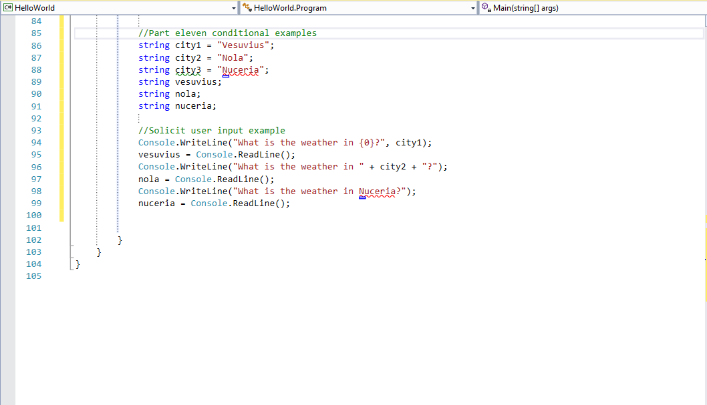

title: Conditionals
subtitle: If not that, then… ?
theme: league

## An Insightful Process

*This diagram isn't quite right. If you don't think learning to code is difficult, then you miiiight not get it yet.*

## Conditional Statements

- Conditional statements are one of the ways that we control the flow of a program.

- We control the flow by making decisions.

- Let's walk through the flow control diagram above.

## Heroes fight battles!!'

- Let's revisit our hero Spartacus in our Hello World program.

- If it's not already, open your <mark>HelloWorld</mark> program in Visual Studio.

- Spartacus, like all heroes, makes his living fighting battles.

- We will use conditional statements to help our hero do the following:

	- Choose which battle to fight

	- Choose what soldiers to take into battle.
	
## We should all be here

- Volunteer time

- Let's start by <mark>Commenting out</mark> part ten.

Question time: What are two of the methods we can use to comment code?

## if this then.....

- An <mark>if</mark> statement is exactly what it sounds like.

- We use if statements in code like we do in every day life. If the temperature is at least 80 degrees, I will go to the beach.

- Putting the above statement in code would look like this: if(temp >= 80)

In C#, we would say:

<pre><code class="language-C#">int temp = 81;
if (temp >= 80) {
  Console.WriteLine("I am going to the beach.");
}</code></pre>

Question time: If we executed this code, what would be the output?

Question time: How would we change the equality operator to make the conditional <mark>false</mark>?

## Where to go

- Now let's use the <mark>if</mark> statement to give our hero direction.

- Spartacus wants to go to battle, but doesn't want to march to the closest city.

- Our <mark>if</mark> statement in spoken language might read: If the city is less than 125 miles, then I will march there.

Question time: What would we need to add to our code to store the distances to each city?

Question time: What equality operator would we use in our conditional statement?

!SLIDE

Add the following code below part ten

- Once complete, execute the code with the following inputs: `126` `40` `55`

- Obviously our scope is small. This example is to show the working of the concept in its simplest form.

- It's important to understand each <mark>if</mark> in this example will be executed if the conditional statement is met.

- You may have noticed we included a few items we have not yet discussed, so let's review them.

## Strings again?

- Remember we use the <mark>Console.ReadLine()</mark> to receive input from the user via the console.

- C# reads all input from the console, regardless of format, as a string. So if we enter the number <mark>42</mark>, C# reads it as a string.

- C# is able to look at input from the user, and decide if that input is a <mark>string</mark>, <mark>int</mark>, <mark>double</mark>, <mark>float</mark> etc..

- We tell C# to review and format the input by using the <mark>Parse</mark> method.

- In our example, we use <mark>int.Parse</mark> to tell C# to convert the console input to an int.

- The same could be and should be done for <mark>double</mark>, <mark>float</mark> etc..

Question time: If we wanted to convert input from the console to a double and save it to a variable, what would our code look like?

## Who is going to march

- Now we need to make sure Spartacus has the best soldiers to go to battle.

- Our statement in spoken language would look as follows: If a soldier is an officer, or 26 years old or younger, they will go to battle, else they will stay home.

- We are introducing a new type of <mark>if</mark> called and <mark>if else</mark> statement. Let's review the following:

<pre><code class="language-C#">
Console.WriteLine("What is your rank?");
string rank = Console.ReadLine();

Console.WriteLine("What is your age?");
int age = int.Parse(Console.ReadLine());

if ((rank == "officer") || (age <= 26))
{ 
    Console.WriteLine("Get your gear, kiss your family goodbye, put on your marching boots.");
} 
else
{

    Console.WriteLine("Sorry, you are staying home.");
}
</code></pre>

- Notice we are using the <mark>||</mark> logical operator.

!SLIDE

- Comment out the previous code, and add the following code to your program

- Execute the code twice with the following inputs: <mark>officer 26</mark> then <mark>corporal 24</mark>.

- Notice the if statement is being executed, and if the conditional fails, the else statement will be printed.

Question time: When will the first statement be printed?

Notice the if statement is being executed, and if the conditional fails the else statement will be printed.

## And the fun continues

- So far we have reviewed and seen examples of the <mark>if</mark> and <mark>if else</mark> statements.

- We know if statments <mark>WILL</mark> be executed, and their values returned if the conditional statement is met.

- We know if else statements will be executed and the else will be executed if the conditional statement is <mark>NOT</mark>met.

- Finally we are going to learn about the <mark>if else if</mark> statement.

- Let's rewrite our prior <mark>if else</mark> statement into and <mark>if else if</mark>.

## If else if...

<pre><code class="language-C#">
Console.WriteLine("What is your rank soldier?");
string rank = Console.ReadLine();
            
Console.WriteLine("What is your age soldier?");
int age = int.Parse(Console.ReadLine());
        
Console.WriteLine("What is your job soldier?");
string job = Console.ReadLine();

if ((rank == "officer") || (age <= 26))
{
    Console.WriteLine("Get your gear, kiss your family goodbye, put on your marching boots.");
}
else if ((job == "cook") || (age >= 26))
{
    Console.WriteLine("My army has to eat. Pack your pots and pans");
}
else
{
    Console.WriteLine("Sorry you are staying home.");
}
</code></pre>

Question time: When would each statement execute? ie... if, else if, else

Execute your code. Use input that will test each part of the <mark>if esle</mark>statement.

## The switch is on!!

- The last remaing tool we will cover in this section is the <mark>Switch Case</mark>.

- Sometimes, we can use a `switch/case` statement to replace several `if/else` statements. 

- Let's say we are categorizing our army based on the following groups: infantry, archers, catapault, supply.

- We will use a soldiers job to decide what weapon they use.

!SLIDE

- Here is an example of a <mark>Switch Case</mark>. Add the following code to your Hello World project.

<pre><code class="language-C#">

switch(job)
{
    case "infantry":
        Console.WriteLine("You will carry a sword");
        break;

    case "archers":
        Console.WriteLine("You will carry a bow and arrow");
        break;

    case "supply":
        Console.WriteLine("You will carry pots and pans");
        break;
	
	case "catapault":
        Console.WriteLine("You will operate the catapault");
        break;

    default:
        Console.WriteLine("You will ride horseback");
        break;
    }
</code></pre>

## We should all be here

- Execute your code to ensure you get the results you are expecting. 

- Ensure you test all cases to include the <mark>default</mark>.

## Switch case explained

- Switch case statement is separated into four sections

	- The <mark>switch method</mark> which takes a variable. This variable acts as part of a conditional with the case statement.

	- The <mark>case</mark> statement whose value is compared to the variable in the switch method.

	- The <mark>output</mark> statement will be delivered when the comparison is true.

	- The <mark>break</mark> statement which has the effect of exiting the statement if the case statement is true.

	- Its important to note if none of othe case statments are true, the default case <mark>WILL</mark> be executed.

- For many students the <mark>switch case</mark> seems pretty daunting, but with practice will be a very useful tool.

