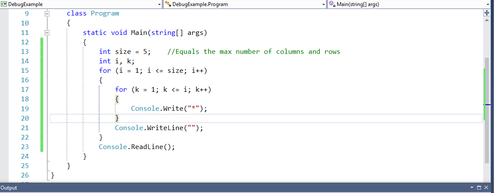
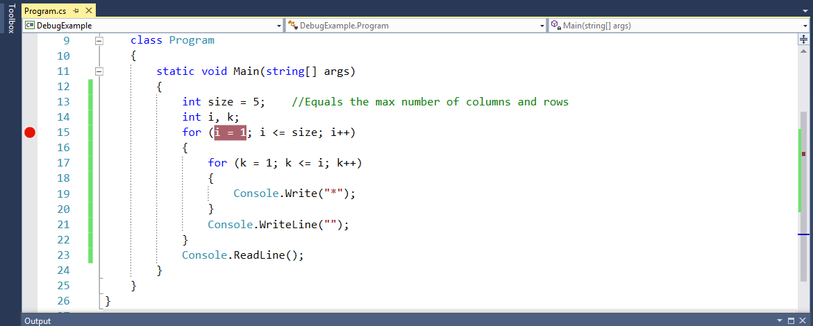
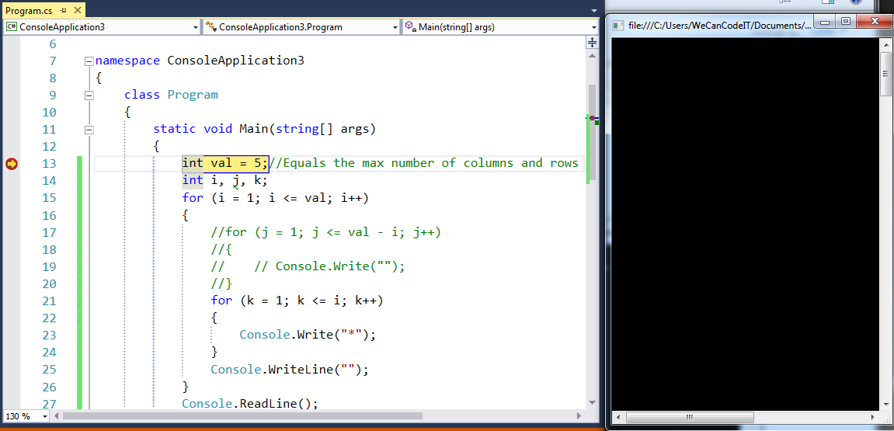

title: Visual Studio Debugger
subtitle: Why isn't my code working?
theme: league

!SLIDE

## Life is good until it's not!!'
 

- Here is one propecy I will make which I can guarentee will come true.

- You will one day feel exactly like this poor gentleman.

- The life of a programmer is full of peaks and valleys!

## You need tools and Visual Studio has Debugger

- In this exercise we are going to learn how to use VS Debugger

- We are going to perform the following Steps:

	- Create a console application in Visual Studio

	- Write code to build a half pyramid using the  <mark>*</mark>

	- Use Debugger to step through the code we have written

	- Observe the pyramid being built in the console, and understand the logical flow of the program.

## Lets get into IT!

	

- Open Visual Studio. From the *File* Menu, select *New > Project*.

- Select *Conole Application* from the *New Project* Window. Specify a *Project name* of *DebugExample*.

- Click the *Ok* button.

!SLIDE

- Now lets put some code in our application

- Our code will contain the following:

	- Three variables
	
	- Two nested for loops
	
	- Two Console.WriteLine()
	
	- One Console.ReadLine() 

	

	Question time: What is the function of the variables named <mark> i and k</mark>
	

!SLIDE

- By default, when Visual Studio opens <mark>Debug</mark> is selected on the Standard toolbar.

- Ensure <mark>Debug</mark> is selected in the Standard toolbar.

!SLIDE

- Now we want to select the logic or code we want to debug.

- We do this by setting a <mark>code break</mark>

- Place the mouse pointer on the far left of the application window on the light blue column.

- Find the number at the beginning of the code you want to debug and click the mouse.

- For the purposes of our application, line <mark>15</mark> is the begining of the code were we want to place the code break.

- The code break will be displayed by a red <mark>dot</mark> in the light blue column.

!SLIDE

- Now that we have our application ready to debug lets press <mark>Start</mark> on the Standard toolbar.

- You will now notice the <mark>Start</mark> button has changed to now read <mark>Continue</mark>.

- You will also notice a yellow <mark>arrow</mark> inside the red <mark>Code Break</mark>.

- Lets debug!!

!SLIDE

- You may have noticed when we pressesd <mark>Start</mark>, a console window opened up automatically.

- Lets adjust the our Visual Studio window and our console window so we can see both at the same time.

- Having both open will allow us to see the operation and the results of our debugging in real time.

!SLIDE

- If you look to the right of the Standard toolbar, you will now see <mark>four arrows</mark>.

- The arrow we will use for our debugging will be the second arrow which points straight down.

- If you hover over the arrow, you will see the arrow border turn yellow, and the lable <mark>Step into f11</mark> appear.

- Although each arrow has a purpose, and with practice you can experiment with their functions, we will use the <mark>Step Into</mark> arrow.

!SLIDE

- Finally as part of the debug process, watching the values of all the variable can be extremely valuable.

- To open the locals window, select the following:

	- From the <mark>Standard toolbar</mark> select <mark>Debug</mark>.

	- From the drop down menu, select <mark>Windows</mark>.

	- From the <mark>Windows</mark> drop down menu select <mark>Locals</mark>.

!SLIDE

- You should screen should now look like the one shown here. 

## Now its your turn to experiment

- Using the <mark>Step Into</mark> arrow, step through the code.

- Obvserve the following:

	- Notice with each click of the <mark>Step Into arrow</mark> the <mark>yellow highlighted</mark> section of code changes.

	- Each changes reflects the code which is currently being processed.

	- Notice the <mark>yellow arrow</mark> changes lines after a line of code is processed.

	- Notice the <mark>variables</mark> in the locals window change throughout the debug process.

	- Finally notice the <mark>console window</mark> displays the output of the code.

!SLIDE

- Hopfully you have taken your time and stepped carefully and slowly through the entire debug session.

- You will see, when complete, the screen shown above.

- The debugging process has many uses, the least of which is debugging.

- I challenge you to use debugging to help you understand how code logic works, and how code logic reacts.

- Finally as part of the testing process, you can use debugging to ensure the logic you wrote will deleliver the results you expect.

