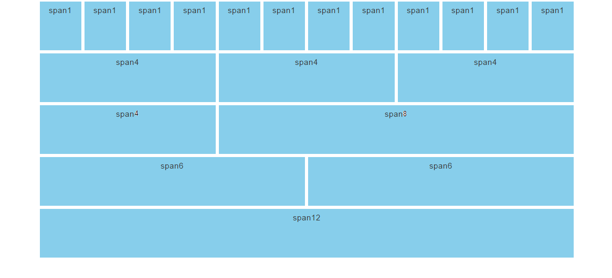
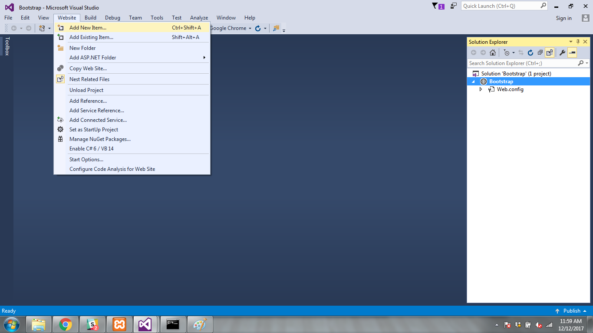
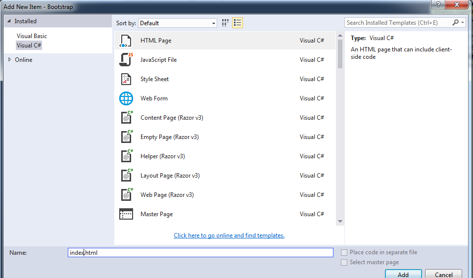
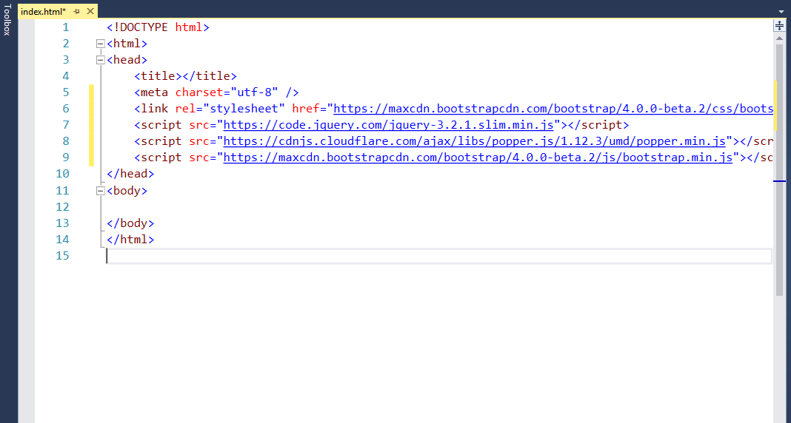
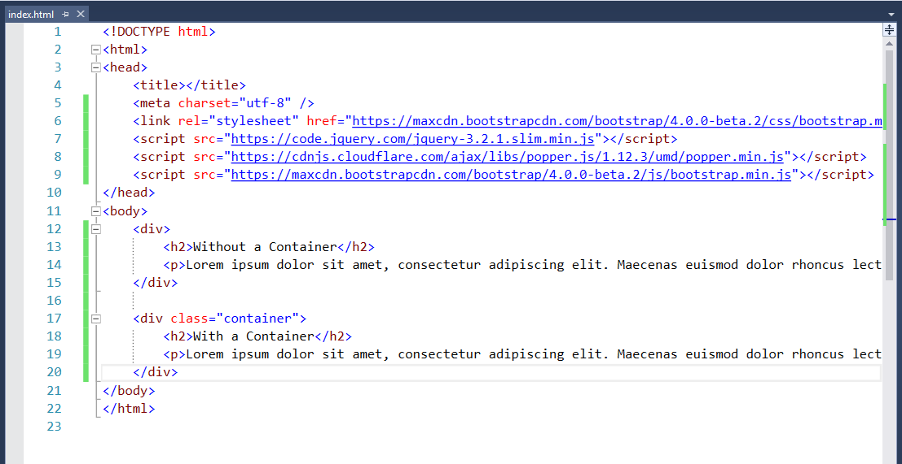
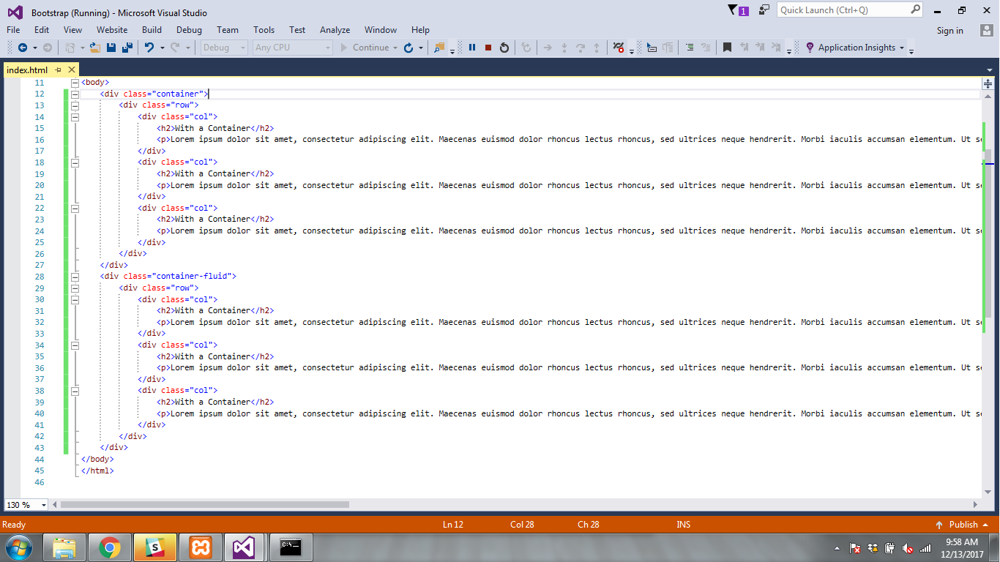
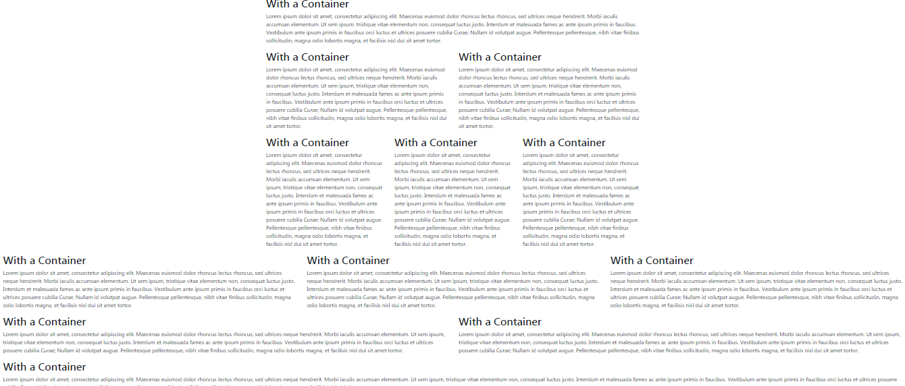

title: Bootstrap
subtitle: Build a Responsive website!!
theme: league

## Life Just Easier

 <div float="right" class="img"></div>

 - If you remember our journey through HTML, formatting a HTML page can be daunting, frustrating, almost impossible task.

 - We learned Cascading Styling Sheets (CSS) offer us greater flexibility and control in our web page developement process.

 - Now finally we will become masters using a tool which gives us a powerful flexbox grid system for building layouts of all shapes and sizes.

## Let's Learn Bootstrap

  <div float="right" class="img"></div>

 - Bootstrap uses a grid system which is composed of a series of containers, rows, and columns to layout and align content. 
 
 - Bootstrap is built with flexbox and is fully responsive.

 - The image above gives a representation of many different possible layouts of the Bootstrap grid.
 
 <div class="fragment">
 Question time: What are the max number of spans on a bootstrap grid?
 </div>

 <div class="fragment">
 Question time: What do we mean when we say "fully responsive"?
 </div>

## So Many Options

   <div float="right" class="img"></div>

 - As we can see, our options on how we layout our grid are almost unlimited.

 - So now lets discuss some of the terms we mentioned earlier.

	- Container: Containers provide a means to center your site’s contents.

	- There are two types of Containers you can utilize: `.container` and `.container-fluid.`

	- `.container` has one fixed width for each screen size in bootstrap (`xs`, `sm`, `md`, `lg`);
	
	- So what does this mean in English?

## .container Explained

```CSS
@media (min-width: 568px) {
  .container {
    width: 550px;
  }
}
@media (min-width: 992px) {
  .container {
    width: 970px;
  }
}
@media (min-width: 1200px) {
  .container {
    width: 1170px;
  }
}
```
- Let's say your browser window has a width of 700px.

- Because 700px is greater than the `.container` width of 550px, the `.container` width will be 550px

- The `.container` width will stay at 550px regardless of the browser size until the browser size reaches a min width of 992px.

- Once the browser window reaches 992px, the `.container` width will increase to 970px.

!SLIDE

```CSS
@media (min-width: 568px) {
  .container {
    width: 550px;
  }
}
@media (min-width: 992px) {
  .container {
    width: 970px;
  }
}
@media (min-width: 1200px) {
  .container {
    width: 1170px;
  }
}
```
<div class="fragment">
 Question time: What will happen to our .container width when our browser size reaches 1159px?
 </div>

 <div class="fragment">
 Question time: What will happen to our .container width when our browser size reaches 1200px?
 </div>

 <div class="fragment">
 Question time: What will happen to our .container width when our browser size reaches 991px?
 </div>

 
## Let's Practice

- Lets put what we learned to the test

    <div float="right" class="img"></div>

	- Open Visual Studio

	- Select File > New > WebSite

!SLIDE

   <div float="right" class="img"></div>

- Ensure <mark>Visual C#</mark> is selected under templates.

- Ensure <mark>ASP.NET Empty Web Site</mark> is highlighted.

- Select the <mark>Web Location Path</mark>.

- Use your right arrow key to navigate to the end of the location path.

- Change <mark>WebSite1</mark> to <mark>Bootstrap</mark>. 

- Your location address might have a value differant than <mark>WebSite1</mark>, not to worry just replace whatever value is there to <mark>Bootstrap</mark>

- Finally Select <mark>Ok</mark>.

## We should all be here!!

   <div float="right" class="img"></div>

## Let's add an HTML page

   <div float="right" class="img"></div>

- Select Website > Add New Item

!SLIDE

   <div float="right" class="img"></div>

- Ensure <mark>Visual C#</mark> is selected under templates.

- Ensure <mark>HTML Page</mark> is highlighted.

- Change the value in the <mark>Name</mark> field to <mark>index.html</mark> 

- Finally select <mark>Add</mark>

## We should all be here!!

   <div float="right" class="img"></div>   

## Let's Do Some Prep Work Next

- Before we can begin, we need to add three items to our index.html page.

```C#
<link rel="stylesheet" href="https://maxcdn.bootstrapcdn.com/bootstrap/3.3.7/css/bootstrap.min.css">
<script src="https://ajax.googleapis.com/ajax/libs/jquery/3.2.1/jquery.min.js"></script>
<script src="https://maxcdn.bootstrapcdn.com/bootstrap/3.3.7/js/bootstrap.min.js"></script>
```
- These three items are necessary for Bootstrap to function correctly.

- You will find current versions of these three items getbootstrap.com under Bootstrap CDN.

- Although you will find more current versions at getbootstrap.com, for our purposes and to ensure stablility of code, we will use the versions listed.

- You can find these versions if needed at [w3schools](https://www.w3schools.com/bootstrapbootstrap_get_started.asp) under <mark>MAXCDN</mark>

- Goto your class Slack channel, and you can copy and past the three items from Slack into the <mark>Head section</mark> of your index.html page.

## We should all be here!!

   <div float="right" class="img"></div>  
   
## Let's build our .container

 - The following code will build the `.container`.

 - Remember, the `.container` is responsible for the resposiveness of you webpage.

 - You must encapsulate the code you want to be reposnsive with a `.container` class.

 ```C#
<div> 
  <h2>Without a Container</h2>
  <p></p>
</div>

<div class="container"> 
  <h2>With a Container</h2>
  <p></p>
</div>
```
- Write the code you see listed above in between the <mark>body</mark> tags on your index.html page.

- Got your class Slack channel, and copy the information that was just posted.

- Paste the information in between the <mark>p</mark> tags in the body of your index.html.

## We should all be here!!

   <div float="right" class="img"></div>  

## Run It!!

- If you will notice there is a small <mark>asterisk</mark> on the index.html page tab next to the words index.html.

- This asterisk is there to remind you the page has not been saved.

- Before we select Google Chrome, let's go ahead and select the <mark>Single Floppy Disk</mark> right above the index.html tab.

- The asterisk is no longer there, so we can proceed.

- Select Google Chrome

- Once you browser opens, maximize it if it is not already.

## We should all be here!!

   <div float="right" class="img"></div>  

## Now let's talk about what we see

   <div float="right" class="img"></div>  

 Question time: What's the difference between the text in a container, and the text not encapsulated in a container?

 <div class="fragment">
- The text inside the container is centered inside the container.
 </div>

## Test It!!
   <div float="right" class="img"></div>  

- The container's size has been set inside the <mark>bootstrap.min.css</mark> we placed in the index.html head.

- Now let's shrink and enlarge the browser and see what what the responsiveness differences are between the two paragraphs.

<div class="fragment">
Let's get a volunteer to come up and demonstrate to the class.
</div>

<div class="fragment">
So let's discuss the differences we see.
</div>

## Let's add .container-fluid

- Go ahead and stop the program from running by selecting the <mark>red box</mark> on the Standard toolbar.

- Lets add a `.container-fluid` div to our code and compare the three.

- Add the following code to your index.html

- You can copy the <mark>p</mark> tag and its contents into the new `container-fluid` div.

```C#
<div> 
  <h2>Without a Container</h2>
        <p>Lorem ipsum dolor sit amet, consectetur adipiscing elit. Maecenas euismod dolor rhoncus lectus rhoncus, sed ultrices neque hendrerit. Morbi iaculis accumsan elementum. Ut sem ipsum, tristique vitae elementum non, consequat luctus justo. Interdum et malesuada fames ac ante ipsum primis in faucibus. Vestibulum ante ipsum primis in faucibus orci luctus et ultrices posuere cubilia Curae; Nullam id volutpat augue. Pellentesque pellentesque, nibh vitae finibus sollicitudin, magna odio lobortis magna, et facilisis nisl dui sit amet tortor.</p>
</div>

<div class="container"> 
  <h2>With a Container</h2>
        <p>Lorem ipsum dolor sit amet, consectetur adipiscing elit. Maecenas euismod dolor rhoncus lectus rhoncus, sed ultrices neque hendrerit. Morbi iaculis accumsan elementum. Ut sem ipsum, tristique vitae elementum non, consequat luctus justo. Interdum et malesuada fames ac ante ipsum primis in faucibus. Vestibulum ante ipsum primis in faucibus orci luctus et ultrices posuere cubilia Curae; Nullam id volutpat augue. Pellentesque pellentesque, nibh vitae finibus sollicitudin, magna odio lobortis magna, et facilisis nisl dui sit amet tortor.</p>
</div>

<div class="container-fluid"> 
  <h2>With a Container-fluid</h2>
        <p>Lorem ipsum dolor sit amet, consectetur adipiscing elit. Maecenas euismod dolor rhoncus lectus rhoncus, sed ultrices neque hendrerit. Morbi iaculis accumsan elementum. Ut sem ipsum, tristique vitae elementum non, consequat luctus justo. Interdum et malesuada fames ac ante ipsum primis in faucibus. Vestibulum ante ipsum primis in faucibus orci luctus et ultrices posuere cubilia Curae; Nullam id volutpat augue. Pellentesque pellentesque, nibh vitae finibus sollicitudin, magna odio lobortis magna, et facilisis nisl dui sit amet tortor.</p>
</div>

```
## We should all be here!!

   <div float="right" class="img"></div>  


## Run It!!

- Before we select Google Chrome, let's go ahead and select the <mark>Single Floppy Disk</mark> right above the index.html tab.

- The asterisk is no longer there, so we can proceed.

- Select Google Chrome

- Once you browser opens, maximize it if it is not already.

## We should all be here!!

   <div float="right" class="img"></div>  

## Now let's talk about what we see

   <div float="right" class="img"></div>  

<div class="fragment">
 Question time: Whats the difference between the text in each container, and the test not encapsulated in a container?
</div>

## Test It!!

   <div float="right" class="img"></div>  

- The container's size has been set inside the <mark>bootstrap.min.css</mark> we placed in the index.html head.

- Now let's shrink and enlarge the browser and see what what the responsiveness differences are between the three paragraphs.

<div class="fragment">
Let's get a volunteer to come up and demonstrate to the class.
</div>

<div class="fragment">
So let's discuss the differences we see.
</div>

## Hey wait, there's only one column per row

   <div float="right" class="img"></div>  

- So obviously we cannot build a website with one column per row!

- Let's add some columns to our code. I need a volunteer.

## Let's separate the masses

- Let's stop our program and go back to our index.html page in Visual Studio.

- Let's discuss our code

```C#
<div> 
  <h2>Without a Container</h2>
        <p>Lorem ipsum dolor sit amet, consectetur adipiscing elit. Maecenas euismod dolor rhoncus lectus rhoncus, sed ultrices neque hendrerit. Morbi iaculis accumsan elementum. Ut sem ipsum, tristique vitae elementum non, consequat luctus justo. Interdum et malesuada fames ac ante ipsum primis in faucibus. Vestibulum ante ipsum primis in faucibus orci luctus et ultrices posuere cubilia Curae; Nullam id volutpat augue. Pellentesque pellentesque, nibh vitae finibus sollicitudin, magna odio lobortis magna, et facilisis nisl dui sit amet tortor.</p>
</div>

<div class="container"> 
  <h2>With a Container</h2>
        <p>Lorem ipsum dolor sit amet, consectetur adipiscing elit. Maecenas euismod dolor rhoncus lectus rhoncus, sed ultrices neque hendrerit. Morbi iaculis accumsan elementum. Ut sem ipsum, tristique vitae elementum non, consequat luctus justo. Interdum et malesuada fames ac ante ipsum primis in faucibus. Vestibulum ante ipsum primis in faucibus orci luctus et ultrices posuere cubilia Curae; Nullam id volutpat augue. Pellentesque pellentesque, nibh vitae finibus sollicitudin, magna odio lobortis magna, et facilisis nisl dui sit amet tortor.</p>
</div>

<div class="container-fluid"> 
  <h2>With a Container-fluid</h2>
        <p>Lorem ipsum dolor sit amet, consectetur adipiscing elit. Maecenas euismod dolor rhoncus lectus rhoncus, sed ultrices neque hendrerit. Morbi iaculis accumsan elementum. Ut sem ipsum, tristique vitae elementum non, consequat luctus justo. Interdum et malesuada fames ac ante ipsum primis in faucibus. Vestibulum ante ipsum primis in faucibus orci luctus et ultrices posuere cubilia Curae; Nullam id volutpat augue. Pellentesque pellentesque, nibh vitae finibus sollicitudin, magna odio lobortis magna, et facilisis nisl dui sit amet tortor.</p>
</div>
```
<div class="fragment">
Question time: How did we separate each of our paragraphs?
</div>

<div class="fragment">
Question time: Could we call each <mark>div</mark> with a container class a row? The answer to this question might not be as straightforward as you may think. We will cover why in later slides.
</div>

## Let's do this

- Because we need container classes to create rows with columns, lets delete the div without a container class.

```C#
<div class="container"> 
  <h2>With a Container</h2>
        <p>Lorem ipsum dolor sit amet, consectetur adipiscing elit. Maecenas euismod dolor rhoncus lectus rhoncus, sed ultrices neque hendrerit. Morbi iaculis accumsan elementum. Ut sem ipsum, tristique vitae elementum non, consequat luctus justo. Interdum et malesuada fames ac ante ipsum primis in faucibus. Vestibulum ante ipsum primis in faucibus orci luctus et ultrices posuere cubilia Curae; Nullam id volutpat augue. Pellentesque pellentesque, nibh vitae finibus sollicitudin, magna odio lobortis magna, et facilisis nisl dui sit amet tortor.</p>
</div>

<div class="container-fluid"> 
  <h2>With a Container-fluid</h2>
        <p>Lorem ipsum dolor sit amet, consectetur adipiscing elit. Maecenas euismod dolor rhoncus lectus rhoncus, sed ultrices neque hendrerit. Morbi iaculis accumsan elementum. Ut sem ipsum, tristique vitae elementum non, consequat luctus justo. Interdum et malesuada fames ac ante ipsum primis in faucibus. Vestibulum ante ipsum primis in faucibus orci luctus et ultrices posuere cubilia Curae; Nullam id volutpat augue. Pellentesque pellentesque, nibh vitae finibus sollicitudin, magna odio lobortis magna, et facilisis nisl dui sit amet tortor.</p>
</div>
```
- Now let's create three columns in each container.

<div class="fragment">
Question time: Can someone explain how I would create three columns in each div?
</div>

!SLIDE

- Let's modify our code further to reflect the creation of columns. I need a volunteer.

- Replace your existing code in you index.html with the following slides

```C#
<div class="container">
	<div class="row"> 
		<div class="col"> 
			<h2>With a Container</h2>
			<p>Lorem ipsum dolor sit amet, consectetur adipiscing elit. Maecenas euismod dolor rhoncus lectus rhoncus, sed ultrices neque hendrerit. Morbi iaculis accumsan elementum. Ut sem ipsum, tristique vitae elementum non, consequat luctus justo. Interdum et malesuada fames ac ante ipsum primis in faucibus. Vestibulum ante ipsum primis in faucibus orci luctus et ultrices posuere cubilia Curae; Nullam id volutpat augue. Pellentesque pellentesque, nibh vitae finibus sollicitudin, magna odio lobortis magna, et facilisis nisl dui sit amet tortor.</p>
		</div>
		<div class="col"> 
			<h2>With a Container</h2>
			<p>Lorem ipsum dolor sit amet, consectetur adipiscing elit. Maecenas euismod dolor rhoncus lectus rhoncus, sed ultrices neque hendrerit. Morbi iaculis accumsan elementum. Ut sem ipsum, tristique vitae elementum non, consequat luctus justo. Interdum et malesuada fames ac ante ipsum primis in faucibus. Vestibulum ante ipsum primis in faucibus orci luctus et ultrices posuere cubilia Curae; Nullam id volutpat augue. Pellentesque pellentesque, nibh vitae finibus sollicitudin, magna odio lobortis magna, et facilisis nisl dui sit amet tortor.</p>
		</div>
		<div class="col"> 
			<h2>With a Container</h2>
			<p>Lorem ipsum dolor sit amet, consectetur adipiscing elit. Maecenas euismod dolor rhoncus lectus rhoncus, sed ultrices neque hendrerit. Morbi iaculis accumsan elementum. Ut sem ipsum, tristique vitae elementum non, consequat luctus justo. Interdum et malesuada fames ac ante ipsum primis in faucibus. Vestibulum ante ipsum primis in faucibus orci luctus et ultrices posuere cubilia Curae; Nullam id volutpat augue. Pellentesque pellentesque, nibh vitae finibus sollicitudin, magna odio lobortis magna, et facilisis nisl dui sit amet tortor.</p>
		</div>
	</div>	
</div>
```
!SLIDE

- Finish modifying your code

```C#
<div class="container-fluid"> 
	<div class="row"> 
		<div class="col"> 
			<h2>With a Container</h2>
			<p>Lorem ipsum dolor sit amet, consectetur adipiscing elit. Maecenas euismod dolor rhoncus lectus rhoncus, sed ultrices neque hendrerit. Morbi iaculis accumsan elementum. Ut sem ipsum, tristique vitae elementum non, consequat luctus justo. Interdum et malesuada fames ac ante ipsum primis in faucibus. Vestibulum ante ipsum primis in faucibus orci luctus et ultrices posuere cubilia Curae; Nullam id volutpat augue. Pellentesque pellentesque, nibh vitae finibus sollicitudin, magna odio lobortis magna, et facilisis nisl dui sit amet tortor.</p>
		</div>
		<div class="col"> 
			<h2>With a Container</h2>
			<p>Lorem ipsum dolor sit amet, consectetur adipiscing elit. Maecenas euismod dolor rhoncus lectus rhoncus, sed ultrices neque hendrerit. Morbi iaculis accumsan elementum. Ut sem ipsum, tristique vitae elementum non, consequat luctus justo. Interdum et malesuada fames ac ante ipsum primis in faucibus. Vestibulum ante ipsum primis in faucibus orci luctus et ultrices posuere cubilia Curae; Nullam id volutpat augue. Pellentesque pellentesque, nibh vitae finibus sollicitudin, magna odio lobortis magna, et facilisis nisl dui sit amet tortor.</p>
		</div>
		<div class="col"> 
			<h2>With a Container</h2>
			<p>Lorem ipsum dolor sit amet, consectetur adipiscing elit. Maecenas euismod dolor rhoncus lectus rhoncus, sed ultrices neque hendrerit. Morbi iaculis accumsan elementum. Ut sem ipsum, tristique vitae elementum non, consequat luctus justo. Interdum et malesuada fames ac ante ipsum primis in faucibus. Vestibulum ante ipsum primis in faucibus orci luctus et ultrices posuere cubilia Curae; Nullam id volutpat augue. Pellentesque pellentesque, nibh vitae finibus sollicitudin, magna odio lobortis magna, et facilisis nisl dui sit amet tortor.</p>
		</div>
	</div>	
</div>
``` 

## We should all be here!!

   <div float="right" class="img"></div>  

## Let's discuss what we have done

- We introduced a new class called `row`.

- Can someone explain why we used the class `row` instead of just placing the columns inside the containers by themsleves?

<div class="fragment">
- Wait!!! Let's not wonder what will happen, let's see what will happen. I need a volunteer.
</div>

## It's time to break something

- Let's remove the <mark>Row</mark> class from our .container.

```C#
<div class="container">
		<div class="col"> 
			<h2>With a Container</h2>
			<p>Lorem ipsum dolor sit amet, consectetur adipiscing elit. Maecenas euismod dolor rhoncus lectus rhoncus, sed ultrices neque hendrerit. Morbi iaculis accumsan elementum. Ut sem ipsum, tristique vitae elementum non, consequat luctus justo. Interdum et malesuada fames ac ante ipsum primis in faucibus. Vestibulum ante ipsum primis in faucibus orci luctus et ultrices posuere cubilia Curae; Nullam id volutpat augue. Pellentesque pellentesque, nibh vitae finibus sollicitudin, magna odio lobortis magna, et facilisis nisl dui sit amet tortor.</p>
		</div>
		<div class="col"> 
			<h2>With a Container</h2>
			<p>Lorem ipsum dolor sit amet, consectetur adipiscing elit. Maecenas euismod dolor rhoncus lectus rhoncus, sed ultrices neque hendrerit. Morbi iaculis accumsan elementum. Ut sem ipsum, tristique vitae elementum non, consequat luctus justo. Interdum et malesuada fames ac ante ipsum primis in faucibus. Vestibulum ante ipsum primis in faucibus orci luctus et ultrices posuere cubilia Curae; Nullam id volutpat augue. Pellentesque pellentesque, nibh vitae finibus sollicitudin, magna odio lobortis magna, et facilisis nisl dui sit amet tortor.</p>
		</div>
		<div class="col"> 
			<h2>With a Container</h2>
			<p>Lorem ipsum dolor sit amet, consectetur adipiscing elit. Maecenas euismod dolor rhoncus lectus rhoncus, sed ultrices neque hendrerit. Morbi iaculis accumsan elementum. Ut sem ipsum, tristique vitae elementum non, consequat luctus justo. Interdum et malesuada fames ac ante ipsum primis in faucibus. Vestibulum ante ipsum primis in faucibus orci luctus et ultrices posuere cubilia Curae; Nullam id volutpat augue. Pellentesque pellentesque, nibh vitae finibus sollicitudin, magna odio lobortis magna, et facilisis nisl dui sit amet tortor.</p>
		</div>
</div>

```

## We should all be here!!

   <div float="right" class="img"></div>

## Run It!!

- Before we select Google Chrome, let's go ahead and select the <mark>Single Floppy Disk</mark> right above the index.html tab.

- The asterisk is no longer there, so we can proceed.

- Select Google Chrome

- Once you browser opens, maximize it if it is not already.

## We should all be here!!

   <div float="right" class="img"></div>

<div class="fragment">
Question time: So let's answer the question I posed earlier in the slides. Can we call each div with a container class a row?
</div>

<div class="fragment">
No!! 
</div>

<div class="fragment">
- Although a container may look like a row, it's a container!! Let's picture a container.
</div>

<div class="fragment">
<div float="right" class="img"></div>
</div> 

!SLIDE

- When we create a container, no matter if it is a `.container` or a `.container-fluid`, what we have done is create a defined space in which to set up our <mark>responsive</mark> page structure.

- We then have the flexibilty using the `row` and `column` classes to build our website to meet our design needs.

<div class="fragment">
- Question time: How many rows can we place in a container?
</div>

<div class="fragment">
- Question time: How many columns can we place in a container?
</div>

<div class="fragment">
- Task time: Let's answer those two questions through coding. I would like each of you to create the following page by modifying your index.html page.
</div>

<div class="fragment">
   <div float="right" class="img"></div>
</div>

## Let's style our page ever further

- If we look at our page, our columns are all the same size in each row.

- In the real world, we wouldn't be so lucky as to use a simple design like this.

- Let's learn another tool which will help us to dicate the size of our columns and make the column sizes different for each column.

- By design, the Bootstrap grid is 12 spans in width.

- Let's look back at the default grid we presented in an earlier slide.

<div class="fragment">
   <div float="right" class="img"></div>
</div>

!SLIDE


   <div float="right" class="img"></div>


- If you notice, each span has a number: Span 1, Span 4, Span 6, Span 8, Span 12

<div class="fragment">
Question time: Who can explain to the class what the numbers tell us in each of the spans?
</div>

<div class="fragment">
The numbers signify how many units of spans each column is taking.
</div>

<div class="fragment">
Question time: So if I needed 3 columns of the exact same size, what size would I make each span?
</div>

<div class="fragment">
Remember, a Bootstrap grid is 12 units across. When you set the sizes for your columns, <b>they must total 12 units</b>.
</div>

<div class="fragment">
Volunteer Time!!
</div>


!SLIDE

- Let's make the following changes to the code.

```C#
	<div class="container">
		<div class="row">
			<div class="col">
				<h2>With a Container</h2>
				<p>Lorem ipsum dolor sit amet, consectetur adipiscing elit. Maecenas euismod dolor rhoncus lectus rhoncus, sed ultrices neque hendrerit. Morbi iaculis accumsan elementum. Ut sem ipsum, tristique vitae elementum non, consequat luctus justo. Interdum et malesuada fames ac ante ipsum primis in faucibus. Vestibulum ante ipsum primis in faucibus orci luctus et ultrices posuere cubilia Curae; Nullam id volutpat augue. Pellentesque pellentesque, nibh vitae finibus sollicitudin, magna odio lobortis magna, et facilisis nisl dui sit amet tortor.</p>
			</div>
		</div>
		<div class="row">
			<div class="col-4">
				<h2>With a Container</h2>
				<p>Lorem ipsum dolor sit amet, consectetur adipiscing elit. Maecenas euismod dolor rhoncus lectus rhoncus, sed ultrices neque hendrerit. Morbi iaculis accumsan elementum. Ut sem ipsum, tristique vitae elementum non, consequat luctus justo. Interdum et malesuada fames ac ante ipsum primis in faucibus. Vestibulum ante ipsum primis in faucibus orci luctus et ultrices posuere cubilia Curae; Nullam id volutpat augue. Pellentesque pellentesque, nibh vitae finibus sollicitudin, magna odio lobortis magna, et facilisis nisl dui sit amet tortor.</p>
			</div>
			<div class="col-8">
				<h2>With a Container</h2>
				<p>Lorem ipsum dolor sit amet, consectetur adipiscing elit. Maecenas euismod dolor rhoncus lectus rhoncus, sed ultrices neque hendrerit. Morbi iaculis accumsan elementum. Ut sem ipsum, tristique vitae elementum non, consequat luctus justo. Interdum et malesuada fames ac ante ipsum primis in faucibus. Vestibulum ante ipsum primis in faucibus orci luctus et ultrices posuere cubilia Curae; Nullam id volutpat augue. Pellentesque pellentesque, nibh vitae finibus sollicitudin, magna odio lobortis magna, et facilisis nisl dui sit amet tortor.</p>
			</div>
		</div>
		<div class="row">
			<div class="col-2">
				<h2>With a Container</h2>
				<p>Lorem ipsum dolor sit amet, consectetur adipiscing elit. Maecenas euismod dolor rhoncus lectus rhoncus, sed ultrices neque hendrerit. Morbi iaculis accumsan elementum. Ut sem ipsum, tristique vitae elementum non, consequat luctus justo. Interdum et malesuada fames ac ante ipsum primis in faucibus. Vestibulum ante ipsum primis in faucibus orci luctus et ultrices posuere cubilia Curae; Nullam id volutpat augue. Pellentesque pellentesque, nibh vitae finibus sollicitudin, magna odio lobortis magna, et facilisis nisl dui sit amet tortor.</p>
			</div>
			<div class="col-8">
				<h2>With a Container</h2>
				<p>Lorem ipsum dolor sit amet, consectetur adipiscing elit. Maecenas euismod dolor rhoncus lectus rhoncus, sed ultrices neque hendrerit. Morbi iaculis accumsan elementum. Ut sem ipsum, tristique vitae elementum non, consequat luctus justo. Interdum et malesuada fames ac ante ipsum primis in faucibus. Vestibulum ante ipsum primis in faucibus orci luctus et ultrices posuere cubilia Curae; Nullam id volutpat augue. Pellentesque pellentesque, nibh vitae finibus sollicitudin, magna odio lobortis magna, et facilisis nisl dui sit amet tortor.</p>
			</div>
			<div class="col-2">
				<h2>With a Container</h2>
				<p>Lorem ipsum dolor sit amet, consectetur adipiscing elit. Maecenas euismod dolor rhoncus lectus rhoncus, sed ultrices neque hendrerit. Morbi iaculis accumsan elementum. Ut sem ipsum, tristique vitae elementum non, consequat luctus justo. Interdum et malesuada fames ac ante ipsum primis in faucibus. Vestibulum ante ipsum primis in faucibus orci luctus et ultrices posuere cubilia Curae; Nullam id volutpat augue. Pellentesque pellentesque, nibh vitae finibus sollicitudin, magna odio lobortis magna, et facilisis nisl dui sit amet tortor.</p>
			</div>
		</div>
	</div>
```
!SLIDE

- Lets make some changes to the .container-fluid code.

```C#
	<div class="container-fluid"> 
		<div class="row">
			<div class="col">
				<h2>With a Container</h2>
				<p>Lorem ipsum dolor sit amet, consectetur adipiscing elit. Maecenas euismod dolor rhoncus lectus rhoncus, sed ultrices neque hendrerit. Morbi iaculis accumsan elementum. Ut sem ipsum, tristique vitae elementum non, consequat luctus justo. Interdum et malesuada fames ac ante ipsum primis in faucibus. Vestibulum ante ipsum primis in faucibus orci luctus et ultrices posuere cubilia Curae; Nullam id volutpat augue. Pellentesque pellentesque, nibh vitae finibus sollicitudin, magna odio lobortis magna, et facilisis nisl dui sit amet tortor.</p>
			</div>
			<div class="col-4">
				<h2>With a Container</h2>
				<p>Lorem ipsum dolor sit amet, consectetur adipiscing elit. Maecenas euismod dolor rhoncus lectus rhoncus, sed ultrices neque hendrerit. Morbi iaculis accumsan elementum. Ut sem ipsum, tristique vitae elementum non, consequat luctus justo. Interdum et malesuada fames ac ante ipsum primis in faucibus. Vestibulum ante ipsum primis in faucibus orci luctus et ultrices posuere cubilia Curae; Nullam id volutpat augue. Pellentesque pellentesque, nibh vitae finibus sollicitudin, magna odio lobortis magna, et facilisis nisl dui sit amet tortor.</p>
			</div>
			<div class="col-7">
				<h2>With a Container</h2>
				<p>Lorem ipsum dolor sit amet, consectetur adipiscing elit. Maecenas euismod dolor rhoncus lectus rhoncus, sed ultrices neque hendrerit. Morbi iaculis accumsan elementum. Ut sem ipsum, tristique vitae elementum non, consequat luctus justo. Interdum et malesuada fames ac ante ipsum primis in faucibus. Vestibulum ante ipsum primis in faucibus orci luctus et ultrices posuere cubilia Curae; Nullam id volutpat augue. Pellentesque pellentesque, nibh vitae finibus sollicitudin, magna odio lobortis magna, et facilisis nisl dui sit amet tortor.</p>
			</div>
		</div>
		<div class="row">
			<div class="col-9">
				<h2>With a Container</h2>
				<p>Lorem ipsum dolor sit amet, consectetur adipiscing elit. Maecenas euismod dolor rhoncus lectus rhoncus, sed ultrices neque hendrerit. Morbi iaculis accumsan elementum. Ut sem ipsum, tristique vitae elementum non, consequat luctus justo. Interdum et malesuada fames ac ante ipsum primis in faucibus. Vestibulum ante ipsum primis in faucibus orci luctus et ultrices posuere cubilia Curae; Nullam id volutpat augue. Pellentesque pellentesque, nibh vitae finibus sollicitudin, magna odio lobortis magna, et facilisis nisl dui sit amet tortor.</p>
			</div>
			<div class="col-3">
				<h2>With a Container</h2>
				<p>Lorem ipsum dolor sit amet, consectetur adipiscing elit. Maecenas euismod dolor rhoncus lectus rhoncus, sed ultrices neque hendrerit. Morbi iaculis accumsan elementum. Ut sem ipsum, tristique vitae elementum non, consequat luctus justo. Interdum et malesuada fames ac ante ipsum primis in faucibus. Vestibulum ante ipsum primis in faucibus orci luctus et ultrices posuere cubilia Curae; Nullam id volutpat augue. Pellentesque pellentesque, nibh vitae finibus sollicitudin, magna odio lobortis magna, et facilisis nisl dui sit amet tortor.</p>
			</div>
		</div>
		<div class="row">
			<div class="col">
				<h2>With a Container</h2>
				<p>Lorem ipsum dolor sit amet, consectetur adipiscing elit. Maecenas euismod dolor rhoncus lectus rhoncus, sed ultrices neque hendrerit. Morbi iaculis accumsan elementum. Ut sem ipsum, tristique vitae elementum non, consequat luctus justo. Interdum et malesuada fames ac ante ipsum primis in faucibus. Vestibulum ante ipsum primis in faucibus orci luctus et ultrices posuere cubilia Curae; Nullam id volutpat augue. Pellentesque pellentesque, nibh vitae finibus sollicitudin, magna odio lobortis magna, et facilisis nisl dui sit amet tortor.</p>
			</div>
		</div>
	</div>
``` 
## Run It!!

- Before we select Google Chrome, let's go ahead and select the <mark>Single Floppy Disk</mark> right above the index.html tab.

- The asterisk is no longer there, so we can proceed.

- Select Google Chrome

- Once you browser opens, maximize it if it is not already.

- Our page is to large to show on a slide, so does everyone's look like our volunteers page?


<style type="text/css">
.img:hover  {
        transform: scale(1.5);
        box-shadow: 0 0 10px rgba(0, 0, 0, 0.5);
    }
.img-center {
    display: block;
    margin-left: 0px;
    margin-right: auto;
	width: 40%;
}
</style>