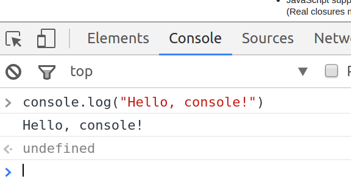
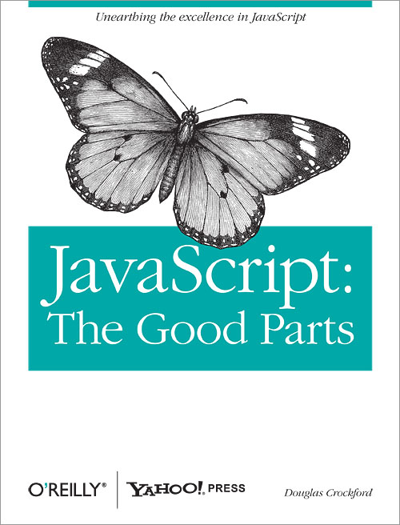

title: Java vs JavaScript
subtitle: <em>"Who… run… Bartertown?"</em>
theme: league

# Java vs JavaScript


<p><q>Java is to Javascript as ham is to hamster.</q> ―Jeremy Keith</p>

# Differences

Java                |vs |JavaScript
-------------------:|---|:---------
compiled            ||interpreted (usually)
write once, run (almost) anywhere||subject to differences in execution environments
statically typed    ||dynamically typed
classical inheritance - a class inherits from another class||prototypal (or prototypical) inheritance - an object delegates to another object (its *prototype*)

# Welcome to the console

- Chrome Developer tools, ways to get there:
  - Tools Menu->Developer tools
  - Shift+Ctrl+I
  - Right click an element and select *Inspect*
- Click the *Console* tab

  

  - `<- undefined` indicates the return value
  - implements what is known as a **R**ead **E**valuate **P**rint **L**oop (REPL)

# Writing to the console

### Java

```Java
System.out.println("my message");
```

### JavaScript

```JavaScript
console.log("my message");
```

# Dynamic languages

- no type-checking or compilation: 'bad' code is executed
- variables have no type

### Java (statically typed)

```Java
String number = "42";
number = 42; // Error!
```

### JavaScript (dynamic)

```JavaScript
var number = "42";
number = 42;
number = 42.0;
number = new Date(); // ? ¯\_(ツ)_/¯
```

Names are more important than ever in a dynamic language.

*Be Careful!* If you do not use `var` to declare a JavaScript variable, it will be created automagically in the global scope. This can cause you pain.

# Arrays

### Java

```Java
String[] menuItems = { "steak", "escargot", "tacos de pescado" };
```

### JavaScript

```JavaScript
var menuItems = [ "steak", "escargot", "tacos de pescado" ];
```
Square brackets, not curly brackets.

## Iterating by index

### Java

```Java
String[] menuItems = { "steak", "escargot", "tacos de pescado" };
for(int idx = 0; idx < menuItems.length; idx++) {
  System.out.println(menuItems[idx]);
}
```

### JavaScript

```JavaScript
var menuItems = [ "steak", "escargot", "tacos de pescado" ];
for (var idx = 0; idx < menuItems.length; idx++) {
  console.log(menuItems[idx]);
}
```

## Iterating with forEach

### Java

```Java 
String[] menuItems = { "steak", "escargot", "tacos de pescado" };
for(String item: menuItems) {
  System.out.println(item);
}
```

### JavaScript

```JavaScript
var menuItems = [ "steak", "escargot", "tacos de pescado" ];
menuItems.forEach(function(element) {
  console.log(element)
});
```

The function argument to `forEach` above is known as a *callback* function. JavaScript has a heavy focus on *functional* programming.

Java's `Collection` interface has a similar `forEach` method (in version 8 and above) for functional programming.

# Functional Programming

Java 8 introduced functional programming features, the most significant change in the language since Java 5.

```Java
List<String> menuItems
  = Arrays.asList("steak", "escargot", "tacos de pescado");
menuItems.forEach(System.out::println);
// or…
menuItems.forEach(item -> System.out.println(item));
```

This is equivalent to the JavaScript from the previous slide:

```JavaScript
var menuItems = [ "steak", "escargot", "tacos de pescado" ];
menuItems.forEach(function(element) {
  console.log(element)
});
```

## Functions are first-class citizens

Storing a function in a variable:
```
> var sayHello = function(arg) {
    console.log("Hello, I'm a function");
  }
<- undefined
```

Getting its value:

```
> sayHello // value of sayHello
<- function (arg) {
    console.log("Hello, I'm a function");
  }
```

Executing the function:

```
> sayHello() // calling sayHello
  Hello, I'm a function
```

# JavaScript Object Notation (JSON)

```JavaScript
function VirtualPet() {}; // constructor
VirtualPet.prototype = {
  hunger: 20,
  feed: function() {
    this.hunger = this.hunger - 5;
  },
  isHungry: function() {
    return this.hunger >= 30;
  }
};
var fido = new VirtualPet();
```

JavaScript inheritance is *prototypal*, which means that objects delegate to a *prototype* associated with the function that created them.

Demo: Fido is always hungry, Bobo is never hungry.

*Encapsulation* in JavaScript is more difficult.

## Also JSON - instead of Maps

### Java

```Java
Map<String, String> prices = new HashMap<String, String>();
prices.put("steak", "34.95");
prices.put("tacos de pescado", "19.95");

for (Entry<String, String> entry : prices.entrySet()) {
  System.out.println(entry.getKey() + ": " + entry.getValue());
}
```

### JavaScript

```JavaScript
var prices = {
  "steak": "34.95",
  "tacos de pescadot": "19.95"
};

for (var item in prices) {
  console.log(item + ": " + prices[item]);
}
```

## Also Also JSON

JavaScript objects are a lot like maps. In our previous example, we were really iterating over the properties of a JavaScript object. Try this:

```JavaScript
function VirtualPet() {}; // constructor
VirtualPet.prototype = {
  hunger: 20,
  feed: function() {
    this.hunger = this.hunger - 5;
  }
};
var fido = new VirtualPet();

console.log("Fido's hunger before feeding is " + fido.hunger);
fido.feed();

console.log("After feeding:");
for (var attr in fido) {
  console.log(attr + ": " + fido[attr]);
}
```

# Arrays are Maps?

```
> var myArray = [ "fee", "fie", "foe" ]
<- undefined
> myArray
  ▼ (3) ["fee", "fie", "foe"]
      0: "fee"
      1: "fie"
      2: "foe"
      length: 3
    ▶ __proto__: Array(0)
<- undefined
```

## So far, so good…

```
> myArray[3] = "fum"
<- "fum"
> myArray
  ▶ (4) ["fee", "fie", "foe", "fum"]
```

Ok, that makes sense. Let's try:
```
> myArray[42] = "fourty-two"
<- "fourty-two"
> myArray
  ▼ (43) ["fee", "fie", "foe", undefined x 38, "fourty-two"]
      0: "fee"
      1: "fie"
      2: "foe"
      42: "fourty-two"
      length: 43
    ▶ __proto__: Array(0)
<- undefined
> myArray[23]
  undefined
<- undefined
```

## How about…

```
> myArray["wat"] = "Welcome to JavaScript!"
<- "Welcome to JavaScript!"
> myArray
  ▼ (43) ["fee", "fie", "foe", undefined x 38, "fourty-two"]
      0: "fee"
      1: "fie"
      2: "foe"
      42: "fourty-two"
      wat: "Welcome to JavaScript!"
      length: 43
    ▶ __proto__: Array(0)
```

Notice that the length of the array is still 43. Now try:

```
> myArray.wat
  Welcome to JavaScript!
```

Wat?

## Duck Typing

Common to dynamic languages.


If it looks like a duck, swims like a duck, and quacks like a duck, then it probably is a duck. *Quack!*

## Recommended Reading

If you'd like to get deeper into JavaScript than we will be, this is a great place to start.

