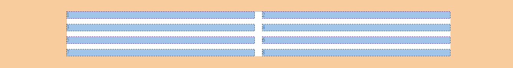
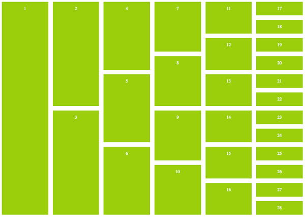

title: CSS Grid
subtitle: Finally! Rows and columns in CSS!
theme: league

## CSS Layouts

- CSS Layouts before Grid and Flexbox were, in all honesty, a nightmare. 

- That's because until recently, CSS wasn't really equipped to handle content layout.

- We had to use all manners of tricks, overrides, or just flat-out violation of separation of concerns to get our web pages laid out properly. 

- This included having to include `<div>` tags in our code that were unnecessary and using percentage based measurements to make columns. (Cue mad scientist laughter)

- No longer my friends!

## CSS Grid vs. Flexbox

- There are two new layout tools available to us in CSS.

- We use CSS Grid for two-dimensional page design.

- Flexbox is used for one-dimensional placement of objects inside of individual containers.

- We are going to go through Grid now.

## Let's do some prep work

- Add another HTML page to your SuperDopeWebSite.

- Name your new HTML page <mark>gridEx</mark>.

- Add another stylesheet to your SuperDopeWebSite.

- Name your new stylesheet <mark>styleTwo</mark>.

- Link your styleTwo file to your gridEx.html page

## We should all be here

- Close your index.html and your style.css pages.

- You should now have two tabs open 

    <div float="right" class="img"></div>


## Grid

- The first thing you need to start using grid is a grid container.

- We accomplish that with `display: grid;` on the containing element

- Add the following code to your gridEx.html page.

```HTML
<body>
	<div class="container">
		<!-- All of the code in the body goes here -->
	</div>
</body>
```
- Add the following code to your styleTwo.css page.

```css
/*style.css*/
.container {
    display: grid;
}
```
## Grid Items

- Grid items are any children of your grid container.

- Add the following code to your gridEx.html page.

- Select save all, then select Google Chrome.

```html
<div class="container">
        <section class="grid-item grid-item-1">1</section>
        <section class="grid-item grid-item-2">2</section>
        <section class="grid-item grid-item-3">3</section>
        <section class="grid-item grid-item-4">4</section>
        <section class="grid-item grid-item-5">5</section>
</div>
```

## What have we created

- Select F12 to open the Chrome Developers Tools window.

- Select the arrow on the top left of the Chrome Developer Tools window and hover over the top of the gridEx.html page.

- You will see four distinct containers.

    <div float="right" class="img"></div>

## Container

- One of the first things developers need to address is the way our content goes from one edge of the page to the other. 

- There aren't a lot of websites out there that use a layout like this. 

- So here is a common container setting that will limit the size of your content and make it look a little neater

- Add the following code to your styleTwo.css page.

- Select save all, then select Google Chrome.

```css
.container {
    display: grid;
    margin: 2rem auto 2rem auto;
    width: 1000px;
}
```

## We should all be here

- Let's step through what's happening here.

    <div float="right" class="img"></div>

!SLIDE

- This line of code is saying that we want our container to have a width of 1000px. 

- Since our viewport is larger than 1000px, our container will be slimmer and have some space between itself and the edges of the window.

<pre><code class="language-css" data-noescape>
.container {
    display: grid;
    margin: 2rem auto 2rem auto;
    <mark>width: 1000px;</mark>
}
</code></pre>

!SLIDE

- This line of code is saying that we want to have `2rem` units of space on the top and bottom of our container. 

- The `auto` keyword is telling our browser to take whatever space is left on the sides and distribute it evenly, effectively centering our container.

<pre><code class="language-css" data-noescape>
.container {
    display: grid;
    <mark>margin: 2rem auto 2rem auto;</mark>
    width: 1000px;
}
</code></pre>

- Notice the repetition? 

- There is a shorthand when both top/bottom AND right/left share the same values.

- Rewrite your code as follows: `2rem auto`

- It will be written this way in following slides. Ok, back to actual grid syntax.

## Grid Columns

- So as you can see, grid layout on its own does nothing for your content. 

- This is because by default your grid is set to have only one column and one row. 

- So this essentially leaves your content looking like it's still displayed as block level elements. 

- Let's add another column

- Add the following code to your styleTwo.css page.

- Select save all, then select Google Chrome.

```css
.container {
    display: grid;
    grid-template-columns: 500px 500px;
    margin: 2rem auto;
    width: 1000px;
}
```

## We should all be here

- Let's step through what's happening here.

    <div float="right" class="img"></div>

- Now we have two columns set to 500px each effectively making a 2 column grid.

- The more values you put into `grid-template-columns`, the more columns you will create.


!SLIDE

- We can now add items to our grid and they will fall in place the same way! 

- Add 3 more items that look the same as the first 5 with updated numbers. Don't forget classes!

    <div float="right" class="img"></div>


## Grid Rows

- Great! Now we can make columns, and we can make as many as we want! 

- Now what about rows? Well rows don't work very differently. 

- Let's make 4 rows and make them grow, and then shrink in size, like this

- Add the following code to your styleTwo.css page.

- Select save all, then select Google Chrome.

```css
.container {
    display: grid;
    grid-template-columns: 500px 500px;
    grid-template-rows: 100px 200px 200px 100px;
    margin: 2rem auto;
    width: 1000px;
}
```

## We should all be here

- Let's step through what's happening here.

    <div float="right" class="img"></div>

!SLIDE

- Same as columns, you will have as many rows as you declare.

- So, if you remove the last value, the row will take up only as much space as the content requires.

```css
.container {
    display: grid;
    grid-template-columns: 500px 500px;
    grid-template-rows: 100px 200px 200px;
    margin: 2rem auto;
    width: 1000px;
}
```
This gives you:

## We should all be here

- Let's step through what's happening here.

    <div float="right" class="img"></div>


- But let's put that back.

## Gutters

- So, last big concern with how our grid is looking. Spacebetweenthegridcells. See what I mean?

- Our content sort of runs together the way it is currently. So, let's look into putting some separation between all that content.

- We have `grid-column-gap` and `grid-row-gap`. 

- I'm sure you might guess by now, there is a way to combine the two and that's what we're going to use.

- Add the following code to your styleTwo.css page.

- Select save all, then select Google Chrome.

<pre><code class="language-css" data-noescape>
.container {
    display: grid;
    /*The first value handles row gap, the second handles col gap*/
    <mark>grid-gap: 15px 20px;</mark>
    grid-template-columns: 500px 500px;
    grid-template-rows: 100px 200px 200px 100px;
    margin: 2rem auto;
    width: 1000px;
}
</code></pre>

## We should all be here

- Let's step through what's happening here.

- Notice that we now have some comfortable space between all of our grid cells.

    <div float="right" class="img"></div>

- Uh oh. Now we have our right column overflowing out of our container!

- There must be some way to prevent such a catastrophe.

- I guess we'll just have to find out after...

## Practice!

- Time to take a little while to put what you just learned into practice.

Navigate to [the practice exercise](https://github.com/donhamiltoniii/css-grid-static-practice) in your browser and follow the instructions to get started.

# Flexible Grids

## fr Unit

- We last left off with a grid that looks pretty good. 

- We had nice, organized content in two columns with four sized rows, nicely centered in our page.

- Then, we added gutters which fixed the problem of condensed content but created a whole new problem, OVERFLOWING COLUMNS!

- This is no good. This is no good at all.

- So it looks like we need something like a dynamic column measurement, i.e. some way to say we want two columns that should be equal and not be affected by the size of our gutters.

- If the title didn't give it away, it's the `fr` (fraction) unit. 

- This unit does exactly that. Let's see it in action.

!SLIDE

- `fr` is used the same way we were using our `px` measurements in our earlier example. 

- So, let's change the code to use this new unit instead.

- Add the following code to your styleTwo.css page.

- Select save all, then select Google Chrome.

```css
.container {
    display: grid;
    grid-gap: 15px 20px;
    grid-template-columns: 1fr 1fr;
    grid-template-rows: 100px 200px 200px 100px;
    margin: 2rem auto;
    width: 1000px;
}
```
## We should all be here

- You'll notice that we now have a grid that looks very much like what we were going for the first time.

- The columns obviously aren't exactly `500px` wide but that's ok.


    <div float="right" class="img"></div>

- I'm not a fan of that repetition though. Let's take care of that with...

## repeat()

- Oh CSS functions, how I love thee. 

- The repeat function takes two arguments, first, the number of columns (or rows) you want, and what value you want them to have.

- Let's change our code in TWO places to use this new function.

- Select save all, then select Google Chrome.

<pre><code class="language-css" data-noescape>
.container {
display: grid;
grid-gap: 15px 20px;
grid-template-columns: <mark>repeat(2, 1fr)</mark>;
grid-template-rows: 100px <mark>repeat(2, 200px)</mark> 100px;
margin: 2rem auto;
width: 1000px;
}
</code></pre>

- Notice that you are able to use this function inline with other size declarations no problem.

## Other Notable Values

- You can use ANY measurement unit you have at your disposal as column/row values. Some to be especially aware of are:

| Unit | Function |
| ---- | -------- |
| `%` | Percentage units will take up whatever percentage you declare of the containing element |
| `em/rem` | `em/rem` will do the same as you're used to. Fixed but much more flexible than `px` |
| `auto` | This unit is a big one. Auto will take up any remaining space in a fixed container. If the container isn't fixed, it will push elements to the edge of the viewport and take up all space in between. |

## Container revisited

- So our columns are behaving flexibly now but our container still has a fixed width.

- I'm not ok with that and you shouldn't be either.

- Let's make some changes to make it a little less rigid.

```css
.container {
    display: grid;
    grid-gap: 15px 20px;
    grid-template-columns: repeat(2, 1fr);
    grid-template-rows: 100px repeat(2, 200px) 100px;
    margin: 2rem auto;
    max-width: 1000px;
    width: 90%;
}
```

- Again, let's dive a little deeper:

!SLIDE

- So, what used to be `width` is now `max-width`.

<pre><code class="language-css" data-noescape>
.container {
    display: grid;
    grid-gap: 15px 20px;
    grid-template-columns: repeat(2, 1fr);
    grid-template-rows: 100px repeat(2, 200px) 100px;
    margin: 2rem auto;
    <mark>max-width: 1000px;</mark>
    width: 90%;
}
</code></pre>

- This style rule is saying the container can be any width in pixels up to `1000px`. Once it hits `1000px`, it stops expanding.

!SLIDE

- And now our `width` is set to `90%`

<pre><code class="language-css" data-noescape>
.container {
    display: grid;
    grid-gap: 15px 20px;
    grid-template-columns: repeat(2, 1fr);
    grid-template-rows: 100px repeat(2, 200px) 100px;
    margin: 2rem auto;
    max-width: 1000px;
    <mark>width: 90%;</mark>
}
</code></pre>

- Since `max-width` is a flexible rule, `width` takes precedence until the condition for `max-width` is met.

- So when our viewport is slimmer than `1000px`, the width of our container is `90%`.

## Spanning Columns and Rows

- So now you have this great grid set up and all of your content is looking GREAT (**without using a framework**).

- But maybe you want one of your elements to take up a whole row or maybe two cells in a column or maybe both! 

- Ahhh! Does it seem like Grid has lost its efficiency?

<div class="fragment">
    
</div>

<div class="fragment">
    Question time: If I wanted to set individual columns and rows, what plan of attack should we use?
</div>

!SLIDE

- We can use the commands on individual items to achieve this functionality.

- For example, if we wanted to have the first item span both columns in our grid.

- Add the following code to your styleTwo.css page.

- Select save all, then select Google Chrome.

```css
.grid-item-1 {
    grid-column-start: 1;
    grid-column-end: 3; /*What? Why 3? There's only 2 columns.
    Don't worry, we'll get there*/
}
```

!SLIDE

- Which will give us the following result:

<div float="right" class="img"></div>

- But let's get back to that 3

## Grid lines

- `grid-column-start` and `grid-column-end` are referring to what are known as grid lines.

<div style="text-align: auto;">


</div>

- There are both four column and four row lines in the grids above.

- The left image shows the third column line while the right image shows the third row line.

- This is what we're referencing when in `grid-column-start` and `grid-column-end`

!SLIDE

- What if, for some reason, you didn't know how many columns you have? 

- How would you reference the last grid line?

- Well, grid is pretty resourceful that way. 

- You can use negative numbers to reference grid lines in reverse order so the last grid line is -1, the second to last is -2, third to last -3, etc.

- **Thus, we can always reference the last grid line with -1.**

- So the following does the same as our current code:
```css
.grid-item-1 {
    grid-column-start: 1;
    grid-column-end: -1;
}
```

!SLIDE

- But, what if we just wanted our item to span two columns no matter how many columns there are?

- There's a solution for that, too. For that we use a shorthand that combines the two rules into one.

- The first parameter applies a value to `grid-column-start`, the second to `grid-column-end`

- Add the following code to your styleTwo.css page.

- Select save all, then select Google Chrome.

```css
.grid-item-1 {
    grid-column: 1 / span 2;
}
```
Let's see the result by adding a third column.
```css
/*inside of the .container rules*/
grid-template-columns: repeat(3, 1fr);
```

!SLIDE

Here's what we get from that:

<div float="right" class="img"></div>

## Handling content

- I would suggest only explicitly sizing either your columns or your rows unless you have a very specific reason to explicitly size both.

- Usually, I would only put values on columns and let your content size the rows for you.

- We'll look at how to handle your content inside of a grid cell another time. For now, it's time for more...

## Practice!

- The following slides are examples of CSS Grid models.

- Recreate each model exactly as they are shown including color.

## Practice One

<div float="right" class="img img-center"></div>

## Practice Two

<div float="right" class="img img-center"></div>

## Practice Three

<div float="right" class="img img-center"></div>

## Practice Four

<div float="right"></div>

## Practice Five

<div float="right" class="img img-center"></div>

### Other Resources
- [Intro to CSS Grid Layout](https://mozilladevelopers.github.io/playground/)
- [Grid by Example](https://gridbyexample.com/)
- [An Introduction to CSS Grid Layout: Part 1](https://hacks.mozilla.org/2017/10/an-introduction-to-css-grid-layout-part-1/)
- [A Complete Guide to Grid](https://css-tricks.com/snippets/css/complete-guide-grid/)

<style type="text/css">
.img:hover  {
        transform: scale(1.5);
        box-shadow: 0 0 10px rgba(0, 0, 0, 0.5);
    }
.img-center {
    display: block;
    margin-left: 0px;
    margin-right: auto;
	width: 40%;
	}
</style>


