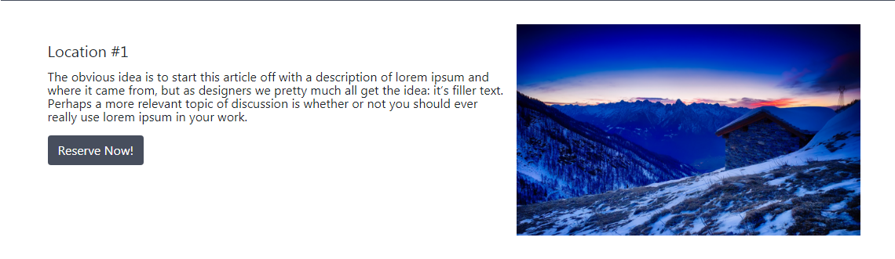
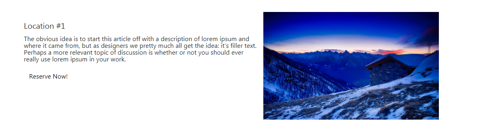
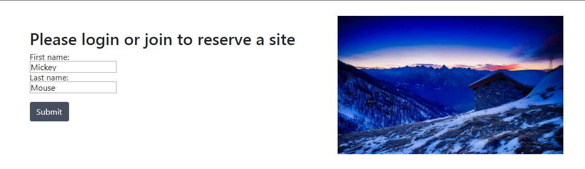
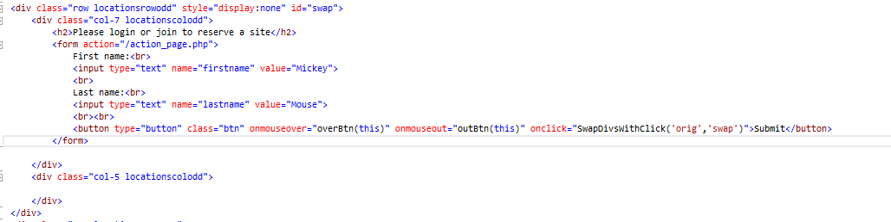
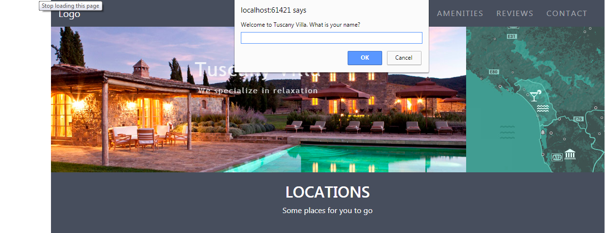
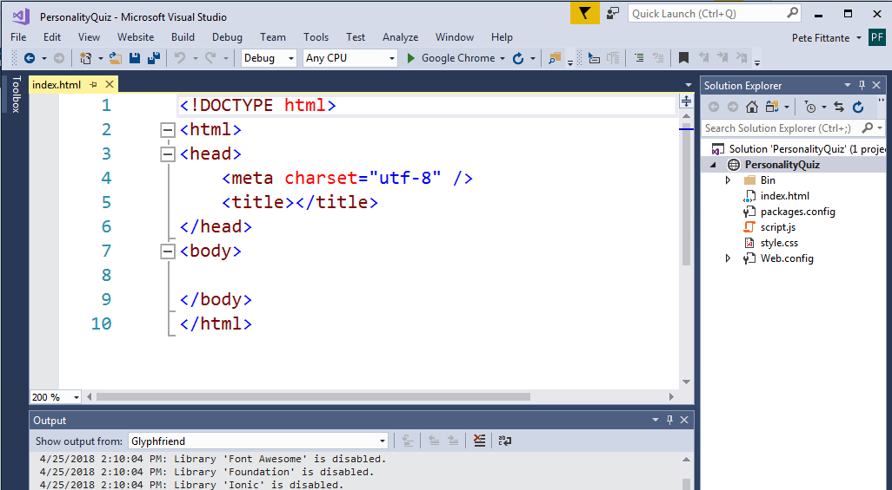
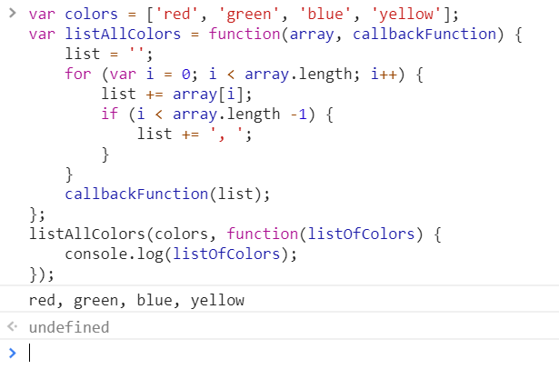

title: JavaScript
subtitle: Like C# but better!
theme: league

## What is JavaScript?

- JavaScript is a **dynamic**, **weakly typed**, **prototype-based** programming language.

- Many of you notice there will be parts of JavaScript that remind you of C#.

- JavaScript is mostly used on the front-end or client-side of web applications.

- But now, JavaScript is able to be used as a full-stack tool for developing robust web applications thanks to **Node.js**

- We will only be going through using JavaScript on the front-end to add interactivity with our end user.

## HTML DOM or Document Object Model

- Before we get started, let's discuss a very important concept you will need to understand.

- When a web page is loaded, the browser creates a <mark>Document Object Model</mark> of the page.

- The HTML DOM model is constructed as a tree of Objects:

<div style="text-align:center" class="img"></div>

## Dynamic HTML

- With the object model, JavaScript gets all the power it needs to create dynamic HTML.

- Here are some example of what you can accomplish using JavaScript:

	- JavaScript can change all the HTML elements in the page
	- JavaScript can change all the HTML attributes in the page
	- JavaScript can change all the CSS styles in the page
	- JavaScript can remove existing HTML elements and attributes
	- JavaScript can add new HTML elements and attributes
	- JavaScript can react to all existing HTML events in the page
	- JavaScript can create new HTML events in the page


## Let's do this

- We could create a blank website and practice, but I feel working with an existing website would be beneficial.

- Go to the following GitHub link, and clone [Tuscany Villa](https://github.com/pfittante1001/Villa).

- Open Tuscany Villa.

- Add a new JavaScript page named <mark>villaScript</mark>

- Place a source reference to `villaScript.js` in your head section above `style.css`

## We should all be here

<div style="text-align:center" class="img1"></div>


## How to include JS

- We can include JavaScript in our page very similarly to how we include CSS.

- Like CSS, there are 3 options (and two of them are not advised).

- Question Time: What are the three methods you can use to implement CSS?

## Inline

- We can include JavaScript right inside of our HTML elements. (Your separation-of-concerns sense should be tingling right now):

- Go to lines <mark>53-54</mark> of your index page and enter/update the following code:

```html
<h2 onclick=" this.style.color = 'red';">LOCATIONS</h2>
<p onclick=" this.style.color = 'yellow';">Some places for you to go</p>
```
- Save and open your browser by selecting Google Chrome.

- Browse to the <mark>Locations</mark> subheader and click on both lines of text.

- You should get the following:

<div style="text-align:center" class="img1"></div>

## Inside Script Tags

- You can also write JavaScript directly inside your HTML by enclosing it in `<script>` tags within the `<body>`

- Go to line 240 of your index pages and enter the following code:

```HTML
<script>
        function myFunction() {
        var x = document.getElementById("jumbomain");
        x.getElementsByTagName("h1")[0].style.fontSize = "50px";
        x.getElementsByTagName("p")[0].style.fontSize = "50px";
        x.getElementsByTagName("h1")[0].style.color = "red";
        x.getElementsByTagName("p")[0].style.color = "red";
    };
</script>
```
- Update lines <mark>43-44</mark> as follows:

```HTML
<h1 onclick="myFunction()">Tuscany Villa</h1>
<p onclick="myFunction()">We specialize in relaxation</p>
```
- Question Time: What section of code will this script affect, and what will be the result?

!SLIDE

Before

<div style="text-align:center" class="img1"></div>


<div class="fragment">
After

<div style="text-align:center" class="img1"></div>
</div>

## Linking an External JS File (Do this one!)

- Finally, similar to CSS, you can link JS code from an external file.

- This is ideal because it keeps your code organized and concerns separated.

- You connect the file to your HTML with the `<script>` tag like your `style.css`


## External is where it is at

- Just like external CSS, we can keep our JavaScript separate from our HTML.

- Copy the following code and paste it into villaScript.js

```Javascript
function overBtn(x) {
	x.style.backgroundColor = "white";
	x.style.color = "black";
    }

function outBtn(x) {
	x.style.backgroundColor = "#474e5d";
	x.style.color = "white";
    }
```
- Make the following changes to the Reserve Now! button located on line 61 of your HTML.

```HTML
<button type="button" class="btn" onmouseover="overBtn(this)" 
   onmouseout="outBtn(this)">Reserve Now!</button>
```
- Question Time: What section of code will this script affect, and what will be the result?

!SLIDE
- Before mouseover
<div class="fragment">
<div style="text-align:center" class="img1"></div>

</div>
<div class="fragment">
- During mouseover
<div style="text-align:center" class="img1"></div>

</div>
<div class="fragment">
- After mouseover
<div style="text-align:center" class="img1"></div>
</div>

## So how does this whole thing work you ask
 
 - Let's make another change to our site which I think you will find extremely useful

 - After we make this change we will dicuss each part of the code

 - Copy and paste the following code into villaScript.js

 ```Javascript
function SwapDivsWithClick(div1,div2)
{
    d1 = document.getElementById(div1);
    d2 = document.getElementById(div2);
   if( d2.style.display == "none" )
   {
        d1.style.display = "none";
        d2.style.display = "flex";
   }
   else
   {
        d1.style.display = "flex";
        d2.style.display = "none";
   }
}
```
!SLIDE

- Paste the following code on line 67 of index.html by inserting a blank line:

```HTML
<div class="row locationsrowodd" style="display:none" id="swap">
   <div class="col-7 locationscolodd">
      <h2>Please login or join to reserve a site</h2>
      <form action="/action_page.php">
         First name:<br>
         <input type="text" name="firstname" value="Mickey">
         <br>
         Last name:<br>
         <input type="text" name="lastname" value="Mouse">
         <br><br>
         <button type="button" class="btn" onmouseover="overBtn(this)" onmouseout="outBtn(this)" onclick="SwapDivsWithClick('orig','swap')">Submit</button>
      </form>

      </div>
      <div class="col-5 locationscolodd">

      </div>
   </div>
```
- Replace the button on line 61 of index.html with the following code:

```HTML
<button type="button" class="btn" onmouseover="overBtn(this)" onmouseout="outBtn(this)" 
  onclick="SwapDivsWithClick('orig','swap')">Reserve Now!</button>
```
- Update line 57 with the following:

```HTML
<div class="row locationsrowodd" style="display:flex" id="orig">
```
## We should all be here

<div style="text-align:center" class="img1"></div>

- Now click on the button and you should have the following

<div style="text-align:center" class="img1"></div>


## Let's discuss the code

<div style="text-align:center" class="img1"></div>

<div style="text-align:center" class="img"></div>

## Some things look familiar

- In the code we have seen the use of the following:
	
- Functions:
```Javascript
onmouseover="overBtn(this)" onmouseout="outBtn(this)" onclick="SwapDivsWithClick(
   'orig','swap')" function SwapDivsWithClick(div1,div2)
```
- Variables:
```Javascript
d1 = document.getElementById(div1);
d2 = document.getElementById(div2);
```
- Parameters:
```Javascript
onmouseover="overBtn(this)" onmouseout="outBtn(this)" onclick="SwapDivsWithClick('orig','swap')"
```
- CSS Styling:
```Javascript
d1.style.display = "none";
d2.style.display = "flex";
```
- The concept behind the use of the tools we have used throughout the course is the same with JavaScript.

- Because JavaScript takes advantage of the DOM and is rooted in the concept of OOP, our options are almost limitless.

## To be sucessful in using JavaScript, you must understand...

- With JavaScript, you want to manipulate HTML elements.

- To do so, you have to find the elements first. There are a couple of ways to do this:

- Finding HTML elements by **id**: `document.getElementById();`
- Finding HTML elements by **tag name**: `document.getElementsByTagName();`
- Finding HTML elements by **class name**: `document.getElementsByClassName();`
- Finding HTML elements by **CSS selectors**: `document.querySelectorAll();`
- Finding HTML elements by **HTML object collections**:
```Javascript
var x = document.forms["frm1"];
var text = "";
var i;
for (i = 0; i < x.length; i++) {
	text += x.elements[i].value + " ";
}
document.getElementById("demo").innerHTML = text;
```

## Let's look at some more tools

- JavaScript allows you to send and receive messages from your user in a number of ways.

- The first ones we're going to talk about are boxes.

- There are three types of boxes:

	- alert
	- confirm
	- prompt

- Let's explore them in more detail.

## Alert

- Alert boxes allow you to send a message that your user can read when an action is performed.

- Replace the submit button located on line 77 of your index.html with the following code:

```html
<button type="button" class="btn" onmouseover="overBtn(this)" onmouseout="outBtn(this)" onclick="SwapDivsWithClick('orig', 'swap'); Redirect();">Submit</button>
```
- Paste the following code into villaScript.js

```JavaScript
function Redirect() {
	alert('You are being redirected');      
	}
```
- Select <mark>Reserve Now!</mark> then select <mark>Submit</mark>

## We should all be here

<div style="text-align:center" class="img1"></div>


## Confirm

- Confirm boxes actually perform a action based on a boolean.

- This way, you can interact with your user and get some kind of feedback from them.

- When your user clicks ok in the confirm box, you get a **true** value, and an action is performed.

- When they click cancel, you get a **false** value, and an action is not performed:


- Paste the following code into villaScript.js:

```JavaScript
function Redirect(x) {
    var confirmButton = document.getElementById(x);
    var userResponse = confirm('You are about to leave this site. If you want to stay, please select cancel.');
    var displayContainer = document.getElementById('confirmResponse');
    var displayMessage = '';
    if (userResponse) {
        var win = window.open("https://www.tuscanyaccommodation.com/tuscany-villas/?gclid=EAIaIQobChMIlcqH3bzi2QIVDEwNCh1Xbg9DEAAYAyAAEgLW1vD_BwE", '_blank');
        win.focus();
    } }
```
- Paste the following code to line 78 of index.html by inserting a blank line:

```HTML
 <output name="result" id="confirmResponse"></output>
 ```

## Prompt

- Prompt works very similar to to confirm.

- It accepts input from your user as well.

- This time, the value is a `string` so you can get specific information from your user and use it however you want.

- Replace the `<body>` tag located on line 14 of index.html with the following code:

```html
<body onload="Greeting()">
```

- Add the following code to villaScript.js.

```JavaScript
function Greeting() {
        var x = document.getElementById("jumbomain");
        var userResponse = prompt('Welcome to Tuscany Villa. What is your name?');
        x.getElementsByTagName('h1')[0].innerText = 'Welcome to Tuscany Villa ' + userResponse;
      }
```
!SLIDE

- When we load our site, we can take input from the user and use it however we want.

- We prompt the user upon load of our site:

<div style="text-align:center" class="img1"></div>

- We take the user input and use it in another element:

<div style="text-align:center" class="img1"></div>


## Variables

- As we have seen, JS uses variables just like we have in C#.

- Since JS isn't statically typed, we don't have to expressly tell JS what type of variable we have.

- This is a cool feature but it can also get you into trouble.

- For example, if you're trying to do some sort of math operation and accidentally pass a boolean value instead of a number, you'll get unexpected functionality.

- Variables are declared in JS using the `var` keyword, like so:

```JavaScript
var myNumber = 42;
var myString = 'Hello world'
var myFunction = function() {
    // I do stuff
}
```
- With these variables declared, you can now use them inside your code.

- These are more useful than literals because you can reference them as many times as you want without having to explicitly define them again.

## Other useful comparisons

- Some of the concepts we used in C# are the same when using JavaScript. Here some examples:

- Tools like **concatenation**, **comparison operators**, **logical** and **mathematical operators** all work the same.

- There are 2 additional comparison operators I would like to highlight: <mark><code>===</code></mark> and <mark><code>!==</code></mark>

- These have more specificity than `==` and `!=`

- With the less specific operators, if two objects have the same value, they are considered equal.

- The more specific versions, however, will compare the types *and* values, e.g.

```javascript
5 == '5' // true
5 === '5' // false
```


## Arrays

- Arrays in JS are way more useful than the arrays we're used to. 

- They're **mutable**, which means you can alter them.

- There are two ways to declare an array:

```javascript
var myFavoriteFruits = ['bananas', 'oranges', 'papaya', 'mango', 'pineapple'];
var myEmptyArray = new Array(5);
```
Similar to what we're used to, these arrays are also zero-indexed and have a built-in **length** property.

- Let's use an array as well as some of the other tools we have in our Tuscany Villa website.

!SLIDE

- Replace the code at line 160 of your index.html with the following code:

```HTML
<div class="col-4 square bg text" id="villachoice">
```

- Insert the following code at line 167 of your index.html by inserting a blank line:

```HTML
<div class="col-4 square bg text" id="villaswap" style="display:none">
    <div class="content">
        <p class="lochead">Available Villas</p>
        <p class="locp" id="villout"></p>
        <input id="buttonloc" type="submit" value="Return" onmouseover="overBtn(this)" onmouseout="outBtn(this)" onclick="SwapDivsWithClick('villachoice', 'villaswap');">
    </div>
</div>
```

!SLIDE

- Paste the following code into your villaScript.js
```JavaScript
function GetVilla() {
    var villaArray = new Array(0);
     var userResponse = confirm('Would you like to check the availability of a Villa?');
     while(userResponse) {
        var villa = prompt('Please enter the name of a villa');
        userResponse = confirm('Would you like to add another Villa?');
        villaArray.push(villa);     
     } 
     var d = new Date();
     var m = d.getMonth();   
     var x = document.getElementById("villaswap");
     if (m > 0 && m < 4) {
         x.getElementsByTagName('p')[1].innerText = villaArray[0];
     } else if (m > 3 && m < 7) {
         x.getElementsByTagName('p')[1].innerText = villaArray[1];
     } else if (m > 6 && m < 10) {
         x.getElementsByTagName('p')[1].innerText = villaArray[2];
     } else if (m > 9 && m < 13) {
         x.getElementsByTagName('p')[1].innerText = villaArray[3];
     } else {
         x.getElementsByTagName('p')[1].innerText = 'Sorry we have no villas available';
     }
}
```
## Push and Pop

- As we have seen in our recent JS code, we can add and remove items to the end of our arrays using the `.push()` and `.pop()` methods.

```JavaScript
//This adds the value of the user input 'villa' to the end of our villaArray.
villaArray.push(villa);     

//This removes the last element from our villaArray
villaArray.pop(villa);     
```
## Have you had enough of Tuscany Villa?

- Let's switch gears and build a fun application.

- In this application, we will really expand out JavaScipt toolbox.

- We are going to us the tools we have already learned HTML, CSS, and Bootstrap combined with JavaScript to build a personality quiz.

- Let's create a new blank ASP.NET empty website in Visual Studio.

- Let's name it <mark>PersonalityQuiz</mark>

!SLIDE

- We will utilize pair programming to accomplish this task.

- Create a blank <mark>site.css</mark> file.

- Create a blank <mark>script.js</mark> file.

- We should all be here.
<div class="fragment">
<div style="text-align:center" class="img1"></div>

</div>

!SLIDE

- Lets start by creating the inital greetings box on the <mark>index.html</mark> page.

- Enter the following code on your <mark>index.html</mark> file.

```HTML
<div id="quizContainer">

<h1>What kind of animal ?</h1>

<div id="quizZone">

    <p>Click <strong>Start Quiz</strong> to find out!</p>

    <button>Start Quiz</button>

</div>
````


!SLIDE

- The object of this website is to ask the user five questions.

- Based on the answers the user give, the website will choose the users spirit animal.

- We will use no other HTML pages to accomplish this task.

- When the user selects the <mark>Start Quiz</mark> button, the following MUST appear.

!SLIDE

- We are going to need to incorporate a Javascript solution to complete this application

- Lets discuss some of the code we will use.

- We are going to use Javascript to do the heavy lifting in our website.

- Some of the things we are going use JS for are as follows:
	- Define the questions and answers
	- Associate an answer with a pet
	- Keep track of the number of times a pet is chosen
	- Keep track of the index number for each question
	- Funtions that allow JS to perform all the necessary requirements.

!SLIDE

- The first step in our process is to create some variables.

- These variable will be used to keep track of the number of times a pet is chosen.

- Copy and paste the following code in your <mark>script</mark> file:

````HTML
// This keeps track of the number of questions the student has answered that match each result
// It will be reset each time the quiz starts
const scoreKeeper = {
    dog: 0,
    cat: 0,
    parrot: 0,
    turtle: 0,
};
````
## We should all be here

<div style="text-align:center" class="img1"></div>

- Next we need to create a counter to keep track of the index number of the question we are on

- Enter the following code in your <mark>script.js</mark> file.

```HTML
let currentQuestionIndex = 0;
````
!SLIDE

- Our next task is to enter the questions, the answers to each question, and the animal chosen based on each choice.

- Enter the following code in your <mark>script.js</mark> file.

```HTML
const questions = [
    {
        text: 'What are you most likely to be doing at a party?',
        options: [
            {
                text: 'Playing games and making new friends',
                point: 'dog',
            },
            {
                text: 'Watching from a corner, hoping someone interesting shows up',
                point: 'cat',
            },
            {
                text: 'Partying! Dressed up, chatting it up, dancing... maybe a little loud',
                point: 'parrot',
            },
            {
                text: 'I would help set up beforehand and make sure everything goes smoothly',
                point: 'turtle',
            },
        ],
    }
]
````
!SLIDE

- Lets take a minute to discuss the structure of the previous code.

- Questions can be added and modified freely.

- Each question must have the same structure.

- The whole `questions` variable is an array, with square brackets: []

- Individual questions are objects, with curly braces: {}

- The options/answers of each question are another array: []

- Each option is its own object {} with two properties: text and point

!SLIDE

- We will come back later and add the remaining questions.

- Lets create the JS functions which will allow our website to operate.

- Our first function will start the quiz.

- Enter the following code into your <mark>script.js</mark> file.

```HTML
function startQuiz() {

    // This puts a message in the console
    // Press Ctrl+Shift+I to open the console in Chrome
    // (Google how to open the dev tools in your browser if you're not sure)
    console.log('Quiz started!');

    // Reset score
    // This loops over each of the properties in the object
    for (let result in scoreKeeper) {
        // We are setting that property's value back to zero
        scoreKeeper[result] = 0;
    }

    // Ask first question
    // This function is defined below
    // We are passing the first question in our questions array into this function
    askQuestion(questions[0]);
}
````
!SLIDE

- Enter the following code into your <mark>script.js</mark> file.

- The first part of this funtion is the Clear quiz zone.

- First we get the element in the HTML by using its "id" value.
    
- Next, while it still has a "first child element", we remove that element.

- This will continue until the parent is empty.

```HTML
// Display Question
function askQuestion(question) {
    let quizZone = document.getElementById('quizZone');
    while (quizZone.firstChild) {
        quizZone.removeChild(quizZone.firstChild);
    }
````
!SLIDE

- Enter the following code into your <mark>script.js</mark> file.

- This next part of the function will render the question. 

- We will create HTML elements here and is basically the same as writing <p>My paragraph</p> in HTML

```HTML
    let questionP = document.createElement('p');
    questionP.innerText = question.text;
    quizZone.appendChild(questionP);
````
!SLIDE

- Enter the following code into your <mark>script.js</mark> file.

- This next part of our function will create a box to hold answers.

- These are more elements that we are creating from scratch.

```HTML
    let answerDiv = document.createElement('div');
    answerDiv.setAttribute('id', 'quizAnswers');
    quizZone.appendChild(answerDiv);
````
!SLIDE

- Enter the following code into your <mark>script.js</mark> file.

- The next part of our function render the answers choices for each question.

- Lets discuss the operation of the forEach loop we see in this render section 

	- Here, we say:
		- take my question
		- take its 'options' property (an array)
		- for each element in that array, do a thing
		- and then, inside the forEach() parentheses, we describe that thing
		- option` is this individual option

```HTML
question.options.forEach((option, i) => {

// Create a list item for this option
let optionDiv = document.createElement('div');
optionDiv.setAttribute('class', 'quizOption');
optionDiv.innerText = option.text;
answerDiv.appendChild(optionDiv);
// Add the index to the optionDiv so we can use it later
optionDiv.index = i;

// Attache event listeners
// This says: when optionDiv is clicked, call the acceptAnswer function
optionDiv.onclick = acceptAnswer;
    });
}
````
!SLIDE

- Enter the following code into your <mark>script.js</mark> file.

- This function will accept the answers from the user
```HTML
function acceptAnswer(event) {
    // Property we added ourselves
    let selectedOptionIndex = event.target.index;
    console.log({ selectedOptionIndex });

    // Add point according to the question and option
    let currentQuestion = questions[currentQuestionIndex];
    let selectedOption = currentQuestion.options[selectedOptionIndex];
    scoreKeeper[selectedOption.point]++;

    console.log(JSON.stringify(scoreKeeper, null, 4));
    
    // Go to next question OR calculate result
    currentQuestionIndex++;
    if (currentQuestionIndex === questions.length) {
        calculateResult();
    }
    else {
        askQuestion(questions[currentQuestionIndex]);
    }
}
```
!SLIDE

- Enter the following code into your <mark>script.js</mark> file.

- This function will calculate the results based on each user answer
```HTML
function calculateResult() {
    // Add up points, taking the FIRST/HIGHEST score
    let quizResult = '';

    let possibleResults = Object.keys(scoreKeeper);

    for (let i = 0; i < possibleResults.length; i++) {
        let thisPossibleResult = possibleResults[i];

        if (!quizResult || scoreKeeper[quizResult] < scoreKeeper[thisPossibleResult]) {
            quizResult = thisPossibleResult;
        }
    }

    // Display result
    showResult(quizResult);
}
````
!SLIDE

- Enter the following code into your <mark>script.js</mark> file.

- This function will display the results based on the score from calculateResult().
```HTML
function showResult(result) {
    // Hide the quizZone (the quiz is over)
    let quizZoneDiv = document.getElementById('quizZone');
    quizZoneDiv.style.display = 'none'; // hide it by adjusting its style (CSS) directly

    // Find the hidden <div> that contains the results
    let resultDiv = document.getElementById('answer-' + result);
    resultDiv.classList.toggle('hide'); // un-hide it by removing the '.hide' class

    // Show the 'Take Again' button
    let takeAgainButton = document.querySelector('#takeAgain');
    takeAgainButton.style.display = 'inline'; // Just a regular inline element that flows in the text, like a word or phrase
}
````
!SLIDE
- Now that we have completed the JS portion of our application, lets address the HTML page.

- Enter the following code into your <mark>index.html</mark> file.

- Add the following button in between the following lines of code 

```HTML
<h1>What kind of animal ?</h1>

<button id="takeAgain" style="display: none; float: right;" onclick="window.location.reload()">Take Again</button>

<div id="quizZone">
````
- Add an <mark>onclick()</mark> to the <mark>Start Quiz</mark> button to call the function <mark>startQuiz()</mark>.

!SLIDE

- Lets enter the final results that will be displayed.

- Enter the following code into your <mark>index.html</mark> file.

```HTML
<div>

<!-- The results below are hidden by CSS when the page loads.
    When the quiz is finished, JavaScript will make the correct result visible.
-->
<div id="answer-dog" class="answer dog hide">
    <h4>You are a dog!</h4>
    <p>
        
        Pros: active, friendly, fun
        <br>
        Cons: short attention span, really want to be liked, angry when hungry
        </ul>
    </p>
</div>
 ````
!SLIDE
 
- Enter the following code into your <mark>index.html</mark> file.

```HTML
<div id="answer-cat" class="answer cat hide">
    <h4>You are a cat!</h4>
    <p>
        
        Pros: know how to get what you want, know how to make people feel good
        <br>
        Cons: easy for your ego to get hurt, tend to be a loner, sometimes would rather scheme than just communicate about what you need
    </p>
</div>
````
!SLIDE

- Enter the following code into your <mark>index.html</mark> file.

```HTML
<div id="answer-parrot" class="answer parrot hide">
    <h4>You are a parrot!</h4>
    <p>
        
        Pros: social, well-informed, great at fitting in
        <br>
        Cons: can be vain, sometimes speaks before thinking
    </p>
</div>
````
!SLIDE

- Enter the following code into your <mark>index.html</mark> file.

```HTML
<div id="answer-turtle" class="answer turtle hide">
    <h4>You are a turtle!</h4>
    <p>
        
        Pros: good listener, resilient, dedicated and can see things through.
        <br>
        Cons: Quiet, guarded, enduring, sturdy
    </p>
</div>
</div>

 </div>
 ````

!SLIDE
- Finally lets add the following code to your <mark>style.css</mark> file.

```C#
	body {
		font-family: Calibri;
		background: skyblue;
	}

	#quizContainer {
		border-width: 5px;
		border-style: solid;
		border-color: #09f;
		border-radius: 15px;
		padding: 15px;
		background: #fff;

		min-width: 400px;
		max-width: 800px;

		/* causes this element to float in the middle of its parent */
		margin: auto;

		/* ONLY overrides margin-top ... other margins are same as declared above */
		margin-top: 50px;
	}

!SLIDE

- Add the following code to your <mark>style.css</mark> file.

```C#
.quizOption {
    cursor: pointer;
    margin: 5px;
    padding: 3px;
    border: 1px solid #000;
    border-radius: 5px;
}

.quizOption:hover {
    color: #fff;
    background: #333;
}

.answer {
    border: 2px solid #ccc;
    border-radius: 10px;
    padding: 20px;
    margin-bottom: 1em;
}
````

!SLIDE

- Add the following code to your <mark>style.css</mark> file.

```C#
.answer p::after {
    content: ' ';
    display: block;
    clear: both;
}

.answer img {
    float: left;
    width: 300px;
    height: auto;
    
    margin: 0 1em 1em 0;
}

.hide {
    display: none;
}
````
!SLIDE

- We have all the tools you need to construct a personality quiz.

- Lets have some fun shall we!!

- I want each team to make their own personality quiz.

- You must do the following

	- Design your own quiz with six questions and answers

	- Choose your own options

	- Choose your own results

	- Include images into your results

- Be sure to add a <mark>;</mark> at the end of the closing <mark>}</mark> in between questions.

## Lets take a breather

- We have covered a lot of material I feel you will find very useful.

- Likewise, the material we have covered should give you a good understanding of how to implement JS.

- In the coming slides, I will present some other JS tools that you could use to enhance your skills.

- Keep in mind there are many tools in JS, so what we have covered is not the end all, be all.

## Splice

- The **splice** method allows you to remove any number of items from your array at any given location.

- Splice accepts two parameters: `.splice(index, number of items to remove)`

- So, for example:

```javascript
// Current value of myFavoriteFruits
// ['bananas', 'oranges', 'papaya', 'mango', 'watermelon']

var myMostFavorite = myFavoriteFruits.splice(2, 2);
// This will store the array ['papaya', 'mango']

// It also makes our array have the value of
// ['bananas', 'oranges', 'watermelon']
```

## Shift and Unshift

- Now you're wondering, if I can add and remove to the end of my array, what if I want to add to the beginning?

- We use the methods `.shift()` and `.unshift()`.

```javascript
// Makes our array have the value of
// ['blueberries', 'bananas', 'oranges', 'watermelon']
myFavoriteFruits.unshift('blueberries');

// This variable gets passed the value 'blueberries'
var kingOfBerries = myFavoriteFruits.shift();
```

## Assigning Values

- There are a few different ways to add values to our array.

- We can declare our array with values already inside:

```JavaScript
// This array has five values. Notice how
// we can mix value types in JS arrays
var numbers = [1.0, 2, 'three', 4, 'five'];
```

- We can also give values to specific indices in arrays:

```JavaScript
var names = new Array(3);

// This changes the value of the second
// item from null to 'Alan'
names[1] = 'Alan';

// This creates a key of 'Brian'
// and gives it the value 'Brian'
names['Brian'] = 'Brian';
```

## Objects

- We have objects in JS the same as C#. They behave in a similar fashion.

- **Methods and Properties vs. Functions and Variables:**

	- Functions and variables are the anonymous versions of methods and properties.

	- Once a variable is place inside of an object, it is a property of that object.

	- The same goes for functions and methods.

	- Let's look at how to declare an object in JS and give it some properties and methods.

```javascript
var Car = {
    color: 'green',
    hornSound: 'BEEEEP!',
    numOfWheels: 4,

    honk: function() {
        console.log(this.hornSound)
    }
};

// We can also add values like this
Car.engine = 'V8';
```

## Dates and times

- We can access current times and dates on the user's machine with JavaScript.

- Make sure to note that times are based on the settings on the user's machine, so we can't be sure that our intended time or date will display.

- We used two Date methods in our last JS entry: `new Date();` and `getMonth();`

- We reference a new date object like so:

```javascript
var date = new Date();

// This method shows the number of milliseconds
// that have passed since 1 January 1970 00:00:00 UTC.
date.getTime();

// This value gets the current year
date.getFullYear();
```

- There are many useful methods on the date object. 

- Read about them [here](https://developer.mozilla.org/en-US/docs/Web/JavaScript/Reference/Global_Objects/Date). You can read about why we're getting milliseconds since 1 January 1970 [here](https://en.wikipedia.org/wiki/Unix_time).

## Intervals

- JavaScript has plenty of useful built-in methods for you to use.

- Two of the most frequently used are `setInterval(time in milliseconds, function to execute)` and `setTimeout(time in milliseconds, function to execute)`.

- These are used to delay operations from happening until a specified time.

- In the case of `setInterval()`, we are setting up intervals for operations to be executed multiple times in increments set by the developer.

!SLIDE

Let's see how they work:

```javascript
var i = 0;

// This will call setInterval() and execute the anonymous function 
// that we're passing into it.
var interval = setInterval(function() {
    i++;
    console.log(i);

    if (i === 10) {
        clearInterval(interval);
    }
}, 1000);

// This will log to the console after 11 seconds.
setTimeout(function() {
    console.log('This took 11 seconds');
}, 11000);
```

- But, what is that function doing?

## Callbacks

- That anonymous function that we pass to `setInterval` is called a callback.

- Callbacks are used to execute specific behavior with a value that has been passed to it. Let's explore:

```javascript
var colors = ['red', 'green', 'blue', 'yellow'];
var listAllColors = function(array, callbackFunction) {
    list = '';
    for(var i = 0; i < array.length; i++) {
        if (!(i === array.length - 1)) {
			list += array[i] + ', ';
		} else {
			list += array[i];
		}
        list += array[i] + ', ';
    }
    callbackFunction(list);
};
listAllColors(colors, function(listOfColors) {
    console.log(listOfColors);
});
```

!SLIDE

This prints the concatenated array to the console:



## DOM Manipulation

- Probably the biggest tool we have in JS is DOM manipulation.

- This is what allows you to dynamically populate your page with elements based on data being updated.

- Let's look at some code to see how this works.

- Let's look at referencing DOM elements first:

```html
<!-- index.html -->
<body>
    <h1 id="title">Here's my title</h1>
</body>
```
```javascript
// app.js
// This tells our browser that we are
// referencing this specific element
// and sets it to a variable.
var title = document.getElementById('title');
```

!SLIDE

- We can also work with attributes on the element (e.g. things like `href` or `type`).

```javascript
// This gives us a variable with the value
// of the ID attribute.
var titleId = title.getAttribute('id');
```

!SLIDE

- We can also see if an element has an attribute and, if so, examine what its value is.
```javascript
// This returns us a boolean value
// of false because our 'h1' element
// doesn't have an 'href' value
title.hasAttribute('href');
```

## Remove Elements

- The same way we can manipulate elements, we can remove them:

```javascript
// The remove method is built in to
// JavaScript and deletes an element for us.
title.remove();
```

## Query Selector

- So, we find ourselves selecting elements in a very clumsy way.

- There seems to be a different way to find each element in JS.

- Why not one way? BECAUSE THERE ARE TWO! `.querySelector('thing')` and `.querySelectorAll('things')`

```javascript
// This selects the first element of
// its kind in the document.
document.querySelector('h1');

// This selects a group of things
// that have the parameter in common.
document.querySelectorAll('.content');
```

- This way, we can select elements more dynamically.

## Event Handlers

- Event handlers are the way we deal with interactivity.

- So, for example, you want to change the way your heading is sized when your user clicks on it, you can!

```javascript
var title = document.querySelector('#title');

// This is going to make your 'h1' tag(s)
// be '50px' when you click it
title.addEventListener('click', function() {
    title.style.fontSize = '50px';
});
```

Now for some...

## PRACTICE!

Clone the example project from [here](https://github.com/WeCanCodeIT/javascript-example-project). ENJOY!
<style type="text/css">
.img:hover  {
        transform: scale(3);
        box-shadow: 0 0 10px rgba(0, 0, 0, 0.5);
    }
.img1:hover  {
    transform: scale(1.5);
    box-shadow: 0 0 10px rgba(0, 0, 0, 0.5);
}
</style>