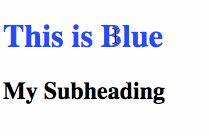
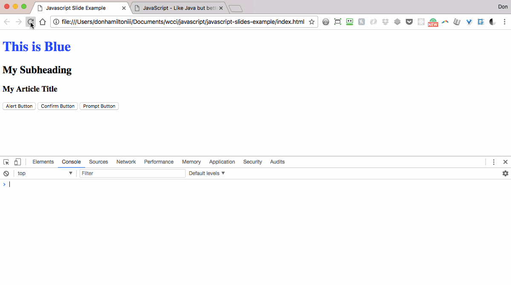

title: JavaScript
subtitle: Like C# but better!
theme: league

## What is JavaScript?

JavaScript is a dynamic, weakly typed, prototype-based programming language. We will use JavaScript for the client side of our web applications. Though now, JavaScript is able to be used as a full stack tool for developing robust web applications thanks to Node.js. We will only be going through using JavaScript on the frontend to add interactivity with our end user.

## How to include JS

We can include JavaScript in our page very similarly to how we include CSS. Like CSS there are 3 options (and two of them are not advised).

## Inline

We can include JavaScript right inside of our HTML elements. (Your separation-of-concerns-sense should be tingling right now):

```html
<h1 onclick="this.style.color = `pink`;">My Title</h1>
```

Which gives you:


## Inside Script Tags

You can also write JavaScript directly inside your HTML by enclosing it in `<script>` tags. Like this:

```HTML
<!DOCTYPE html>
<html>
    <head>
        <meta charset="utf-8">
        <title>JS Example</title>
    </head>
    <body>
        <h1 onclick="this.style.color = `pink`">My Title</h1>
        <h2>My Subheading</h2>
        <script type="text/JavaScript">
            document.getElementsByTagName('h2')[0].onclick = function() {
                this.getElementsByTagName('h2')[0].style.fontSize = `30px`;
            };
        </script>
    </body>
</html>
```

!SLIDE

Which yields:



## Linking an External JS File (Do this one!)

Finally, similar to CSS, you can link JS code from an external file. This is ideal because it keeps your code organized and concerns separated. You connect the file to your HTML with the `<script>` tag like so:

```html
<!-- index.html -->
<script src="./js/app.js"></script>
```
```JavaScript
// app.js
document.getElementsByTagName('h3')[0].onclick = function() {
    this.style.backgroundColor = `orange`;
}
```

!SLIDE

Which gives you:


## Boxes

JavaScript allows you to send and receive messages from your user in a number of ways. The first ones we're going to talk about are boxes. There are three types of boxes:

- alert
- confirm
- prompt

Let's explore them in more detail.

## Alert

Alert boxes allow you to send a message that your user can read when an action is performed. By adding a button we can see how this works:

```html
<button type="button" name="button" id="alert">Alert Box</button>    
```

And inside of our JS file:

```JavaScript
var alertButton = document.getElementById('alert');
alertButton.onclick = function() {
    alert('Here is our alert box')
}
```

!SLIDE

Which then performs like this:


## Confirm

Confirm boxes actually return a boolean value to you. This way you can interact with your user and get some kind of feedback from them. When your user clicks ok in the confirm box, you get a true value. When they click cancel, you get a false value:

```html
<button type="button" name="button" id="confirm">Confirm Box</button>
<output name="result" id="confirmResponse"></output>
```

And inside of our JS file:

```JavaScript
var confirmButton = document.getElementById('confirm');
confirmButton.onclick = function() {
    var userResponse = confirm('Here is our confirm box');
    var displayContainer = document.getElementById('confirmResponse');
    var displayMessage = '';
    if (userResponse) {
        displayMessage += 'You like bananas! Did you know they\'re a berry?'
    } else {
        displayMessage += 'You don\'t like bananas because you\'re wrong.'
    }
    displayContainer.innerText = displayMessage;
}
```

!SLIDE

Which then performs like this:


## Prompt

Prompt works very similar to to confirm. It accepts input from your user as well. This time the value is a string. So you can get specific information from your user and use it however you want.

```html
<button type="button" name="button" id="prompt">Prompt Box</button>
<output name="result" id="promptResponse"></output>
```

And inside of our JS file:

```JavaScript
var promptButton = document.getElementById('prompt');
promptButton.onclick = function() {
    var userResponse = prompt('What is your name?');
    var displayContainer = document.getElementById('promptResponse');
    displayContainer.innerText = 'Hey, ' + userResponse;
}
```

!SLIDE

Let's see what it does when we give it a value and what we get when we hit cancel:


## Printing to the console

We can print to our console with JS the same way we can with C#. The only thing that's different is the command to execute this behavior.

In JS that command is `console.log()`. There is also `console.error()` and `console.dir()`. They are for more specific tasks but have generally the same behavior. Let's see them in action:



## Variables

We have variables in JS just like we have in C#. Since JS isn't statically typed, we don't have to expressly tell JS what type of variable we have. This is a cool feature but it can also get you into trouble. For example, if you're trying to do some sort of math operation an accidentally pass a boolean value instead of a number, you'll get unexpected functionality. Variables are declared in JS using the `var` keyword, like so:

```JavaScript
var myNumber = 42;
var myString = 'Hello world';
var myFunction = function() {
    // I do stuff
}
```

With these variables declared, you can now use them inside your code. These are more useful than literals because you can reference them as many times as you want without having to explicitly define them again.

## Concatenation

Concatenating is the same here as well (notice how similarly programming languages behave?). In fact, we use the same concatenation operator in JS as in Java:

```javascript
var myName = 'Instructor';

console.log('Hey, ' + myName + '! How\'s it going?');
```

This would print out `Hey, Instructor! How's it going?` to the console.

## Comparison operators

More of the same here. JS has the same comparison operators as C#. It adds two new ones though and that's what we're going to focus on.

- `==`
- `!=`
- `>`
- `<`
- `>=`
- `<=`
- `===`
- `!==`

These last two have more specificity than `==` and `!=`. With the less specific operators, if two objects have similar values, they are considered equal. Similarly, the more specific versions will compare the types and values i.e.

```javascript
5 == '5' // true
5 === '5' // false
```

## Logical and Mathematical operators

These are the same as C#.

### Logical
- `&&`
- `||`
- `!`

### Mathematical
- `+`
- `-`
- `/`
- `*`
- `%`
- `++`
- `--`

## Commenting

You can comment things out in JS also. You can use `//` for inline commenting and `/*  */` for commenting blocks of code.

```javascript
var name = 'Instructor'; // This is a name

/*
Here is a bunch
of stuff that I
want to comment
out because it
isn't actually
relevant to our
code.
*/
```

# Arrays

Arrays in JS are way more useful than the arrays we're used to. They're mutable, which means you can alter them. There are two ways to declare an Array:

```javascript
var myFavoriteFruits = ['bananas', 'oranges', 'papaya', 'mango', 'pineapple'];
var myEmptyArray = new Array(5);
```

When we print these to the console we get:


Similar to what we're used to, these arrays are also zero-based and have a built in length property.

## Push and Pop

We can add and remove items to the end of our arrays using the `.push()` and `.pop()` methods.

```JavaScript
// This removes 'pineapple' from the
// array and stores it in the variable
// pineapple.
var pineapple = myFavoriteFruits.pop();

// This adds the value 'watermelon'
// to the end of our array.
// ['bananas', 'oranges', 'papaya', 'mango', 'watermelon']
myFavoriteFruits.push('watermelon');
```
## Splice

The splice method allows you to remove any number of items from your array at any given location. Splice accepts two parameters `.splice(index, number of items to remove)`. So for example:

```javascript
// Current value of myFavoriteFruits
// ['bananas', 'oranges', 'papaya', 'mango', 'watermelon']
//
// This will store the array ['papaya', 'mango']
var myMostFavorite = myFavoriteFruits.splice(2, 2);

// It also makes our array have the value of
// ['bananas', 'oranges', 'watermelon']
```

## Shift and Unshift

Now you're wondering, if I can add and remove to the end of my array, what if I want to add to the front? We use the methods `.shift()` and `.unshift()`.

```javascript
// Makes our array have the value of
// ['blueberries', 'bananas', 'oranges', 'watermelon']
myFavoriteFruits.unshift('blueberries');

// This variable gets passed the value 'blueberries'
var kingOfBerries = myFavoriteFruits.shift();
```

## Assigning Values

There are a few different ways to add values to our array. We can declare our array with values already inside:

```JavaScript
// This array has five values. Notice how
// we can mix value types in JS arrays
var numbers = [1.0, 2, 'three', 4, 'five'];
```

We can also give values to specific indices in arrays:

```JavaScript
var names = new Array(3);

// This changes the value of the second
// item from null to 'Alan'
names[1] = 'Alan';

// This creates a key of 'Brian'
// and gives it the value 'Brian'
names['Brian'] = 'Brian';
```

## Objects

We have objects in JS the same as C#. They behave in a similar fashion

### Methods and Properties vs. Functions and Variables

Functions and variables are the anonymous versions of methods and properties. Once a variable is placed inside of an object, it is a property of that object. The same goes for functions and methods. Let's look at how to declare an object in JS and give it some properties and methods.

```javascript
var car = {
    color: 'green',
    hornSound: 'BEEEEP!',
    numOfWheels: 4,

    honk: function() {
        console.log(this.hornSound)
    }
};

// We can also add values like this
car.engine = 'V8';
```

## Encapsulation

We can use objects in JS to encapsulate our applications. We do this by making everything part of an object and containing all of our properties and methods inside of the object. This way we can avoid name collision inside of our global scope. This allows us to have only one global object, our application, which should be named uniquely so that no other plugins or libraries will use the same names as you.

```javascript
var MyApp = {
    users: [],
    userCount: users.length,

    addAUser: function() {
        // logic to add a user
    }
};
```

Now `MyApp` is the only thing that we are adding to our global scope, everything else is local to our application and can't be accessed accidentally by our browser or any other JavaScript frameworks or libraries that may be in our document.

## Dates and times

We can access current times and dates on the user's machine with JavaScript. Make sure to note that times are based on the settings on the user's machine so we can't be sure that our intended time or date will display. We reference a new `Date` object like so:

```javascript
var date = new Date();

// This method shows the number of milliseconds
// that have passed since 1 January 1970 00:00:00 UTC.
date.getTime();

// This value gets the current year
date.getFullYear();
```

There are many useful methods on the `Date` object. Read about them [here](https://developer.mozilla.org/en-US/docs/Web/JavaScript/Reference/Global_Objects/Date). You can read about why we're getting milliseconds since 1 January 1970 [here](https://en.wikipedia.org/wiki/Unix_time).

## Intervals

JavaScript has plenty of useful built-in methods for you to use. Two of the most frequently used are `setInterval(time in milliseconds, function to execute)` and `setTimeout(time in milliseconds, function to execute)`. These are used to delay operations from happening until a specified time. In the case of `setInterval()`, we are setting up intervals for operations to be executed multiple times in increments set by the developer.

!SLIDE

Let's see how they work:

```javascript
var i = 0;

// This will call setInterval() and
// execute the anonymous function
// that we're passing it.
var interval = setInterval(function() {
    i++;
    console.log(i);

    if (i === 10) {
        clearInterval(interval);
    }
}, 1000);

// This will log to the console
// after 11 seconds.
setTimeout(function() {
    console.log('This took 11 seconds');
}, 11000);
```

But, what is that function doing?

## Callbacks

That anonymous function that we pass to `setInterval` is called a callback. Callbacks are used to execute specific behavior with a value that has been passed to it. Let's explore:

```javascript
var colors = ['red', 'green', 'blue', 'yellow'];
var listAllColors = function(array, callbackFunction) {
    list = '';
    for (var i = 0; i < array.length; i++) {
        list += array[i];
        if (i < array.length -1) {
            list += ', ';
        }
    }
    callbackFunction(list);
};
listAllColors(colors, function(listOfColors) {
    console.log(listOfColors);
});
```

!SLIDE

This prints the concatenated array to the console:


## DOM Manipulation

Probably the biggest tool we have in JS is DOM manipulation. This is what allows you to dynamically populate your page with elements based on data being updated. Let's look at some code to see how this works. Let's look at referencing DOM elements first:

```html
<!-- index.html -->
<body>
    <h1 id="title">Here's my title</h1>
</body>
```
```javascript
// app.js
// This tells our browser that we are
// referencing this specific element
// and sets it to a variable.
var title = document.getElementById('title');
```

## Accessing Attributes

Let's now look at what we can do with the element we've grabbed:

```javascript
var title = document.getElementById('title');
// This will set the text inside of our #title to a new value
title.innerText = 'This is dynamically set text.';

// But what if we want to add HTML element?
title.innerHTML = 'This is <span>dynamically</span> set text!';
```
This allows you to put actual HTML elements into you string. We can now manipulate this span with CSS!

!SLIDE

We can also work with attributes on the element (i.e. things like `href` or `type`).

```javascript
// This gives us a variable with the value
// of the ID attribute.
var titleId = title.getAttribute('id');
```

!SLIDE

We can also see if an element has an attribute and, if so, examine what its value is.
```javascript
// This returns us a boolean value
// of false because our 'h1' element
// doesn't have an 'href' value
title.hasAttribute('href');
```

## Remove Elements

The same way we can manipulate elements, we can remove them:

```javascript
// The remove method is built in to
// javascript and deletes an element for us.
title.remove();
```

## Query Selector

So we find ourselves selecting elements in a very clumsy way. There seems to be a different way to find each element in JS. Why not one way? BECAUSE THERE ARE TWO! `.querySelector('thing')` and `.querySelectorAll('things')`.

```javascript
// This selects the first element of
// its kind in the document.
document.querySelector('h1');

// This selects a group of things
// that have the parameter in common.
document.querySelectorAll('.content');
```

This way we can select elements more dynamically.

## Event Handlers

Event handlers are the way we deal with interactivity. So, for example, you want to change the way your heading is sized when your user clicks on it, you can!

```javascript
var title = document.querySelector('#title');

// This is going to make your 'h1' tag(s)
// be '50px' when you click it
title.addEventListener('click', function() {
    title.style.fontSize = '50px';
});
```

Now for some...

## PRACTICE!

Clone the example project from [here](https://github.com/WeCanCodeIT/cs-javascript-example-project). ENJOY!
