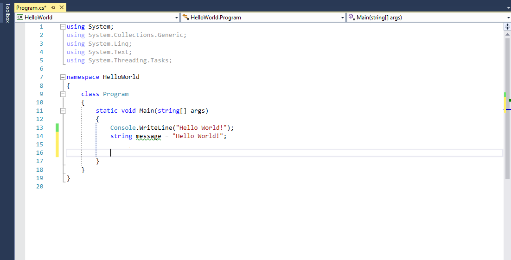
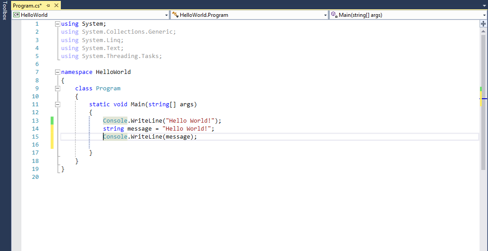
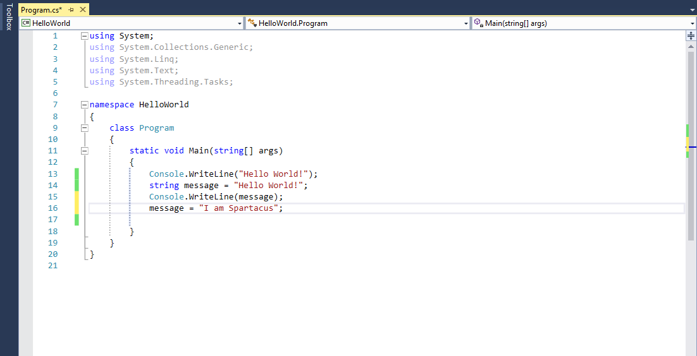
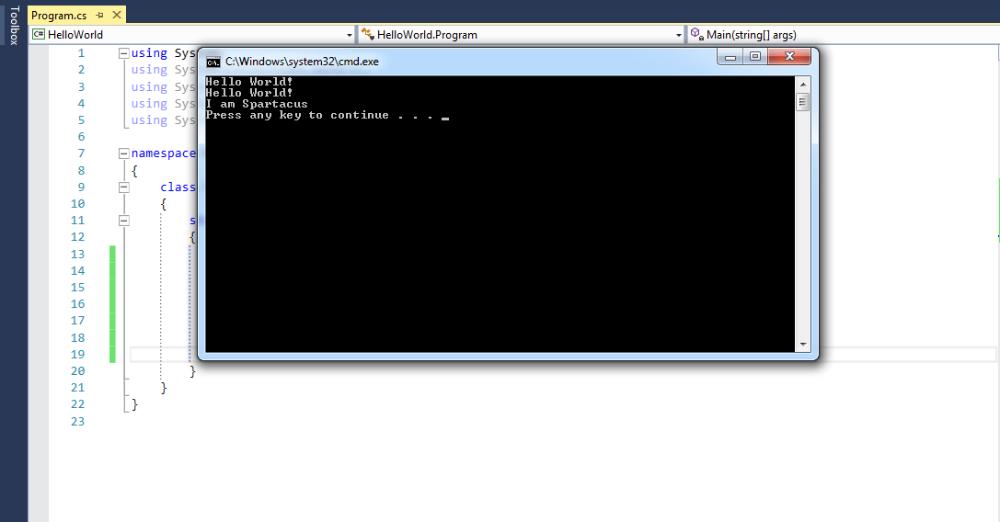
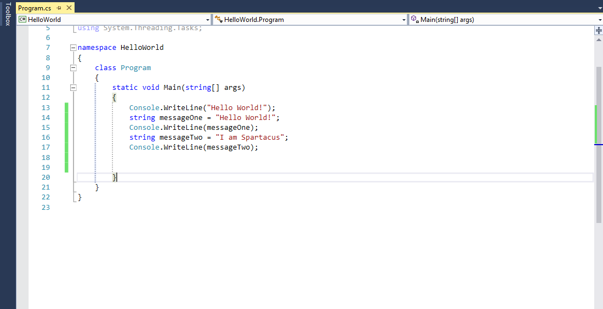
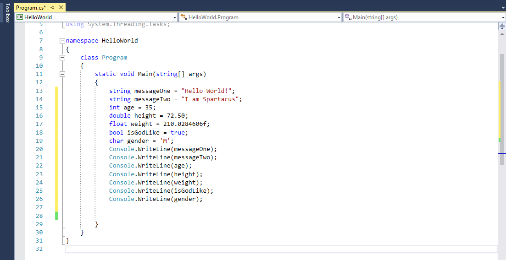
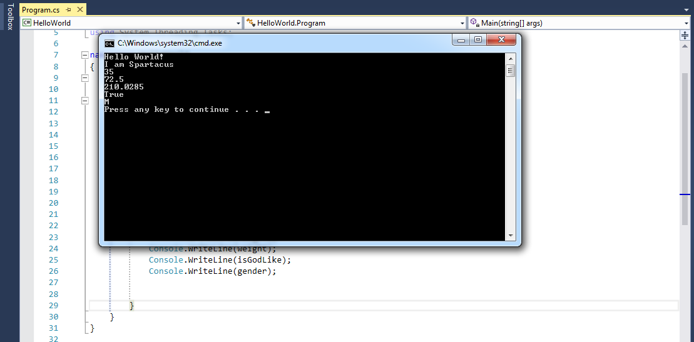

title: Basic Types and Variables
subtitle: •••
theme: league

## Let's build on what we learned yesterday

<div float="right" class="img"></div>

- We have already started building our first application, so let's open <mark>HelloWorld</mark> and build upon our success

- Volunteer Time!!

- Open Visual Studio

- Select File > Open > Project Solution

!SLIDE

<div float="right" class="img"></div>

- Select HelloWorld > Open

## We should all be here!!

<div float="right" class="img"></div>

- Let's review a few things before we begin

<div class="fragment">
Question time: Where are classes defined in C#?
</div>

<div class="fragment">
Question time: All C# programs must have what type of method?
</div>

<div class="fragment">
Question time: What features indicate the beginning and ending of a segment of code, method, or class? 
</div>

## It's a Value-Based Proposition

We saw *literals* yesterday. In the statement:

```C#
Console.WriteLine("Hello World!");
```

`"Hello World!"` is a string literal. It's a string because it's a sequence of characters surrounded by quotation marks. It's a literal because it always has that value.

## Let's Not Be Literal

- In contrast, we have *variables*. In C#, a variable's *type* is defined, but its value can *vary* (thus the name).

- Let's experiment

- In our code we have `Console.WriteLine("Hello World!");`

- Comment out any other code you may have

- Let's declare a variable and assign it the value <mark>Hello World!</mark>

- Underneath `Console.WriteLine("Hello World");` let's insert the following code:

<pre><code class="language-C# hljs">string message = "Hello World!";
</code></pre>


## We should all be here

<div float="right" class="img"></div>

- You may see a green wavy line underneath the variable name <mark>message</mark>

- This line indicates we have created a variable that is not being used.

- If you use your cursor and hover over the green line, Visual Studio will display a pop-up message.

- This message will describe the purpose of the green line, and in some cases offer a solution if the problem requires attention.

- We will discuss this tool Visual Studio provides for us at a later time.

!SLIDE

<div float="right" class="img"></div>

- So let's discuss what we have done

- We have declared a variable called <mark>message</mark>

- The operating system has reserved an empty space in memory for our <mark>message</mark> variable

- Next we assigned our <mark><code>string message</code></mark> a value of <mark>Hello World!</mark>


## We should all be here

<div float="right" class="img"></div>

- Volunteer Time!!

<div class="fragment">
Question time: We named our string variable <mark>message</mark>. Do you think we could have used any name we wanted?
</div>

<div class="fragment">
Question time: When we are creating variables, do you think using descriptive names would be important? If so, why?
</div>

<div class="fragment">
- Now let's append our code so we send the <mark>Console.WriteLine()</mark> and the contents of <mark>message</mark> to the Visual Studio console.
</div>

!SLIDE

- Underneath `string message = "Hello World!";` let's insert the following code:

<pre><code class="language-C# hljs">Console.WriteLine(message);
</code></pre>

- Let's see what our code should look like

<div class="fragment">

Question time: What output to the console do you think this line of code will produce? If any?
</div>


<div class="fragment">
    <div float="right" class="img"></div>
</div>


## Run It!!

- If you will notice there is a small <mark>asterisk</mark> on the Program.cs page tab next to the words Program.cs.

- This asterisk is there to remind you the page has not been saved.

- Before we select Start, lets go ahead and select the <mark>Single Floppy Disk</mark> right above the Program.cs tab.

- The asterisk is no longer there, so we can proceed.

- Select Start

- You should see a blank screen pop-up and disappear. This is the console. Press <mark>Ctrl F5</mark> and the console window will appear.

## We should all be here

<div float="right" class="img"></div>

- Volunteer time!!

- As we have just observed, variables allow us to store values.

- We created a `string` variable, and assigned it a value of "Hello World!".


<div class="fragment">
Question time: Think about the name <mark>variable</mark>. What does the name imply?
</div>

<div class="fragment">
It implies that the contents can vary. Let's use a cup as an example. We can create a cup (variable) and we can fill it with coffee (value) in the morning, then tea (value) at night.
</div>


## Variables are variable

- So now that we know how flexible a variable can be, let's do an experiment.

- Let's close our console window.

<div class="fragment">
Question time: We want to give our string variable <mark>message</mark> a new value. Any ideas on how we accomplish this daunting task?
</div>

<div class="fragment">
Let's give it a try. Underneath <code>Console.WriteLine(message);</code>, insert the following code:
</div>

<div class="fragment">
<code>message = "I am Spartacus";</code>
</div>

## We should all be here

<div float="right" class="img"></div>

- Now let's copy <mark><code>Console.WriteLine(message);</code></mark>, and paste it below 

<mark><code>message = "I am Spartacus";</code></mark>.

<div class="fragment">
Question time: What output to the console do you think this line of code will produce? If any?
</div>

## Very important information

Question time: Why didn't we type the following when changing the value of <mark>message</mark>: 

<pre><code class="language-C# hljs">string message = "I am Spartacus";
</code></pre>

<div class="fragment">
The first part of the command, on the left side of the <mark>=</mark> sign, <mark>string message</mark> <i>declares</i> a variable of type string, while the second part, on the right side of the <mark>=</mark> sign, <i>initializes</i> the variable with a value.
</div>

<div class="fragment">
Once you declare a variable you cannot declare another variable with the same name. Using the type <code>string</code> tells Visual Studio you are declaring a new variable.
</div>

## Run It!!

- Once again you will notice there is a small <mark>asterisk</mark> on the Program.cs page tab next to the words Program.cs.

- Before we select Start, let's go ahead and select the <mark>Single Floppy Disk</mark> right above the Program.cs tab.

- The asterisk is no longer there, so we can proceed.

- Select Start.

- You should see a blank screen pop-up and disappear. This is the console. Press <mark>Ctrl F5</mark> and the console window will appear.


## We should all be here

<div float="right" class="img"></div>

- Its time to understand why we received the results we see in the console.

- Lets execute the program step by step the way Visual Studio does when you select Start.

## Step by step

- Visual Studio looks in the <mark>Program Class</mark> for the <mark>Main</mark> method.

	- Visual Studio executes the code in the <mark>Main</mark> method from the top down.

	<div class="fragment">
	- Visual Studio executes <mark>Console.WriteLine("Hello World!")</mark>, and prints what to the console?
	</div>

	<div class="fragment">
	- Visual Studio executes <mark>string message = "Hello World!";</mark>, and assigns what value to what variable?
	</div>

	<div class="fragment">
	- Visual Studio executes <mark>Console.WriteLine(message);</mark>, and prints what value to the console?
	</div>

	<div class="fragment">
	- Visual Studio executes <mark>message = "I am Spartacus";</mark>, and assigns what value to what variable?
	</div>

	<div class="fragment">
	- Visual Studio executes <mark>Console.WriteLine(message);</mark>, and prints what value to the console?
	</div>


## Variable Naming Conventions

- When we attended grade school, we learned the importance of correct punctuation, capitalization, and sentence structure.

- We adhered to the standards we learned not because it was easier for us to write, but we learned it was important so other people can read what we wrote.

- Coding is just another form of writing, and you will find it has its own standards on how it should be written.

- As with writing a paper in school, we adhere to writing standards in coding for the benefit of those who may read the code we have written.

- The first standards we will tackle are <mark>Naming Conventions</mark>

- We will talk about naming conventions quite a bit. 

- Let's take a look at our code, and cover some of the naming standards we have already used but now we can give them a name.

!SLIDE

<pre><code class="language-C#" data-noescape>namespace <mark>HelloWorld</mark>
{
    class <mark>Program</mark>
    {
        static void <mark>Main</mark>(string[] args)
        {
            Console.<mark>WriteLine</mark>("Hello World!");
            string message = "Hello World!";
            Console.<mark>WriteLine</mark>(message);
            message = "I am Spartacus";
            Console.<mark>WriteLine</mark>(message);
        }
    }
}
</code></pre>

- If you look at the highlighted text in our code, you will see they all have one thing in commom. Can anyone tell the class to what I am referring?

- Each highlighted word starts with the first letter in that word capitalized. 

- If you look at the word <mark>WriteLine</mark>, you see it's actually two words. You will also notice the first letter of each word is capitalized.

- This naming convention is called <mark>PascalCase</mark>. Simply put, the first letter in each word is capitalized.

- In C# we would use PascalCase when we name the following: Classes and Methods. We will talk more about these later.

!SLIDE

- To better understand our next naming convention, we need to make a few changes and additions to our code.

- Volunteer time!!

- Look at the code below, and make the following highlighted changes and additions

<pre><code class="language-C#" data-noescape>namespace HelloWorld
{
    class Program
    {
        static void Main(string[] args)
        {
            Console.WriteLine("Hello World!");
            string <mark>messageOne</mark> = "Hello World!";
            Console.WriteLine(<mark>messageOne</mark>);
            <mark>string messageTwo</mark> = "I am Spartacus";
            Console.WriteLine(<mark>messageTwo</mark>);
        }
    }
}
</code></pre>
## We should all be here

<div float="right" class="img"></div>

!SLIDE

<pre><code class="language-C#" data-noescape>namespace HelloWorld
{
    class Program
    {
        static void Main(string[] args)
        {
            Console.WriteLine("Hello World!");
            string <mark>messageOne</mark> = "Hello World!";
            Console.WriteLine(<mark>messageOne</mark>);
            string <mark>messageTwo</mark> = "I am Spartacus";
            Console.WriteLine(<mark>messageTwo</mark>);
        }
    }
}
</code></pre>

- If you look at the highlighted text in our code, you will see they all have one thing in common. Can anyone tell the class to what I am referring?

- Each highlighted word starts with the first letter in that word lowerCase and the beginning of the second word is upperCase. 

- This naming convention is called <mark>camelCase</mark>. As stated the first letter in the first word lowerCase and the beginning of the second word and every subsequent word in upperCase. 

- In C# we would use camelCase when we name the following: Variables and Method Arguments. We will talk more about these later.

## Basic Data Types

- There are two kinds of basic data types in C#

- We refer to these to basic data types as <mark>value types</mark> and <mark>reference types</mark>. 

- To better understand basic data types, we need to make a few changes and additions to our code.

- Volunteer time!!

!SLIDE

- Look at the code below, and make the following highlighted changes and additions

<pre><code class="language-C#" data-noescape>namespace HelloWorld
{
    class Program
    {
        static void Main(string[] args)
        {
            string messageOne = "Hello World!";
            string messageTwo = "I am Spartacus";
            <mark>int age = 35;</mark>
            <mark>double height = 72.50;</mark>
            <mark>float weight = 210.028461f;</mark>
            <mark>bool isGodLike = true;</mark>
            <mark>char gender = 'M';</mark>
            <mark>Console.WriteLine(messageOne);</mark>
            <mark>Console.WriteLine(messageTwo);</mark>
            <mark>Console.WriteLine(age);</mark>
            <mark>Console.WriteLine(height);</mark>
            <mark>Console.WriteLine(weight);</mark>
            <mark>Console.WriteLine(isGodLike);</mark>
            <mark>Console.WriteLine(gender);</mark>
        }
    }
}
</code></pre> 

## We should all be here

<div float="right" class="img"></div>

## Value type variables

- Value type variables contain their data whereas variables of reference types store references to their data.

- We have already seen value type variables in the code we have written.

- The highlighted variables list below are examples of value type variables. 

<pre><code class="language-C#" data-noescape>
        static void Main(string[] args)
        {
            string messageOne = "Hello World!";
            string messageTwo = "I am Spartacus";
            <mark>int age</mark> = 35;
            <mark>double height</mark> = 72.50;
            <mark>float weight</mark> = 210.028461f;
            <mark>bool isGodLike</mark> = true;
            <mark>char gender</mark> = 'M';
            Console.WriteLine(messageOne);
            Console.WriteLine(messageTwo);
            Console.WriteLine(age);
            Console.WriteLine(height);
            Console.WriteLine(weight);
            Console.WriteLine(isGodLike);
        }
    }
</code></pre> 

## Integer value type variable

- The value variable integer comes in five flavors, but we will focus on only three: `short`, `int` and `long`.

- You might have guessed the name denotes the size of the integer. Your guess would be correct.

- Integer (int) types are whole numbers, and have following sizes and value ranges: 

	- `short`:	size = 2 bytes, value range = -32,768 to 32,767

	- `int`:	size = 2 or 4 bytes, value range = -32,768 to 32,767 or -2,147,483,648 to 2,147,483,647

	- `long`:	size = 4 bytes, value range = -2,147,483,648 to 2,147,483,647

- Integers should not be used for precise calculations or calculations that require a decimal point.

<div class="fragment">
Question time: What situations when you are coding do you think an <code>int</code> would be the preferred data type?
</div>

<div class="fragment">
Question time: Which of the following is not a <code>short</code>: 45, 32767, 8000, -32769
</div>

## Floating value type variables

- The floating value type variable comes in three flavors, but we will focus on only two: `double` and `float`.

- When your code needs to perform precision arithmetic, or your code requires using exponentially large numbers a floating value type variable is your data type.

- Floating value type variables use decimal places and have the following sizes, value ranges and precision.

	- `float`:	size = 4 bytes, value range = 1.2E-38 to 3.4E+38, precision = 6 decimal places

	- `double`:	size = 8 bytes, value range = 2.3E-308 to 1.7E+308, precision = 15 decimal places

<pre><code class="language-C#" data-noescape>
        static void Main(string[] args)
        {
            string messageOne = "Hello World!";
            string messageTwo = "I am Spartacus";
            int age = 35;
            <mark>double height</mark> = 72.50;
            <mark>float weight</mark> = 210.028461f;
            bool isGodLike = true;
            char gender = 'M';
        }
    }
</code></pre> 
 
## Booleans

- A `bool` value type variable holds either the value `true` or `false`, which is represented by a '1' for 'true' and '0' for 'false'.

<pre><code class="language-C#" data-noescape>
        static void Main(string[] args)
        {
            string messageOne = "Hello World!";
            string messageTwo = "I am Spartacus";
            int age = 35;
            double height = 72.50;
            float weight = 210.028461f;
            <mark>bool isGodLike</mark> = true;
            char gender = 'M';
        }
    }
</code></pre> 


## Character Value Types

- The `char` value type variable holds individual characters. 

- We define `char` literals by using single apostrophes.

<pre><code class="language-C#" data-noescape>
        static void Main(string[] args)
        {
            string messageOne = "Hello World!";
            string messageTwo = "I am Spartacus";
            int age = 35;
            double height = 72.50;
            float weight = 210.028461f;
            bool isGodLike = true;
            <mark>char gender</mark> = 'M';
        }
    }
</code></pre> 

## String Reference Type

- Strings are Reference Types. 

- We've seen examples of them. 

- We denote their values with quotation marks:

<pre><code class="language-C#" data-noescape>
        static void Main(string[] args)
        {
            <mark>string messageOne</mark> = "Hello World!";
            <mark>string messageTwo</mark> = "I am Spartacus";
            int age = 35;
            double height = 72.50;
            float weight = 210.028461f;
            bool isGodLike = true;
            char gender = 'M';
        }
    }
</code></pre> 

<div class="fragment">
Question time: What is the difference between "a" and 'a'?
</div>

## We should all be here!!

<div float="right" class="img"></div>

## Run It!!

- If you will notice there is a small <mark>asterisk</mark> on the Program.cs page tab next to the words Program.cs.

- This asterisk is there to remind you the page has not been saved.

- Before we select Start, lets go ahead and select the <mark>Single Floppy Disk</mark> right above the Program.cs tab.

- The asterisk is no longer there, so we can proceed.

- Select Start

- You should see a blank screen pop-up and dissapear. This is the console. Press <mark>Ctrl F5</mark> and the console window will appear.

## We should all be here!!

<div float="right" class="img"></div>

- Let's talk about what we see.

## Time for some reflection

- Now that we have learned about Basic Types and Variables, let's take a minute to answer any questions.

- Let's go ahead and save our project, as we will continue building our project throughout the week.

- I hope you have followed along, and you have sucessfully finished the coding exercises throughout this lecture.

- The project we are building will give you the experience and tools you need to sucessfully complete your weekend project.

- If your code does not look and act like the code we have in the last slide, please get with one of your team mates and correct what issues you might have.

- If you still have questions about anything we have covered, please do not hesitate to ask one of the WCCI instructors.


<style type="text/css">
.img:hover  {
        transform: scale(1.5);
        box-shadow: 0 0 10px rgba(0, 0, 0, 0.5);
    }
</style>
