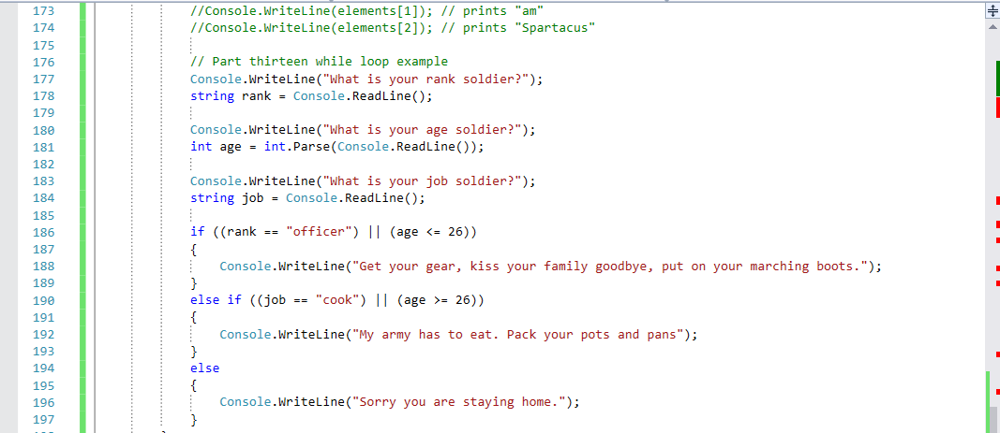

title: Loops
subtitle: A New Hope
theme: league

## What is Looping?

- Looping means to repeat something. 

- Looping is another means of controlling flow within a program. 

- `if/else` and `switch/case` statements focus on *decision making*. 

- Looping statements focus on doing something repeatedly. 

- We call doing something repeatedly *iterating*.

- Our efforts will focus predominantly on three types of loops: <mark>while, do while, for</mark>

## Why Would I Want To Do That?

There are many practical examples of loops:

- Sunrise and sunset

- Your daily routine: drink coffee, walk the dog, ask the neighbors if they've seen the dog, catch the dog, take a shower, go to work, come home, eat dinner, repeat

<div class="fragment">
Question time: What are some real life examples of a loop?
</div>

## While Loops

- A `while` loop continues to do what you've told it to do *while* some condition **continues to be true**.

- Let's go back to our Hello World program and use loops to make the program more efficient.

- When Spartacus is deciding who will march to battle, we have to assume there will be more than one soldier.

- Currently, our decision logic only processes one soldier at a time. Let's use a while loop to process many soldiers.

- Before we get started, please comment out section twelve of our Hello World program.

!SLIDE
 
- Volunteer time

- Copy and paste the following code from your Hello World program. 

```C#
// Part thirteen while loop example
Console.WriteLine("What is your rank soldier?");
string rank = Console.ReadLine();

Console.WriteLine("What is your age soldier?");
int age = int.Parse(Console.ReadLine());

Console.WriteLine("What is your job soldier?");
string job = Console.ReadLine();

if ((rank == "officer") || (age <= 26))
{
    Console.WriteLine("Get your gear, kiss your family goodbye, 
		put on your marching boots.");
}
else if ((job == "cook") || (age >= 26))
{
    Console.WriteLine("My army has to eat. Pack your pots and pans");
}
else
{
    Console.WriteLine("Sorry, you are staying home.");
}
```
## We should all be here

<div class="img" float="right"></div>

- For a loop to operate successfully, we need to have an <mark>enter/exit statement</mark>.

- This means there needs to be a process by which the program can enter and exit the loop.

- If we do not provide an enter/exit statement, we will have a situation programmers call <mark>infinite looping</mark>.

## Let's Break That Down

- Let's construct our while loop around our existing code.

- We start with the `while` keyword. This keyword tells the compiler we are processing a loop.

<pre><code class="language-C#" data-noescape><mark>while</mark> () {	
}</code></pre>

<div class="fragment">
<p><code>while</code> is followed by a set of parentheses. Our enter/exit statement in the form of a conditional statement goes here.</p>
<p>We will use the following conditional as our enter/exit statement: <code>(rank != "exit")</code></p>
<pre><code class="language-C#" data-noescape>int count = 0;
while <mark>(</mark>rank != "exit"<mark>)</mark> {
}</code></pre>
</div>

<div class="fragment">
- In each iteration of the while loop, the conditional <mark><code>rank != "exit"</code></mark> will be checked.
</div>

<div class="fragment">
- As long as the value returned by the conditional remains true, the loop will execute.
</div>

<div class="fragment">
- When the value returned by the conditional changes to false, the loop will no longer execute.
</div>

## Let's Keep Breaking It Down

- Within these curly braces goes the code we want to execute. 

<pre><code class="language-C#" data-noescape>int count = 0;
while (rank != "exit") <mark>{</mark>
	//Code body
<mark>}</mark></code></pre>

- Any variables, data structures, or methods we declare in a loop are considered <mark>local</mark> to the loop, and cannot be accessed by the rest of the program.

- Any variables, data structures, or methods declared outside a loop are considered <mark>global</mark>, and can be accessed inside and outside the loop.

- Thus, our enter/exit conditional statement variable must be declared **outside** the scope of the loop. Let's create that variable.

- There are many ways to format this variable. We will format as follows: <mark><code>string action = " "</code></mark>

- Finally, we need a way to assign a new value to our variable <mark>action</mark> so we can exit the loop.

## Add the following code to your HelloWorld Program 

<pre><code class="language-C#" data-noescape><mark>string action = " ";
while (action != "exit"){ </mark>
Console.WriteLine("What is your rank soldier?");
string rank = Console.ReadLine();

Console.WriteLine("What is your age soldier?");
int age = int.Parse(Console.ReadLine());
Console.WriteLine("What is your job soldier?");
string job = Console.ReadLine();

if ((rank == "officer") || (age <= 26))
{
    Console.WriteLine("Get your gear, kiss your family goodbye, put on your marching boots.");
}
else if ((job == "cook") || (age >= 26))
{
    Console.WriteLine("My army has to eat. Pack your pots and pans");
}
else
{
    Console.WriteLine("Sorry, you are staying home.");
}
<mark>Console.WriteLine("Add another? Type exit to quit");
action = Console.ReadLine();
}</mark>
</code></pre>
## We should all be here

<div class="img" float="right"></div>

- Let's execute our program. Ensure the loop is operating as designed.

<div class="fragment">
Question time:  What happens when you type anything other than exit or just hit the enter key?
</div>

## Do while

- The next loop we will discuss is the <mark>do while</mark> loop.

- If we look at the while loop, we notice the loop **only** executes if the conditional statement is satisfied.

- The <mark>do while</mark> loop, on the other hand, will **always execute at least once**.

- The operation of the <mark>do while</mark> loop is essentially the same as the while loop.

<div class="fragment">
Question time:  Can you give me a real life example of a <code>do while</code> loop?
</div>

<div class="fragment">
Let's take the code we just wrote in the while format and convert it to a <code>do while</code> loop. Comment out the <code>while</code> loop before we proceed with the exception of our action variable.
</div>

## Add the following code to your Hello World Program 

<pre><code class="language-C#" data-noescape>string action = " ";
<mark>do { </mark>
Console.WriteLine("What is your rank soldier?");
string rank = Console.ReadLine();

Console.WriteLine("What is your age soldier?");
int age = int.Parse(Console.ReadLine());
Console.WriteLine("What is your job soldier?");
string job = Console.ReadLine();

if ((rank == "officer") || (age <= 26))
{
    Console.WriteLine("Get your gear, kiss your family goodbye, put on your marching boots.");
}
else if ((job == "cook") || (age >= 26))
{
    Console.WriteLine("My army has to eat. Pack your pots and pans");
}
else
{
    Console.WriteLine("Sorry you are staying home.");
}
Console.WriteLine("Add another? Type exit to quit");
action = Console.ReadLine();
<mark>} while (action != "exit");</mark>
</code></pre>

## We should all be here

<div class="img" float="right"></div>

- Let's execute our program. Ensure the loop is operating as designed.

- You will notice the execution of the loop is almost the same, but the circumstances for using each loop are varied.

<style type="text/css">
.img:hover  {
        transform: scale(1.5);
        box-shadow: 0 0 10px rgba(0, 0, 0, 0.5);
    }
</style>