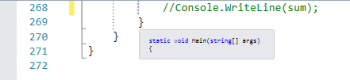
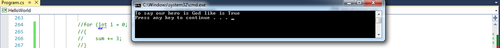

title: Methods
subtitle: Control the flow!
theme: league

## Organization is key

- So far we have learned a very linear approach to programming.

- If we review our HelloWorld program, it's important to note the compiler reads each line of code from top to bottom until it executes the last line.

- Likewise, all of our code resides in the <mark>main</mark>method.

- As much as possible, we want to try to compartmentalize our code.
 
- When we think about programming, we want to consider that we may not need to execute every line of code with each execution.

- One example may be accessing your email account. 

- After you setup your email account, you do not want to have to perform the same steps everytime you access your account. 

- Methods are a way of controlling code execution, i.e. reading and executing code as needed and when needed.

## ...You are already familiar with some methods 

- So far in our lessons, we have used a number of native C# methods.

Question time: What are some methods we have already encountered?

- Do you remember the term <mark>abstraction</mark> we referenced in a prior lecture? Mountain Dew ingredients?

- Methods are a form of abstraction. If we didn't have a <mark>Console.WriteLine()</mark> method, we would have to include all the code in the Console.WriteLine() method each time we wanted to print to the console.

- The command <mark>Console.WriteLine()</mark> is what we term as a <mark>method call</mark>.

- We can use the <mark>Console.WriteLine() method call</mark> when neccessary which in turn keeps our code clean, shorter in length, and efficient.

## Step through the structure

- Let's discuss methods using an example we are already familiar with called the <mark>main</mark> method.

<pre><code class="language-C#" data-noescape>
    class Program
    {
		static void Main(string[] args)
        {
            
        }
    }
</code></pre> 

- As we discussed, the <mark>main method</mark> resides in the <mark>Program</mark> class.

- All methods must reside in a <mark>class</mark>!!

- Visual Studio creates the main method by default when your project is created.

- Unlike other methods, the main method by default is the start of an application.

- The main method is the location where all other methods are called.

!SLIDE

- A method has four characteristics: <mark><b>Modifiers/Access Level</b>, <b>Return Value</b>, <b>Method Name</b>, <b>Method Parameters</b>.</mark>

- Let's walk through each characteristic starting with <mark>Modifiers/Access Level</mark>

- Modifiers/Access levels are characteristics we use to set access to our code.

- Some of the Modifiers/Access level keywords you will encounter are <mark>Public</mark>, <mark>Private</mark>, <mark>Protected</mark>, <mark>Internal</mark>, and <mark>Static</mark>.

- We will define all these keywords, but the three you will become most familiar with are <mark><b>Public</b></mark>, <mark><b>Private</b></mark>, and <mark><b>Static</b></mark>.

	- <mark>Public</mark>: This type of method can be accessed by any other code in the same namespace or another namespace that references it.

	- <mark>Private</mark>: This type of method can be accessed only by code in the same class.

	- <mark>Protected</mark>: This type of method can be accessed only by code in the same class, or in a class that is derived from that class.

	- <mark>Internal</mark>: This type of method can be accessed by any code in the same namespace, but not from another namespace.

	- <mark>Static</mark>: This type of method can be accessed by code in any other class in the same namespace without instantiating an instance of that class.

## Back to main

<pre><code class="language-C#" data-noescape>
namespace HelloWorld
{
    class Program
    {
		<mark>static</mark> void Main(string[] args)
        {
            
        }
    }
}
</code></pre> 

- Given the definitions we just reviewed, because main is <mark>static</mark>, it can be accessed by any other class in the HelloWorld namespace.

- It can be accessed without <mark>instantiating</mark> an instance of that class.

- This makes absolutely no sense to you right now, but we will be experts at <mark>instantiation</mark> when we learn Object-Oriented Programming (OOP).

- By default, the <mark>main</mark> method is private.

Question time: What classes other than the Program class, if any, can access our main method? Why?

## ...Return type

<pre><code class="language-C#" data-noescape>
namespace HelloWorld
{
    class Program
    {
		static <mark>void</mark> Main(string[] args)
        {
            
        }
    }
}
</code></pre> 

- The next characteristic we will discuss is the <mark>Return Type</mark>.

- Simply put, the <mark>Return Type</mark> is the type of value the method will return when executed.

- Remember, our types are `int`, `string`, `bool`, `double`, `float`, etc......

- The main method is an example of a <mark>void</mark>, meaning the method will not return a value when executed.

- Let me reiterate, unlike type methods, void methods <mark>do not</mark> return a value.

## ...MethodName

<pre><code class="language-C#" data-noescape>
namespace HelloWorld
{
    class Program
    {
		static void <mark>Main</mark>(string[] args)
        {
            
        }
    }
}
</code></pre> 

- Well, there is not too much to say about this characteristic...

- Remember to give your methods a name that describes their purpose or function.

Question time: What naming convention do we use for methods?

## ...Method parameters

<pre><code class="language-C#" data-noescape>
namespace HelloWorld
{
    class Program
    {
		static void Main <mark>(string[] args)</mark>
        {
            
        }
    }
}
</code></pre>

- <mark>Method parameters</mark> are used to pass data from the method call into the method.

- In the case of the main method we have one declared variable: a string array named `args`.

- Let's see an example of the main method operation so we can better understand.

!SLIDE

- Here is an example of a simple C# console application.

- This application is executed at the command line.

- At the command line the user enters one or more values. These values could be any data. 

- At the command line we will execute our console application like such: <mark>MyApp.exe</mark>.

- We will pass three arguments into our application: <mark>MyApp.exe "Pete" "is" "crazy"</mark>.

- When we execute our application, here is what happens.

<pre><code class="language-C#" data-noescape>
class Program
{
  static void Main(string[] args) <mark>string[] arg = {"Pete", "is", "crazy"}</mark>
  {
    for(int i = 0; i < args.Length; i++)
    {
      Console.WriteLine(arg[i]);
    }
  }
}
</code></pre>

!SLIDE

<pre><code class="language-C#" data-noescape>
class Program
{
  static void Main(string[] args) <mark>string[] arg = {"Pete", "is", "crazy"}</mark>
  {
    for(int i = 0; i < args.Length; i++)
    {
      Console.WriteLine(arg[i]);
    }
  }
}
</code></pre>

Question time: How many times will our for loop execute?

Question time: What values will be printed to the console and in what order?

## Let's experiment

- Now that we have an idea about methods and have at least some understanding of their operation, let's do some coding.

- Let's use our HelloWorld program and create a few methods.

- Open your HelloWorld program, and comment out the code in part fourteen.

- In part fifteen we will create three example methods: `bool`, `string`, `int[]`. 

## We should all be here

- Volunteer time

- The first method we will create will receive our <mark>ageOne</mark> value, perform a modulus operation, and finally update the <mark>isGodLike</mark> `bool`. 

- Because we are creating a new method, we must create these methods *outside* of the main method.

- At the bottom of your program you will find three closing <mark>}</mark> braces.

- If you hover over each <mark>}</mark> you will see a pop-up describing the purpose of each <mark>}</mark> brace.

!SLIDE

- The first <mark>}</mark> is the closing brace for the main method.

- The second <mark>}</mark> is the closing brace for the Program class.

- We want to write all our methods in between these two curly braces.

## ...Bool method

- Our program has one class, so we will leave our methods with the default access level.
- Even though we only have one class, we do not want to instantiate an instance of the program class when we call our method. We will need to set the modifer to <mark>static</mark>.

<pre><code class="language-C#" data-noescape>class Program
{
  static void Main(string[] args) 
  {
    int ageOne = 35;
    bool isGodLikeOne = true; // I am not showing all the code.
    isGodLikeOne = IsGodLike(ageOne);
    Console.WriteLine("To say our hero is God like is " + isGodLikeOne);
  }
  static bool IsGodLike(int age)
  {
    bool status;
    if (age % 2 == 0) {
	  status = false;
    }
    else {
	  status = true;
    }
    return status;
  }
}
</code></pre>

## Let's dig deeper

- Now let's walk through the process step by step.

	1. We assigned the bool variable <mark>isGodLikeOne</mark> the return value of the <mark>IsGodLike</mark> method call.

	2. We passed the value from the int variable <mark>ageOne</mark> into the <mark>IsGodLike</mark> method call.

	3. When the compiler executes the new value assignment of the bool <mark>isGodLikeOne</mark>, it executes the<mark>IsGodLike</mark> method call.
	
	4. The compiler exits the main method, and executes the <mark>IsGodLike</mark> method.
	
	5. The value of the int variable <mark>ageOne</mark> is passed to the <mark>IsGodLike</mark> method parameter <mark>age</mark>.

	6. The value of age is passed to the conditional statement in the <mark>if</mark> statement, and the logic is processed.

	7. The return value <mark>status</mark> is passed back to the <mark>IsGodLike</mark> method call. The value of that method call is assigned to <mark>isGodLikeOne</mark> variable.

	8. The Console.WriteLine() then prints the value of the bool variable <mark>isGodLikeOne</mark>.

- Execute your code.

## We should all be here

- Now change the value of <mark>ageOne</mark> to 34 and execute your program.

## ...String Method

- We took our time and I walked you step by step through a `bool` method.

- Now let's create a `string` method and you will walk us through the process.

- Add the following code to your HelloWorld program, then execute your code.

- Let's get two volunteers to come up and walk us through the methods process.

<pre><code class="language-C#" data-noescape>class Program
{
  static void Main(string[] args) 
  {
   Console.WriteLine("To say our hero is God like is " + isGodLikeOne);
   Console.WriteLine(Reverse(messageTwo));
  }
 static string Reverse(string text)
 {
   char[] cArray = text.ToCharArray();
   string reverse = " ";
   for (int i = cArray.Length - 1; i > -1; i--)
   {
        reverse += cArray[i];
   }
    return reverse;
 }
}
</code></pre>

## ...Int Array Method

- Add the following code to your Hello World program, then execute your code.

- Let's get two volunteers to come up and walk us through the methods process.

<pre><code class="language-C#" data-noescape>
class Program
{
  static void Main(string[] args) 
  {
   Console.WriteLine("The total sum of the foodAmount array is {0}", SumArray(foodAmount));

  }
         static int SumArray(int[] num)
        {
            int sum = 0;
            for (int i = 0; i < num.Length; i++)
            {
                sum += num[i];
            }
            return sum;
        }
}
</code></pre>

## Results

- Here are the results of both methods. Did you get the same results? If not, why?

- String Method

- Int array method

## Okay, let's breathe

- We have covered in detail the parts, characteristics, and processes of C# methods.

- I would like to say this is all you will need to know about methods, but we know that wouldn't be true.

- When we cover OOP, you will learn about virtual, abstract, and override methods to name a few.

- You also will learn how important access levels are in multiple-class programs.

- As always, the best way to learn about methods is to code code code.

