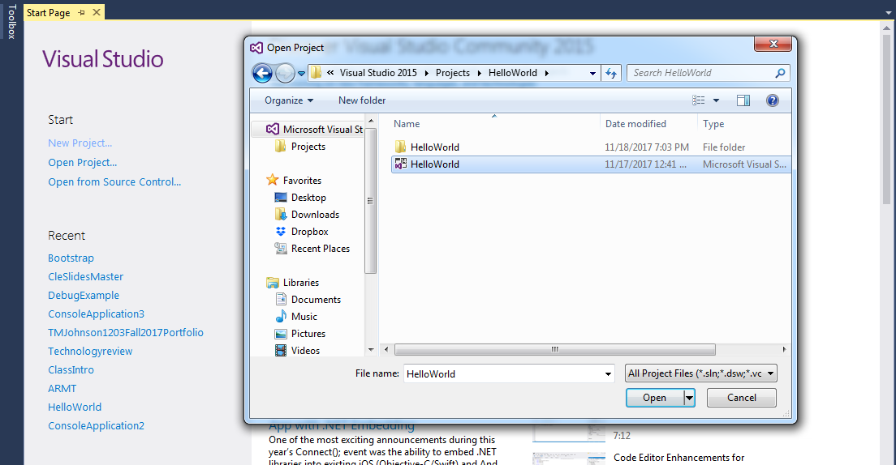
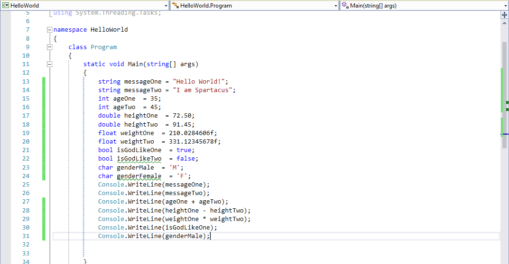
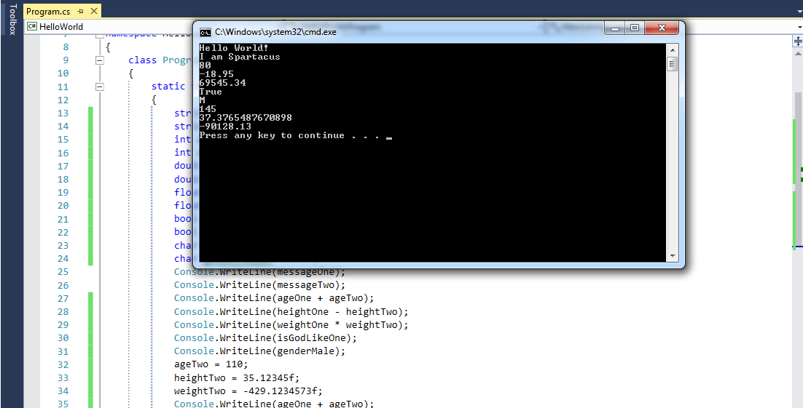
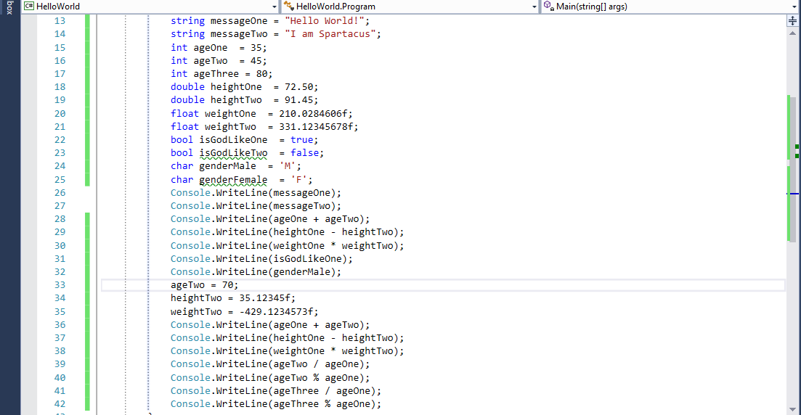
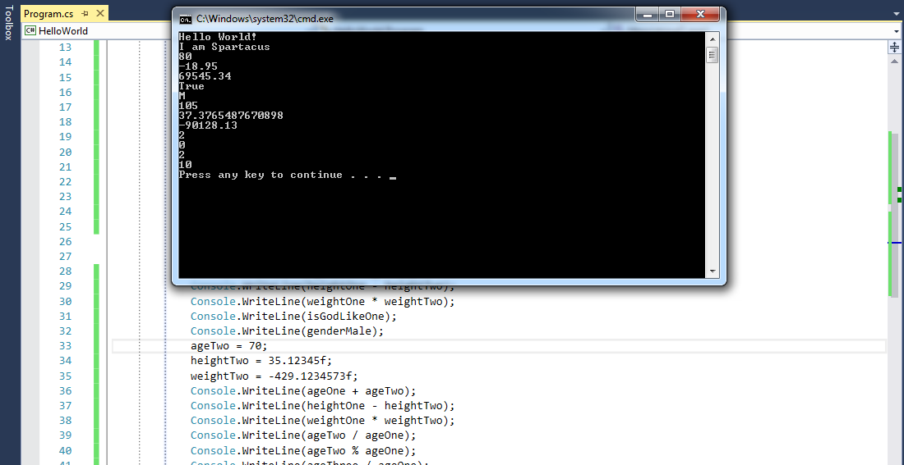
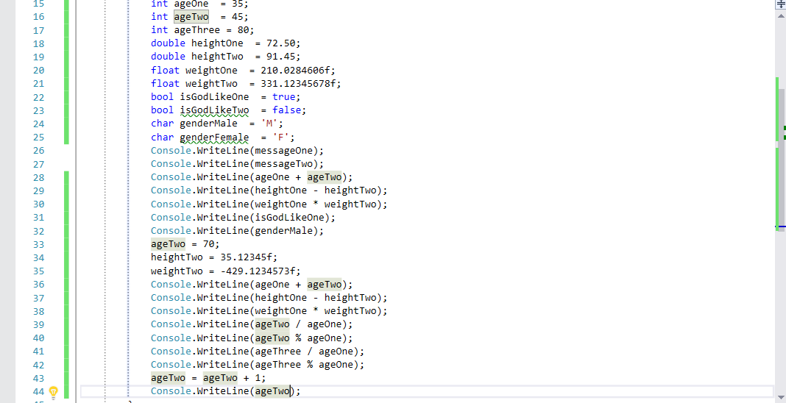
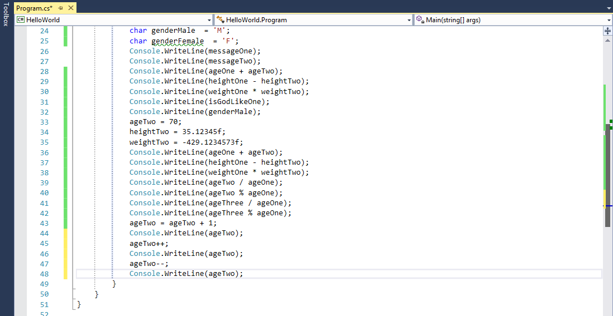
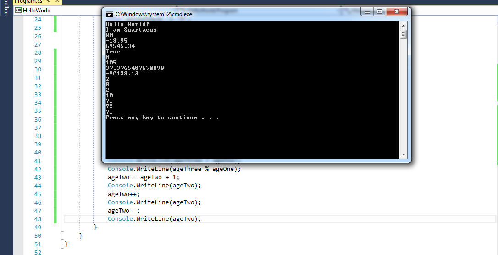

title: Operators and Expressions
subtitle: •••
theme: league


## Lets build on what we learned yesterday

<div float="right" class="img"></div>

- We have already started building our first application, so let's open <mark>Hello World</mark> and build upon our success.

- Volunteer Time!!

- Open Visual Studio

- Select File > Open > Project Solution

!SLIDE

<div float="right" class="img"></div>

- Select HelloWorld > Open

## We should all be here!!

<div float="right" class="img"></div>

- Let's review a few things before we begin

<div class="fragment">
Question time: What is the difference between an <code>int</code> and a <code>float</code> value type variable?
</div>

<div class="fragment">
Question time: What value type variable would you use to denote true or false?
</div>

<div class="fragment">
Question time: How would you denote the difference between a <code>string</code> and a <code>char</code>?
</div>

# Put on your math hats

- Throughout our academic careers, one of the main focuses of our education was arithmetic.

- We learned some fundamentals about how we perform basic operations like addition, subtraction, division, and multiplication.

- We also learned each operation has its own <mark>operator</mark> which we use to show what type of operation we are performing.

- For example, if we wanted to add, we used the <mark>+</mark> operator. Subtract, we used the <mark>-</mark> operator. Multiply, we used the <mark>*</mark> symbol and when we divide <mark>/</mark>.

- In the first part of our lesson, we are going to discuss how we use these same operators in coding, and how we use variables in place of the actual numbers we are accustomed to using.

- Likewise, we will introduce you to some operators you may not be familiar with, but are critical in achieving clean, successful code.

## Remember: value type variables hold a value

- Let's look at our code we have already written. We highlighted each of the value type variables we declared. Likewise, we assigned a value to each.

<pre><code class="language-C#" data-noescape>
        static void Main(string[] args)
        {
            string messageOne = "Hello World!";
            string messageTwo = "I am Spartacus";
            <mark>int age</mark> = 35;
            <mark>double height</mark> = 72.50;
            <mark>float weight</mark> = 210.028461f;
            <mark>bool isGodLike</mark> = true;
            <mark>char gender</mark> = 'M';
        }
    }
</code></pre> 

 <div class="fragment">
Question time: What is the value of height?
</div>

<div class="fragment">
Question time: What is the value of weight?
</div>

## Variable means the value can change

- When we are writing code, we use variables because often the values we assign will change. Hence the term variable!!

- Because we know these values will change, we cannot directly address the actual values of the variables when performing math operations.

- In order to better visualize this concept, we will need to make some changes and additions to our code.

- Volunteer Time!!

!SLIDE

- Please make the highlighted additions and changes in your code.

 <pre><code class="language-C#" data-noescape>
        static void Main(string[] args)
        {
            string messageOne = "Hello World!";
            string messageTwo = "I am Spartacus";
            <mark>int ageOne  = 35;</mark>
            <mark>int ageTwo  = 45;</mark>
            <mark>double heightOne  = 72.50;</mark>
            <mark>double heightTwo  = 91.45;</mark>
            <mark>float weightOne  = 210.028461f;</mark>
            <mark>float weightTwo  = 331.123457f;</mark>
            <mark>bool isGodLikeOne  = true;</mark>
            <mark>bool isGodLikeTwo  = false;</mark>
            <mark>char genderMale  = 'M';</mark>
            <mark>char genderFemale  = 'F';</mark>
            <mark>Console.WriteLine(messageOne);</mark>
            <mark>Console.WriteLine(messageTwo);</mark>
            <mark>Console.WriteLine(ageOne + ageTwo);</mark>
            <mark>Console.WriteLine(heightOne - heightTwo);</mark>
            <mark>Console.WriteLine(weightOne * weightTwo);</mark>
            <mark>Console.WriteLine(isGodLikeOne);</mark>
            <mark>Console.WriteLine(genderMale);</mark>
        }
    }
</code></pre> 

## We should all be here

<div float="right" class="img"></div>

- Ok let's run our application and see our results

!SLIDE

<div float="right" class="img"></div>

<div class="fragment">
Question time: When we perform the addition operation on variables ageOne and ageTwo, what values are we adding? 
</div>

<div class="fragment">
Question time: When we perform the multiplcation operation on variables weightOne and weightTwo, what values are we multiplying? 
</div>

<div class="fragment">
Question time: Looking at our results, what logic can we infer about performing mathematical operations using value type variables? 
</div>

<div class="fragment">
Question time: Is it safe to assume we are actually performing the operations on the contents of our value type variables? 
</div>

<div class="fragment">
Question time: Because we are using variables, if we assigned new values to our variables would our answers change? Let's do an experiment!! 
</div>

## Let's test your knowledge

- Volunteer time!!

- Working in pairs, I want you to assign these values to the following variables:

	- Assign ageTwo a new value of 110.

	- Assign heightTwo a new value of 35.12345f.

	- Assign weightTwo a new value of -429.123456f.

- Do not change the original values, as we want to see the orginal output and the new output so we can compare the difference.

- We want our new calculations to be sent to the console, so write a statement to display our new calculations to the console.

- Once you have assigned the variables new values and written the code to send them to the console, go ahead and save your project then run it!!

## Let's see our results

<div float="right" class="img"></div>

- Did anyone get get different results?

- Let's look at our code.

## We should all be here

<div float="right" class="img"></div>

- You will find in coding - as you have found in life - that there are many roads and techniques you can utilize which will give you the same result.

- If your code does not look the same as the code above, please take a minute to change yours even if you achieved the same results.

- For the sake of continuity, we need all your code to look the same as mine.

## What we have learned so far...

Here is a reference chart you can use to refresh your memory on what we have learned so far:

`int a = 25`

`int b = 15`

|Operator|Operation|Description|Expression|Result
|--------|---------|-----------|------------------|------
|+|addition|adds two operands|`a + b`|40
|-|subtraction|subtracts second operand from the first|`a - b`|10
|*|multiplication|multiplies the operands|`a * b`|375

Note: **operands** are the data on which the operation is performed.

<div class="fragment">
We learned if we assigned new values to our variables our answers will change.
</div>

<div class="fragment">
Question time: What is the advantage of using variables when performing mathematical operations when coding? 
</div>

## What happened to division?

- Now its time to introduce you too the two operators that deal with division

- The first is one you are already aware of the **division** <mark>/</mark> operator.

- A new operator you might not be aware of is the **modulus** <mark>%</mark> operator.

- In order to better visualize this concept we will be discussing, we will need to make some changes and additions to our code.

- Volunteer Time!!


!SLIDE

- Please make the highlighted additions and changes in your code.

- Be aware some code has been hidden from this view in order to read the changes.

 <pre><code class="language-C#" data-noescape>
	static void Main(string[] args)
        {
            string messageOne = "Hello World!";
            string messageTwo = "I am Spartacus";
            int ageOne  = 35;
            int ageTwo  = 45;
            <mark>int ageThree = 80;</mark>

            <mark>//The code in-between has been hidden for readability</mark>

            ageTwo = <mark>70</mark>;
            heightTwo = 35.12345f;
            weightTwo = -429.123456f;
            Console.WriteLine(ageOne + ageTwo);
            Console.WriteLine(heightOne - heightTwo);
            Console.WriteLine(weightOne * weightTwo);
            <mark>Console.WriteLine(ageTwo / ageOne);</mark>
            <mark>Console.WriteLine(ageTwo % ageOne);</mark>
            <mark>Console.WriteLine(ageThree / ageOne);</mark>
            <mark>Console.WriteLine(ageThree % ageOne);</mark>
        }
   </code></pre> 

## We should all be here

<div float="right" class="img"></div>

- Let's run our program and discuss the results


## So let's discuss our results.

<div float="right" class="img"></div>

- <mark>ageTwo / ageOne</mark> gave us the expected result of <mark>2</mark> because 70 / 35 = 2; No suprise there.

- <mark>ageTwo % ageOne</mark> gave us <mark>0</mark> as a result. <mark>0</mark>?

- Ok so <mark>ageThree / ageOne</mark> gave us the expected result of <mark>2</mark>, but is 2 really the correct answer?

- Finally what is up with <mark>ageThree % ageOne</mark> giving us a result of <mark>10</mark>?

- Do we have any math geniuses in the classroom? Can anyone guess why we are getting the results we are getting?

## It's all about what's left over

- The modulus operator will give us the <mark>remainder</mark> in a division calculation.

- When you look at both operators <mark>/</mark> and <mark>%</mark> they are each responsible for returning one of the two values we would expect perfoming normal division. <mark>/</mark> returns an integer here because operands are `int`s.

- Let's look at some easy examples for mod.

 <div class="fragment">
<div float="right" class="img" id="img-mod"></div>
</div>

<div class="fragment">
The modulus operator will have many useful benefits in coding, so make sure you understand the modulus concept.
</div>

-Here is a reference chart you can use to refresh your memory on what we have learned so far.

`int a = 25`  | `int b = 15`

|Operator|Operation|Description|Expression|Result
|--------|---------|-----------|------------------|------
|/|division|divides first operand by second operand|`a / b`|1
|%|modulus (remainder)|returns the remainder after integer division|`a % b`|10


## Increment and decrement operators

- In the field of coding, there often comes the need to add or subtract by <mark>1</mark>.

- You will see this predominantly in loops and counters. We will go into great detail about loops and counters later in the course.

- We may need to count every time a loop is run, or we may need to count the number of times a value has changed.

- One way of adding <mark>1</mark> to an variable is to simply write: <mark>ageTwo = ageTwo +1;</mark>

	- The calculation on the right side of our statement ageTwo = <mark>ageTwo + 1</mark>; is performed first.

	- Because <mark>ageTwo</mark> is a value type variable, we can save our calculation in <mark>ageTwo</mark>.

	- Let's do an experiment!!

- In order to better visualize this concept we will be discussing, we will need to make some changes and additions to our code.

- Volunteer Time!!

!SLIDE

- Please make the highlighted additions and changes in your code on the next slide.

- Be aware some code has been hidden from this view in order to read the changes.

 <pre><code class="language-C#" data-noescape>
	static void Main(string[] args)
        {
            <mark>//The code in-between has been hidden for readability</mark>

            ageTwo = 70;
            heightTwo = 35.12345f;
            weightTwo = -429.123456f;
            Console.WriteLine(ageOne + ageTwo);
            Console.WriteLine(heightOne - heightTwo);
            Console.WriteLine(weightOne * weightTwo);
            Console.WriteLine(ageTwo / ageOne);
            Console.WriteLine(ageTwo % ageOne);
            Console.WriteLine(ageThree / ageOne);
            Console.WriteLine(ageThree % ageOne);
            <mark>ageTwo = ageTwo + 1;</mark>
            <mark>Console.WriteLine(ageTwo);</mark>
        }
   </code></pre> 

## We should all be here

<div float="right" class="img"></div>

- Let's run our program and discuss the results


## So let's discuss our results.

<div float="right" class="img"></div>

- An examination of our code shows ageTwo was assigned a value of <mark>70</mark>.

- When we assigned the new value by adding <mark>1</mark> to ageTwo, we increased the value by <mark>1</mark>.

- This step is called <mark>incrementing</mark>. If we were to subtract by <mark>1</mark> this step would be called <mark>decrementing</mark>.

- Shortcut: we can use the operator <mark>++</mark> to *increment by 1* or the operator <mark>--</mark> to *decrement by 1*.


!SLIDE

- Let's make some changes to our code and see how it works.

- Add the following code under the last line on code in our project:

```C#
ageTwo++;
Console.WriteLine(ageTwo);
ageTwo--;
Console.WriteLine(ageTwo);
```
## We should all be here

<div float="right" class="img"></div>

- Let's run our program and discuss the results

<div class="fragment">
Note: <code>ageTwo = ageTwo + 1;</code>, <code>ageTwo+=1;</code>, and <code>ageTwo++;</code> are all equivalent.
</div>

## So let's discuss our results.

<div float="right" class="img"></div>
 
 - As we have seen, the <mark>increment and decrement</mark> allow us to perform the same functions as the variable assignment, but the amount of code is significantly decreased.

 - We also have flexibility with the <mark>increment and decrement</mark> operators to add or subtract values greater than <mark>1</mark>.

!SLIDE

 - Likewise, we can perform post <mark>increment and decrement</mark> operations.

 - Observe the following code for examples

 ```C#
//Post increment and decrement by 1 example
ageTwo++;
ageTwo--;
//Post increment and decrement by 2 example
ageTwo+=2;
ageTwo-=2;
//Pre increment and decrement by 1 example
++ageTwo;
--ageTwo;
```
- Although we do not commonly use the last two increment and decrement examples, they can and will be useful. 

## Equality operators

- We have seen how we use the <mark>=</mark> operator to assign a value to a variable.

- I think of the <mark>=</mark> operator in the terms of ownership. Lets review the following line of code.

	- ageTwo = 70;

	- By using the <mark>=</mark> operator, we can say that ageTwo owns the value <mark>70</mark>.

- We also have another category of operators which use the <mark>=</mark> operator. We use the following <mark>equality</mark> operators when we need to make decisions on the flow of logic.

- It is important to note using an <mark>equality</mark> operator will not return a numeric value. The <mark>equality</mark> operator will instead return a value of <mark>True</mark> or <mark>False</mark>.

- We will see plenty of examples in upcoming classes which will demonstrate how to use <mark>equality</mark> operators. For our purposes now I will highlight a few examples.

	- The <mark>==</mark> operator tests for equality. An example would be (5 == 5).  We know 5 <mark>is equal to</mark> 5, so the value returned will be <mark>True</mark>.

	- Another example would be (5 == 56).  We know 5 <mark>is not equal to</mark> 56, so the value returned will be <mark>False</mark>.

	- Yet another example would be ('5' == 5).  Can someone guess what the return value will be. Why?

## Inequality

- We can also check for <mark>inequality</mark> with the <mark>inequality</mark> operator <mark>!=</mark>.

- We will see plenty of examples in upcoming classes which will demonstrate how to use <mark>inequality</mark> operators. For our purposes now I will highlight a few examples.

	- In programming, we commonly use the <mark>!</mark> as a <mark>not</mark> operator.
	
	- The <mark>!=</mark> operator tests for inequality. An example would be (5 != 5).  We know 5 <mark>is equal to</mark> 5, so the value returned will be <mark>False</mark>.

	- Another example would be (5 != 56).  We know 5 <mark>is not equal to</mark> 56, so the value returned will be <mark>True</mark>.

	- Yet another example would be ('5' != "five").  Can someone guess what the return value will be. Why?


## Relational operators

- If we think back again to our early education years, we will remember using the following operators.

	- We would use the <mark>< or ></mark> operator to check if value <mark>a</mark> is less than or greater than value <mark>b</mark>. 
	
	- So <mark>a < b</mark> checks to see if <mark>a</mark> is less than value <mark>b</mark>.

	- Likewise, <mark>a > b</mark> checks to see if <mark>a</mark> is greater than value <mark>b</mark>.
	
- Now let's incorporate our <mark>=</mark> operator.

	- So <mark>a <= b</mark> checks to see if <mark>a</mark> is less than *or* equal to value <mark>b</mark>.

	- Likewise, <mark>a >= b</mark> checks to see if <mark>a</mark> is greater than *or* equal to value <mark>b</mark>.
	
<div class="fragment">
Question time: What value is returned with the following: ("pete" !> "PETE")? Why? 
</div>

<div class="fragment">
Question time: What value is returned with the following: (5 <= 2)? Why? 
</div>

<div class="fragment">
I would suggest experimenting with  the operators we have covered during your coding practice.
</div>


## Logical operators

- Last but not least, let's discuss the **logical operators**: <mark>&&</mark> and <mark>||</mark>

- When we make decisions in life, we commonly use the following language:

	- I will go to the mall if Mitchell's *and* Brownstone are open.

	- I will go to the mall if Mitchell's *or* Brownstone are open.

- We use statements just like these to control the decision making process in coding.

- Let's rewrite these two statements in code.

	- ("shopping" && "ice cream") The <mark>&&</mark> operator is commonly called the <mark>AND</mark>.

	- ("hiking" `||` "beach") The <mark>||</mark> operator is comonly called the <mark>OR</mark>.

## How about we take this one step further.

- We can use these operators in conjunction with each other.

- When we use logical operators we have to be careful to understand that they have an order of operations.

- The <mark>&&</mark> operator has precedence over the <mark>||</mark> operator.

- Let's see an example.

	- I will go to the mall if Mitchell's *and* Brownstone are open, *or* I will go to the beach if the Beachcomber *or* the Boardwalk are open.

- Now let's rewrite in code. (("Mitchell's" && "Brownstone") `||` ("Beachcomber" `||` "Boardwalk"))

- So because of order of operations, if Mitchell's *and* the Brownstone are <mark>BOTH</mark> open we are going to the mall.

- If Mitchells *or* the Brownstone are closed and <mark>EITHER</mark> the Beachcomber *or* the Boardwalk are open then it's off to the beach.

<div class="fragment">
Question time: What values will be returned when a logical operation is processed? 
</div>


## So let's put into code the following statements.

- Pair programming time!! 

- Volunteer time!!

<div class="fragment">
- Lisa is cooking muffins. The recipe calls for 7 cups of sugar. She has already put in 2 cups. How many more cups does she need to put in?
<div>

<div class="fragment">
- At a restaurant, Mike and his three friends decided to divide the bill evenly. If each person paid $13 then what was the total bill?
<div>

<div class="fragment">
- How many packages of diapers can you buy with $40 if one package costs $8?
<div>

<div class="fragment">
- Last Friday Trevon had $29. Over the weekend he received some money for cleaning the attic. He now has $41. How much money did he receive?
<div>

<div class="fragment">
- Last week Julia ran 30 miles more than Pranav. Julia ran 47 miles. How many miles did Pranav run?
<div>

<div class="fragment">
- How many boxes of envelopes can you buy with $12 if one box costs $3?
<div>

<div class="fragment">
- After paying $5.12 for a salad, Norachai has $27.10. How much money did he have before buying the salad?
<div>

<style type="text/css">
.img:hover  {
        transform: scale(1.5);
        box-shadow: 0 0 10px rgba(0, 0, 0, 0.5);
    }
#img-mod {
    display: block;
    margin-left: 0px;
    margin-right: auto;
	width: 40%;
}
</style>
