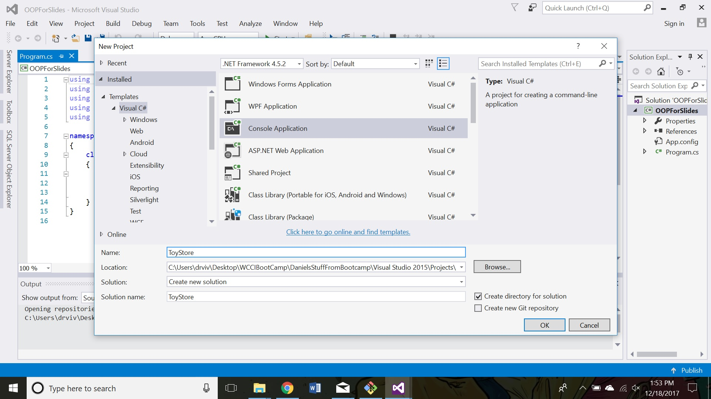
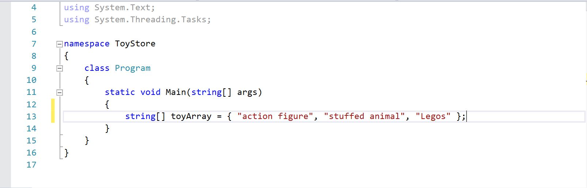
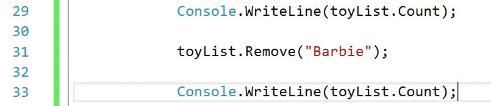
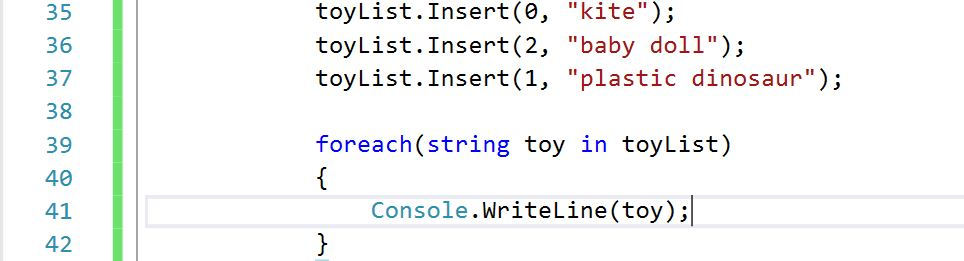
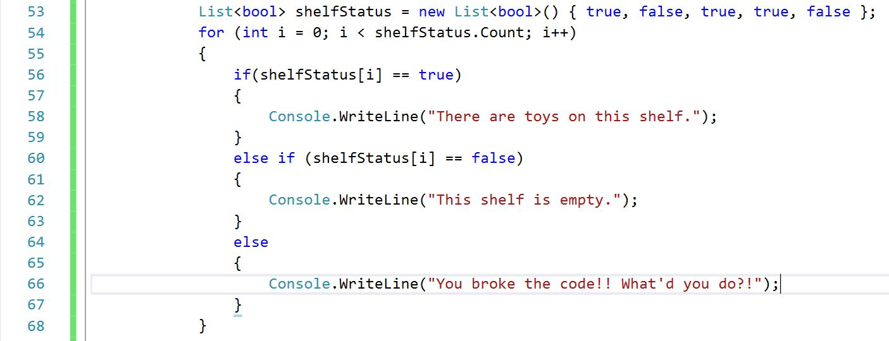

title: Lists
subtitle: Like Arrays, but Mutable!
theme: league

# Data Collections

We have already seen one data collection type, an `array`. An `array` is a collection of values that have the same type, like `int` or `string`.

There are several types of data collections in C#, many of which you will see during the upcoming weeks and even more during final projects.

Today, we will be talking about `Lists`.

## Arrays are fixed size

We can't change the size of an array once we've created it. It will never grow or shrink. This array will always have a `length` of three:

<code class="language-C#" data-noescape>
int[] myArray = {1, 2, 3};
</code>

If I wanted to add an element to this array, I'd generally do something like this (but hopefully I'd use a loop):

```C#
int[] oldArray = myArray;

myArray = new int[4];
for(int index = 0; index < oldArray.Length; index++) 
{
  myArray[index] = oldArray[index];
}
myArray[3] = 42;
```

We are forced to create a new array and assigned it to our `myArray` variable. Imagine if we needed to insert a new element in the middle? *Yuck!*

## Let's Start a New Project

Create a new Console Application with the title "ToyStore"

<div float="right"></div>

## Array Review

This is how we'd set up an array of toys at our toy store. Remember, arrays have a fixed size.

<div float="right"></div>

## How To Initialize a List

A list is created with the <mark>new</mark> keyword, which we will see a lot more of soon!

Create the following list.

<div float="right"></div>

Notice the similarities and differences between creating a new List versus creating an array.

## Initializing an Empty List

Unlike arrays, with lists we don't have to set a size when we create an empty list.

<div float="right"></div>

## Mutable

Unlike an array, a List is **mutable**, meaning that it does not have a fixed size and can increase or decrease in size.

We can use the <mark>.Add()</mark> method to add elements to our list.

<div float="right"></div>

<div class="fragment">
What did our <code>foreach</code> loop do?
</div>

## Printing Elements in a List

We saw what the `foreach` loop did in our previous slide. There is another way to print elements in a list using their indices.

<div float="right"></div>

## Objects and Methods

We will be talking a lot more about objects this week, but it is good for you to know that Lists are a type of object.

Lists have several built-in properties and methods, which we will go over now. Some of those are:
 - `.Count`
 - `.Insert()`
 - `.Add()`
 - `.Remove()`

## Count and Remove

The `.Count` property is the List version of the `.Length` property that is built in to arrays. `.Count` tells us the size of the list.

Write out the following code and share what you discover about `.Remove()`.

<div float="right"></div>

## Insert

The `.Insert()` method allows us to put a new element in our list AND specify which index we want that element to go to. Take a look at the following code.

<div float="right"></div>

<div class="fragment">
What index is each element at?
</div>
<div class="fragment">
Where did the elements originally at the indices of 0, 2, and 1 go?
</div>

## Contains

Another built-in method with Lists is the `.Contains()` method. `.Contains()` checks for a value in a list and returns a boolean value.

We can use methods inside of loops and conditionals. Write out the example below:

<div float="right"></div>

<div class="fragment">
What result did you expect? What method that we've learned can we use to change the result?
</div>

## Loops and Conditionals with Lists

Just like an array, we can iterate through a list. Write out the following code:

<div float="right"></div>

<div class="fragment">
What is the logic behind this code?
</div>
<div class="fragment">
Will we ever get to the <code>else</code> statement?
</div>

## Do It!

- Create a `List`. Add five stuffed animals to your list. Print each stuffed animal in your list.

<div class="fragment">
<b>Practice Question</b>
- Create a list with the following numbers: 1, 23, 9, 77, 922, 6, 32, 63, 14, 5, then:
	<p>- determine whether each of the following values is an element in the list: 23, 77, 15</p>
	<p>- remove the following elements: 27, 922, 32, 6</p>
	<p>- again determine whether each of the following values is an element in the list: 23, 77, 15 (<b>Stretch</b>: create a method so that you don't need to duplicate this work.)</p>
</div>

<div class="fragment">  
<li>Come up with an example of how you might use each of the methods from the previous slide.</li>
</div>